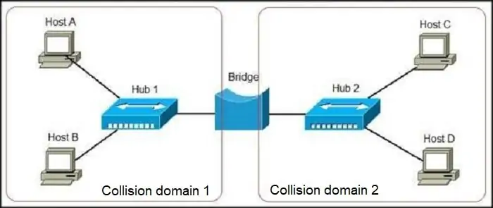

# Cheat sheet# Security controls

## Physical Security

Physical security prevents unauthorized access to buildings or areas using:

- **Deterrents**:
  - Warning signs
  - Fences
  - Guard dogs
  - Security lighting (to improve visibility in dark areas)
  - CCTV
- **Monitoring**:
  - CCTV (dual-purpose for deterrence and evidence)
  - Security guards
  - Intrusion detection systems (IDS)
- **Access Controls**:
  - Restricted access to secure areas using:
    - RFID badges
    - Mantraps
    - Turnstiles
    - Gates
    - Electronic doors

---

## Endpoint Security

- **Host Intrusion Detection System (HIDS)**:
  - Monitors activity against rules to detect suspicious patterns.
  - Generates alerts and forwards them to SIEM platforms.
- **Host Intrusion Prevention System (HIPS)**:
  - Similar to HIDS but can autonomously act to prevent malicious activity.
- **Antivirus (AV)**:
  - **Signature-based**: Matches malware signatures to known threats.
  - **Behavior-based**: Monitors deviations from normal activity.
- **Endpoint Detection and Response (EDR)**:
  - Logs and monitors endpoint activity.
  - Enables threat investigation through centralized platforms.
- **Log Monitoring**:
  - Sends endpoint logs to SIEM for analysis and threat detection.
- **Vulnerability Scans**:
  - **External**: Simulates an attacker’s view of internet-facing systems.
  - **Internal**: Reviews internal systems but doesn’t reflect external attack vectors.
  - **Credentialed**: Provides detailed configuration insights.
  - **Non-credentialed**: Simulates an attacker’s perspective to prioritize vulnerabilities.
- **Compliance Scanning**:
  - Ensures endpoints meet regulatory security standards using pre-configured scanner profiles.

---

## Email Security

- **Phishing**: The most common attack vector.
- **Spam Filters**:
  - Block suspicious or malicious emails based on predefined patterns.
- **Data Loss Prevention (DLP)**:
  - Monitors outgoing emails for sensitive data in headers, body, or attachments.
  - Blocks potentially harmful emails using keywords, regex, or predefined rules.
- **Email Scanning**:
  - Identifies malicious links or attachments using blacklists, patterns, and signatures.
  - Quarantines suspicious emails.
- **Security Awareness Training**:
  - Educates employees to identify phishing attempts.

---

## Network Security

- **Network Intrusion Detection System (NIDS)**:
  - **Passive**: Monitors traffic through mirrored SPAN ports.
  - **Inline**: Sits directly in traffic paths; can act as a Network Intrusion Prevention System (NIPS).
  - **Network Tap**: Directly taps into network cables to monitor traffic.
- **Network Intrusion Prevention System (NIPS)**:
  - Automatically blocks malicious activity.
- **Firewalls**:
  - **Standard**: Dedicated hardware separating network zones.
  - **Local**: Software firewalls on endpoints (e.g., Windows Firewall).
  - **Web Application Firewall (WAF)**: Protects internet-facing applications.
- **Log Monitoring**:
  - **Web Proxy Logs**: Tracks employee web activity and flags malicious sites.
  - **Perimeter Firewalls**: Detects scans, DDoS attempts, or other anomalies.
- **Network Access Controls (NAC)**:
  - Enforces security policies (e.g., patches, AV) for BYOD or guest devices.

---

## AAA Control Methods

The **AAA framework** ensures access is restricted to authorized users while monitoring actions:

- **Authentication**:
  - Verifies user identity through:
    - Something you know (password, PIN).
    - Something you have (RFID badge, key).
    - Something you are (biometric systems).
  - Multi-factor authentication (MFA) uses two or more factors.
- **Authorization**:
  - Grants access based on the Principle of Least Privilege (minimum required access for the job).
- **Accountability**:
  - Tracks actions for auditing and evidence during incidents.

---
# Networking 101

## Network Fundamentals

### Transmission Control Protocol (TCP)

- **Connection-oriented protocol**: Establishes a reliable, two-way connection for data transmission.
- **Error detection and correction**: Ensures data loss is detected and corrected automatically.
- **OSI Model**: Operates at the transport layer.
- **TCP/IP Protocol Stack**: Commonly used to refer to the Internet protocol suite, as TCP is closely integrated with the Internet Protocol (IP), forming the foundation of public and local networks.

#### Three-Way Handshake

1. **Client sends SYN**: Initiates the connection, including its sequence number.
2. **Server responds with SYN-ACK**: Acknowledges the client’s SYN and sends its own sequence number.
3. **Client sends ACK**: Acknowledges the server’s SYN-ACK and begins data transmission.

---

### User Datagram Protocol (UDP)

- **Connectionless protocol**: Sends data without establishing a connection between sender and receiver.
- **Transport layer**: Mediates between the network layer and the application layer.
- **Key Features**:
  - **Uses ports**: Ensures packets reach the correct subsequent protocols or applications.
  - **Fast, delay-free communication**: Suitable for real-time applications (e.g., streaming) as it doesn’t re-request lost packets.
  - **No guarantees**: Does not ensure security, integrity, or packet order; services using UDP must implement their own correction measures.
  - **UDP Header**:
    - Fields include source port, destination port, packet length, and an optional checksum.

---

### Internet Control Message Protocol (ICMP)

- **Purpose**: Diagnoses network communication issues and determines whether data reaches its intended destination.
- **Usage**: Commonly used in network devices (e.g., routers) for tools like `ping` to test connectivity.

---

### IP Addresses

- **Definition**: Provides an identity for devices on a network, similar to a physical address.
- **DNS Resolution**:
  - Translates domain names (e.g., `www.example.com`) into IP addresses to locate and communicate with devices.

#### Types of IP Addresses

1. **Private IP Addresses**:
   - Used within local networks (e.g., home or business networks).
     - used by tablets, Wi-Fi cameras, wireless printers, and desktop PCs.
   - Assigned manually or automatically via routers.
   - Ranges:
     - `192.168.0.0 - 192.168.255.255`
     - `172.16.0.0 - 172.31.255.255`
     - `10.0.0.0 - 10.255.255.255`
2. **Public IP Addresses**:
   - Used for external communication, assigned by ISPs.
   - Enables devices in a private network to connect to the wider internet.

#### Static vs. Dynamic IPs

- Both private IP addresses and public IP addresses are either dynamic or static, which means that, respectively, they either change or they don't.
  - **Static IP**: Manually assigned; does not change.
  - **Dynamic IP**: Assigned by a DHCP server and may change over time.

---

### MAC Address

- **Definition**: A hardware identification number unique to each network device (e.g., Ethernet or Wi-Fi cards).
- **Format**: Six two-digit hexadecimal numbers separated by colons (e.g., `00:0d:83:b1:c0:8e`).
- **Purpose**: Ensures device-level identification on a network.
- **Viewing in Windows**:
  - Search for "Network Status" → Click "View your network properties".
- **Spoofing**: Cannot be changed but can be spoofed by attackers.

---

## The OSI Model

### Introduction to the OSI Model

To understand how communication between networks works, we can relate it to real-life scenarios. Consider the following analogy:

Imagine you want to send a gift to a friend in another city. Since you can’t deliver it personally, you use an intermediary. To ensure successful delivery, you:

1. Provide your address for pickup.
2. Wrap the gift carefully to avoid damage.
3. Label the package with your friend's address and name.

The intermediary:

1. Checks the package for completeness.
2. Transports it to the destination city.
3. Delivers the gift to your friend after verifying their identity.

Similarly, in the IT world, communication follows a structured process. To standardize this, the **Open Systems Interconnection (OSI) Model** was developed.

---

### What is the OSI Model?

The **Open Systems Interconnection Model (OSI)** is a reference framework created by the International Organization for Standardization (ISO) in 1984. It defines the operation of communication networks by dividing them into **7 distinct layers**. Each layer performs a specific role and interacts with the layer above and below it.

The OSI Model enables standardized data transmission between computers, applications, and networks.

---

### Memorizing the OSI Layers

- **Top to Bottom**: _All People Seem To Need Data Processing (APSTNDP)._
- **Bottom to Top**: _Please Do Not Throw Sausage Pizza Away (PDNTSPA)._

---

### The 7 Layers of the OSI Model

Below is an explanation of each layer, starting from the top (Layer 7) to the bottom (Layer 1), representing how data flows during communication.

The only two layers that can be manipulated by the user:

- Layer 7: Application Layer
- Layer 1: Physical Layer

#### Layer 7: Application Layer

- **Function**: Provides an interface for users to interact with the network.
- **Role**: Handles application-level protocols like:
  - **HTTP**: Web browsing.
  - **SMTP**: Email communication.

#### Layer 6: Presentation Layer

- **Function**: Acts as a translator between the user and the machine.
- **Role**:
  - Ensures data is understandable by applications.
  - Handles encryption and decryption of data.

#### Layer 5: Session Layer

- **Function**: Manages sessions between communicating systems.
- **Role**:
  - Opens, closes, and resets sessions.
  - Establishes the order of communication.

#### Layer 4: Transport Layer

- **Function**: Ensures reliable data transfer between computers.
- **Role**:
  - Assembles and fragments packets.
  - Provides error control, flow control, congestion control, and retransmission.

#### Layer 3: Network Layer

- **Function**: Routes data between networks.
- **Role**:
  - Redirects connections.
  - Finds the optimal path for data delivery.

#### Layer 2: Data Link Layer

- **Function**: Handles addressing and physical transmission of data.
- **Role**:
  - Encapsulates data into frames.
  - Prepares data for physical transfer.

#### Layer 1: Physical Layer

- **Function**: Manages the physical elements of the network.
- **Role**:
  - Includes physical components like Ethernet cables and optical fibers.
  - Handles the global topology and physical transmission of data.

---

## Network Devices

### Router


- **Function**: Forwards data based on logical addresses (e.g., IP addresses in TCP/IP networks).
- **Use Case**: In a home network, if you access `Google.com`, the router:
  - Receives your request.
  - Uses DNS to translate `Google.com` into its IP address.
  - Forwards the request over the internet to the appropriate server IP.
- **OSI Model**: Operates at Layer 3 (Network Layer).

---

### Hub


- **Function**: Connects devices within a Local Area Network (LAN).
- **Characteristics**:
  - Broadcasts data received on one port to all other connected devices.
  - Does not differentiate between intended recipients.
  - Generates unnecessary traffic and poses a security risk (e.g., attackers can intercept data if connected to the hub).
- **Nickname**: "Dumb" device due to lack of recipient awareness.
- **OSI Model**: Operates at Layer 1 (Physical Layer).

---

### Switch


- **Function**: A "smart" hub that forwards data to the correct recipient.
- **How it Works**:
  - Uses **MAC addresses** as unique identifiers to determine the recipient of incoming data.
  - Prevents unnecessary traffic by sending data only to the intended device.
  - Relies on the Address Resolution Protocol (ARP) to map IP addresses to MAC addresses.
- **Use Case**: In a network, if a desktop sends a print request, the switch forwards the data only to the printer.
- **OSI Model**: Operates at Layer 2 (Data Link Layer).

---

### Bridge



- **Function**: Connects separate networks to form a single larger network.
- **Difference from a Router**:
  - Bridges combine networks into one cohesive entity.
  - Routers connect networks while allowing them to operate independently.
- **OSI Model**: Operates at Layer 2 (Data Link Layer).

---

### Firewall


- **Function**: Provides fundamental network security by monitoring and controlling traffic based on predefined rules.
- **Types**:
  - **Hardware firewalls**: Physical devices integrated into network infrastructure.
  - **Software firewalls**: Installed on devices to manage traffic.
- **Use Case**: Creates private networks by blocking unauthorized communication and allowing only permitted traffic.
- **Activity**: Set up a PfSense firewall to practice creating and applying rules.
- **OSI Model**: Operates at Layers 3 (Network Layer) and 4 (Transport Layer).

---

## Network Tools

### Command-Line Tools

Section names include tool names for Windows and Linux. Examples only show linux commands.

#### IP and ipconfig

- **Purpose**: Displays the current network configuration of the device, including:
  - Private IP address
  - Gateway address
  - DNS server
- **Use Case**: Troubleshooting connectivity issues.
- **Examples**:
  - `ip a` – Shows IP addresses on the device.
  - `ip r list` – Displays the routing table.
  - `ip link set dev [Device Name] [up|down]` – Enables or disables a network interface.

---

#### Traceroute and Tracert

- **Purpose**: Shows the path network packets take from one host to another.
- **Use Case**: Troubleshooting routing issues between systems.
- **Examples**:
  - `traceroute [url]` – Runs a basic traceroute to view the path to a specified address.
  - `traceroute [url] -p [port number]` – Runs a traceroute for a specific port.

---

#### Dig and Nslookup

- **Purpose**: Queries DNS servers for information about a domain.
- **Use Case**: Identify IP addresses of domains or locate mail servers.
- **Examples**:
  - `dig [domain name]` – Queries the DNS server for the A record.
  - `dig [domain name] MX` – Queries DNS for mail (MX) records.
  - `dig [domain name] ANY +nocomments +noauthority +noadditional +nostats` – Queries the DNS server for all DNS records for the specified domain and removes the extra information provided by dig.

---

#### Netstat

- **Purpose**: Monitors TCP and UDP connections on the host system.
- **Use Case**: Troubleshooting applications or identifying signs of malware (e.g., connections to remote servers).
- **Examples**:
  - `netstat -a` – Displays all current connections and listening ports.
  - `netstat -a -b` – Displays connections and ports with their corresponding executables.
  - `netstat -s -p tcp -f` – Displays TCP connection statistics in FQDN format.
    - FQDL format is `hostname.domain.TLD`. For example, `yahoo.com` domain might use the FQDN `mail.yahoo.com`.

---

### Nmap

- **Purpose**: A versatile tool for network discovery and security scanning.
- **Use Case***:
  - Reveals open ports and running services.
  - Identifies devices, operating systems, and potential vulnerabilities.
- **Examples**:  
  - Running a TCP SYN scan with verbosity: `nmap -v -sT -sV scanme.nmap.org`.

---

### Nmap Scripting Engine (NSE)

- **Purpose**: Enhances functionality through scripts for:
  - Network discovery
  - Version detection
  - Vulnerability detection and exploitation

---

## Protocols and Ports

- **Port**: In networking, a port is a communication endpoint. At the software level, a port identifies a specific process or a type of network service.
- **Port Ranges**:
  1. **Well-known ports (0–1023)**: Reserved for widely used services (e.g., FTP, SSH, DNS, HTTPS).
  2. **Registered ports (1024–49151)**: Assigned to specific services upon registration.
  3. **Private ports (49152–65535)**: Used for ephemeral (temporary) connections by clients during server-client communication.
     - When connecting to a web server on port 443 (HTTPS), the source port used by the client will be a random private port (49152–65535).

---

### Common Ports and Protocols

[Port quiz](https://www.proprofs.com/quiz-school/quizshow.php?title=network-ports-quiz&q=1.).

#### Port 20, 21 - **File Transfer Protocol (FTP)**

- **Function**: Transfers files between systems.
- **Use Case**: Employees retrieving files from a company FTP server.
- **Weakness**: Communication, including usernames and passwords, is transmitted in cleartext, making it vulnerable to eavesdropping.

---

#### Port 22 - **Secure Shell (SSH)**

- **Function**: Provides encrypted remote access to servers. This channel is encrypted, so any data moved between two connected systems will not be clearly visible.
- **Use Case**: IT technicians use SSH for secure maintenance of remote servers.

---

#### Port 23 - **Telnet**

- **Function**: Enables remote access to servers (unencrypted). Was used before SSH.
- **Weakness**: Transmits data in cleartext, making it insecure.  

---

#### Port 25 - **Simple Mail Transfer Protocol (SMTP)**

- **Function**: Sends emails between servers.
- **Use Case**: Transport emails over internal or external networks.
- **Note**: This is just a transport method, to actually download and view emails you need to use an email client and the protocol POP or IMAP.

---

#### Port 53 - **Domain Name System (DNS)**

- **Function**: Uses relational databases to convert human-readable hostnames and domain names (such as `Google.com`) into their respective IP addresses.
- **Use Case**: Simplifies access to websites using human-readable names instead of numerical IPs.

---

#### Ports 67, 68 - **Dynamic Host Configuration Protocol (DHCP)**

- **Function**: Automatically assigns IP addresses and network configuration to devices.
- **Use Case**: Assigns IPs to devices like phones or laptops when they connect to a network.

---

#### Port 80 - **Hypertext Transfer Protocol (HTTP)**

- **Function**: Allows clients (e.g., browsers) to request content from web servers.
- **Use Case**: Viewing unencrypted web pages.
- **Weakness**: Data is transmitted in cleartext, making it susceptible to sniffing attacks.

---

#### Port 443 - **Hypertext Transfer Protocol Secure (HTTPS)**

- **Function**: Encrypted version of HTTP using Transport Layer Security (TLS).
- **Use Case**: Secure communication between web servers and clients.
- **Strength**: Sites that use HTTPS are less susceptible to man-in-the-middle and sniffing attacks.

---

#### Port 514 - **Syslog (UDP)**

- **Function**: A Syslog server will have port 514 open and listening for incoming Syslog notifications, transported by UDP protocol packets. These packets are generated by remote systems that have been set up to forward Syslog information to the server.
- **Use Case**: Forwards logs to SIEM platforms for security event monitoring.

---

#### Port 3389 - **Remote Desktop Protocol (RDP)**

- **Function**: Microsoft proprietary protocol that enables remote connections to computers over TCP.
- **Use Case**: IT professionals remotely manage Windows systems.# Management principles

## Risk

- **Definition**: The possibility of a negative impact on any aspect of an organization, such as business, financial, or security.
- **Key Components**:
  - **Vulnerability**: A weakness that can be exploited by a threat. Vulnerabilities can be managed whereas a threat cannot.
  - **Threat**: A potential danger or adversary. Threats cannot be managed directly but can be mitigated through controls.
- **Risk Management**: The process of applying controls to reduce risk to an acceptable level.
- **Likelihood of Exploitation**: Determined by the presence of a threat, the existence of vulnerabilities, and the effectiveness of controls in place.

---

### Risk Assessments

- **Purpose**:
  - Identify and evaluate risks, including their likelihood and potential consequences.
  - Inform decision-making and compliance with laws or regulations.

---

### Conducting a Risk Assessment

- **Identify Potential Hazards**: Recognize what could cause harm.
- **Identify Who Might Be Harmed**: Determine who or what could be affected.

**Evaluate Risk**: Assess severity and likelihood; establish suitable precautions.
**Implement Controls**: Apply measures to mitigate risks and document findings.
**Review and Reassess**: Periodically update the assessment to reflect changes in circumstances or threats. Risk assessments should be dynamic and evolve with changing environments, particularly in fast-paced fields like cybersecurity.

---

### Managing Risk

Organizations manage risk based on their **risk appetite** and objectives. There are four primary strategies:

- **Risk Mitigation**:
  - Apply technical controls (e.g., patches, firewalls) and administrative controls (e.g., policies, procedures).
- **Risk Transfer**:
  - Shift the potential cost of loss to another party (e.g., through insurance).
- **Risk Acceptance**:
  - Proceed with an activity despite possible harm.
  - Common for unavoidable or low-priority risks.
- **Risk Avoidance**:
  - Prevent an incident entirely by eliminating hazards.
  - The most effective strategy, though not always feasible.

---


## Policies and Procedures

### Policies

- **Definition**: A policy is a high-level plan of intent or course of action within a specific domain, guiding actions and responsibilities.
- **Purpose**:
  - Outlines rules and principles.
  - Defines roles, responsibilities, and accountability.
  - Provides clear guidance for actions and expected behavior.
- **Hierarchy**:
  - Policies are at the highest level, followed by procedures, standards, and guidelines.
- **Importance in Organizations**:
  - Employees must read and adhere to organizational policies, such as acceptable use policies (AUPs).
  - Policies often interlink and may include sub-policies, requiring employees to be familiar with those relevant to their roles while knowing where to find others.

---

### Common Policy Examples

- **Acceptable Use Policy (AUP)**:
  - Stipulates what users can and cannot do on corporate, university, or ISP networks.
  - Governs behavior (e.g., no social media or adult content) and outlines consequences for violations (e.g., loss of privileges).

- **Service Level Agreement (SLA)**:
  - Defines the commitments between a service provider and a customer.
  - Includes:
    - Services provided.
    - Performance levels.
    - Response times for issues.
    - Consequences for failing to meet service levels.

- **Bring Your Own Device (BYOD)**:
  - Outlines rules for using personal devices (e.g., laptops, phones) on corporate networks.

- **Memorandum of Understanding (MOU)**:
  - A formal agreement between two or more parties that is **not legally binding**.
  - Typically precedes a binding contract.

---

### Standard Operating Procedures (SOPs)

- **Definition**: A step-by-step set of instructions for routine tasks, designed to ensure:
  - Effectiveness.
  - Efficiency.
  - Compliance with regulations.
  - Reduces errors, miscommunication, and non-compliance.
  - Creates uniformity within an organization by standardizing tasks.
  - Periodically reviewed and updated.
  - Tested before implementation.
  - Easily accessible to all team members.
  - Local or branch-specific variations may exist to comply with regional laws or conditions.

---

## Compliance and Frameworks

Organizations must follow security frameworks to meet minimum security standards and comply with industry-specific legislation and regulations.

- **Definition**: Adherence to rules and requirements specified by a framework or regulation.
- **Purpose**
  - Ensures organizations meet legal and regulatory standards while maintaining a high level of security.
  - **Builds Trust**: Customers and partners value organizations that follow recognized frameworks.
  - **Legal Requirement**: Non-compliance can result in significant legal and regulatory fines.
  - **Improves Security**: Reduces risk by ensuring organizations are better prepared to handle security incidents.

### Key Compliance Frameworks

#### General Data Protection Regulation (GDPR)

- **Scope**: Governs data protection and privacy in the EU and EEA, and the transfer of data outside these regions.
- **Key Requirements**:
  - Controllers/processors must implement technical and organizational measures to protect data.
  - No personal data may be processed unless this processing is done under one of six lawful bases specified by the regulation (consent, contract, public task, vital interest, legitimate interest, or legal requirement). When the processing is based on consent the data subject has the right to revoke it at any time.
  - Data controllers must clearly disclose any data collection, declare the lawful basis and purpose for data processing, and state how long data is being retained and if it is being shared with any third parties or outside of the EEA.
  - Data subjects have the right to request a portable copy of the data collected by a controller in a common format, and the right to have their data erased under certain circumstances
  - Businesses must report data breaches to national supervisory authorities within 72 hours if they have an adverse effect on user privacy.
  - Violators of the GDPR may be fined up to €20 million or up to 4% of the annual worldwide turnover of the preceding financial year in case of an enterprise, whichever is greater.
  - Principles include:
    - Pseudonymization or anonymization.
    - Privacy by default (e.g., highest-possible privacy settings).

---

#### ISO 27001

- **Scope**: Global information security standard, part of the ISO/IEC 27000 family.
- **Key Requirements**:
  - Specifies a management system to bring information security under control.
  - Certification available upon successful audit by an accredited body.

---

#### Payment Card Industry Data Security Standard (PCI DSS)

- **Scope**: Applies to organizations handling branded credit cards from major card schemes.
- **Purpose**: Reduces credit card fraud by securing cardholder data.
- **Validation**: Validation of compliance is performed annually or quarterly.
- **Validation Methods**:
  - **Self-Assessment Questionnaire (SAQ)**: For smaller transaction volumes.
  - **External Qualified Security Assessor (QSA)**: For moderate transaction volumes.
  - **Internal Security Assessor (ISA)**: For large transaction volumes; includes issuing a Report on Compliance.

---

#### Health Insurance Portability and Accountability Act (HIPAA)

- **Scope**: Protects Electronic Protected Health Information (ePHI) in the U.S. The primary goal of HIPAA is to protect ePHI which includes, name, dates such as birth, admission, discharge, death, telephone number, SSN, photographs, address, etc.
- **Covered Entities**: Includes healthcare providers, suppliers, and outsourced IT providers handling ePHI.
- **Key Requirements**:
  - **Technical Controls**:
    - Encryption, authentication, password complexity, access auditing, and segmentation.
  - **Procedural Controls**:
    - Password policies, incident response plans, contingency plans, and audit procedures.
  - Risk analysis to evaluate risks to the confidentiality, integrity, and availability of ePHI.

---

## Change and Patch Management

### Change Management

- **Definition**: The process of ensuring organizational changes are:
  - Planned.
  - Supported.
  - Well-documented.
  - Audit-able.
- **Purpose**:
  - Identifies accountability if changes lead to security risks or incidents.
  - Ensures transparency in system updates and security modifications.
- **Key Benefits**:
  - Provides a clear record of changes and the individuals involved.
  - Simplifies troubleshooting and accountability during incidents.

---

### Patch Management

- **Definition**: The process of deploying patches and security fixes to IT assets, such as operating systems, software, and applications.
- **Purpose**:
  - Remediates vulnerabilities in older versions of software.
  - Reduces the risk of exploitation.
  - Ensures compliance with frameworks like **Security Essentials+** (e.g., remediating critical vulnerabilities within 14 days).

---

### Patch Deployment Methods

#### **Windows Server Update Services (WSUS)**

- **Purpose**: Deploys Microsoft updates across a network.
- **How It Works**:
  - A designated "upstream server" connects to Microsoft Update to download patches.
  - The upstream server deploys updates to endpoints and servers, even without direct internet access.

#### **Microsoft System Center Configuration Manager (SCCM)**

- **Purpose**: A paid solution that assists with:
  - Asset inventory.
  - Software installation.
  - Patch deployment.
- **Features**:
  - Uses WSUS for update checks and installation.
  - Provides advanced control over patching schedules and methods.
  - Primarily designed for Windows systems, with limited support for macOS, Linux, and 3rd-party applications.

#### **Commercial Patch Management Solutions**

- **Example**: **ManageEngine Patch Manager Plus**
- **Capabilities**:
  - Deploy patches to Windows, macOS, and Linux systems.
  - Update operating systems, Microsoft Office, and 3rd-party applications (e.g., Adobe, browsers, utilities).
  - Scan endpoints for missing patches and report compliance.
  - Manage patch testing phases to reduce risk for IT teams.

#### **Retroactive Patch Releases**

- Vendors occasionally release patches for unsupported operating systems during critical vulnerabilities.
  - Microsoft released a patch for **Windows XP** in 2019 to mitigate **BlueKeep (CVE-2019-0708)**, despite XP’s end-of-support in 2014.# Active directory

## Features

- **Authentication**
  - **Purpose**: Provides a secure way for employees to log into the network using provisioned user accounts.
  - **Features**:
    - Account locking to prevent unauthorized access.
    - Automatic locking after a set number of unsuccessful login attempts.

---

- **Authorization**
  - **Purpose**: Controls access to resources based on user account permissions and group memberships.
  - **Features**:
    - Determines what resources a user can access.
    - Specifies actions users are allowed to perform.

---

- **Centralized Management**
  - **Purpose**: Enables efficient management of resources across the domain.
  - **Features**:
    - Centralized control of user accounts, computers, printers, and security policies.

---

- **Group Policy**
  - **Purpose**: Allows administrators to define and manage settings for users and computers across the network.
  - **Features**:
    - Enforce security settings.
    - Manage software installation.
    - Configure desktop settings across the network.

---

## Objects and Organizational Units

- In Active Directory (AD), an object is a digital representation of a resource within the network, such as users, computers, groups, printers, or shared folders.


---

### Key Features of Active Directory Objects

- **Attributes**:
  - Each object has attributes that describe its properties.
  - Attributes may include job role, manager details, group memberships, or security settings.

- **Globally Unique Identifier (GUID)**:
  - Every object is assigned a GUID that remains constant, even if the object is renamed or moved within AD.

- **Distinguished Name (DN)**:
  - Reflects the object's location in the AD hierarchy.
  - The DN changes if the object is relocated.

- **Object Classes**:
  - Objects belong to specific classes, defining the attributes they can have.
  - Example classes:
    - `User` for user accounts.
    - `Computer` for domain-joined computers.

---

### Types of Objects in Active Directory

- **User Objects**
  - Represent individual users.
  - Store:
    - Usernames.
    - Passwords.
    - Personal details.
    - Group memberships.
  - Security Identifier (SID):
    - Unique to each user account.
    - Remains the same if the user is renamed.
    - Changes if the account is deleted and recreated.

- **Computer Objects**
  - Represent computers within the domain.
  - Manage:
    - Policies.
    - Permissions.
    - Security settings.
  - SID:
    - Unique for each computer within the domain.
    - Remains constant even if the computer is renamed.

- **Group Objects**
  - Represent collections of users or computers.
  - Simplify management by assigning permissions to a group rather than individual users.
  - Types:
    - **Security Groups**: Assign permissions and rights to resources.
    - **Distribution Groups**: Used for email distribution lists (no security permissions).

- **Organizational Units (OUs)**
  - Containers used to organize objects within a domain.
  - Can hold:
    - User accounts.
    - Groups.
    - Computers.
    - Other OUs.
  - Enable:
    - Delegated administration.
    - Application of Group Policies.
  - **Example**: A Finance OU could include user accounts and computers for the Finance team.

- **Printer Objects**
  - Represent network printers.
  - Store printer configurations and permissions.

- **Shared Folder Objects**
  - Represent shared resources, such as file shares.
  - Manage access and permissions for shared folders.

---

- **Security Identifiers (SIDs)**
  - **Purpose**: Uniquely identify objects within the domain for security purposes.
  - **Structure**:
    - **Domain SID**: Common across all objects in the domain.
    - **Relative Identifier (RID)**: Unique portion distinguishing each object.

  - **Example**:
    - Domain SID:   `S-1-5-21-123456789-987654321-123456789`.
    - User SID:     `S-1-5-21-123456789-987654321-123456789-1000`.
    - Computer SID: `S-1-5-21-123456789-987654321-123456789-1001`.

Each object has the same Domain SID but a unique RID, ensuring distinct identifiers.

---

## Searching AD Objects

During investigations, you may need to gather detailed information about Active Directory (AD) objects, particularly user accounts. This could involve tasks such as:

- Checking if accounts are disabled.
- Reviewing password settings.
- Retrieving descriptive information.
- Identifying group memberships.

There are two primary methods for querying AD objects:

- PowerShell
- Lightweight Directory Access Protocol (LDAP)

---

### Using PowerShell

- **Basic Search Command**
  - **Command**: `Get-ADUser -Identity "NameHere" -Properties *`
  - **Explanation**:
    - Retrieves all properties of a specified AD user.
    - The `*` wildcard fetches all available properties (often an overwhelming amount of data).

- **Key Properties**
  - Some commonly useful properties include:
    - `LastLogonTimestamp`: Indicates when the account was last logged into.
    - `LockedOut`: Specifies if the account is currently locked.
    - `MemberOf`: Lists the groups the user belongs to.
    - `Modified`/`modifyTimeStamp`: Shows when the account was last modified.
    - `PasswordExpired`/`PasswordLastSet`: Shows when the password was last set or modified.

- **Filtering Properties**
  - To reduce clutter, you can specify only the properties of interest:
    - **Command**:  `Get-ADUser -Identity "NameHere" -Properties LastLogonDate,LockedOut,Modified,PasswordExpired,PasswordLastSet`
    - **Explanation**: Retrieves the specified properties instead of all properties, making the results more manageable.

---

### Using LDAP

- **LDAP (Lightweight Directory Access Protocol)**
  - A protocol for accessing and managing directory services over a network. It is commonly used by users and applications to interact with AD.

- **GUI Tools for LDAP**
  - Many software tools provide graphical interfaces to simplify interaction with LDAP. One example is the **Softerra LDAP Browser**, which is free to use.

---

## Domain Controllers

A **Domain Controller (DC)** is a server that hosts the Active Directory Domain Services (AD DS) role. It plays a critical role in managing the domain, ensuring authentication, access control, and directory services across the network.

---

### Key Functions of a Domain Controller

- **Authentication**:
  - Validates user credentials during logon requests.
  - Compares the username and password against stored credentials in Active Directory.

- **Authorization**:
  - Determines what resources a user can access after authentication.
  - Enforces security policies based on permissions and group memberships.

- **Access to the Active Directory Database**:
  - Stores information about all objects in the domain, such as users, computers, and groups.
  - Provides access to this directory for users and applications, either locally or remotely via protocols like LDAP.

- **Group Policy Enforcement**:
  - Applies policies across the domain, including:
    - Security settings.
    - Software installations.
    - User and computer configurations.

- **Replication Across DCs**:
  - In multi-DC environments, changes made on one DC (e.g., creating or modifying a user account) are replicated to other DCs.
  - Ensures consistency and redundancy within the domain.

---

### Types of Domain Controllers

- **Primary Domain Controller (PDC)**
  - **Role**:
    - Acts as the main DC for managing critical operations, such as password changes.
    - In modern Windows environments, the **PDC Emulator** role is used for backward compatibility with older Windows systems.
  - **Key Feature**: Ensures central coordination for certain domain operations.

- **Backup Domain Controller (BDC)**
  - **Role**:
    - Used in older Windows NT environments to provide redundancy.
    - Holds read-only copies of the user accounts database.
  - **Modern Alternative**: Multi-master replication in newer environments allows all DCs to read and write data, making traditional BDCs obsolete.

- **Read-Only Domain Controller (RODC)**
  - **Role**:
    - Holds a read-only copy of the Active Directory database.
    - Useful for branch offices or locations with limited physical security.
  - **Limitations**:
    - Can authenticate users but cannot make changes to the directory.
    - Enhances security in environments where full DC access might pose risks.

---

## AD Structure Examples

### Single Domain Example


In a **single domain** setup, all resources and objects are contained within a single domain. For example:

**Domain**: `securityblue.team`  
**Components**:

- **Domain Controller Server**: `SBTDC01` the manages the domain.
- **Organizational Units (OUs)**:
  - **HR OU**: Contains user accounts for HR employees.
  - **Finance OU**: Contains user accounts for Finance employees.
  - **Corporate OU**: Contains all employee computers.

This structure is simple and suitable for smaller organizations with centralized management needs.

---

### Multi-Domain Example (Tree/Forest)


In a **multi-domain** structure, subdomains are created under a root domain to organize resources and departments. For example:

**Root Domain**: `NotARealCompany`  
**Subdomains**:
- `finance.NotARealCompany`: Contains OUs for Finance resources.
- `engineering.NotARealCompany`: Contains OUs for Engineering resources.

**Key Notes**:

- Each domain can have its own organizational units.
- Even with a single tree of domains, the structure is referred to as an **Active Directory Forest**.

---

### Multi-Root Domain Example (Forest)


A **multi-root domain forest** occurs when multiple root domains are combined. This setup is common during mergers and acquisitions. For example:

**Scenario**:

- `NotARealCompany` acquires `FakeCompany`.  
- Each company retains its own domain but integrates into a shared forest.

**Benefits of an AD Forest**:

- Domains operate independently.
- Shared configuration across domains.
- Security and trust relationships can be established, allowing:
  - Users from `FakeCompany` to access resources on `NotARealCompany` servers.
  - Centralized management while maintaining domain autonomy.

**Example Structure**:

- Root Domains:  
  - `NotARealCompany`
  - `FakeCompany`
- Subdomains:  
  - `finance.NotARealCompany`
  - `engineering.NotARealCompany`

This structure allows large organizations to maintain scalability and flexibility across different domains while enabling secure collaboration.

---

## Security Groups

**Security Groups (SGs)** in Active Directory (AD) are used to group users or other AD objects (e.g., computers) and assign permissions collectively. Unlike Organizational Units (OUs), which are used for administrative organization and Group Policy application, Security Groups focus on **access control**.

---

### Key Features of Security Groups

- **Purpose**:
  - Simplifies permission management by assigning access rights to groups rather than individual users.
  - Supports the principle of least privilege by ensuring that users only have access to resources necessary for their roles.

- **Differences from OUs**:
  - **Security Groups**: Used for access control.
  - **Organizational Units**: Used for logical organization and administrative purposes.

---

### Naming Structure for Security Groups

While AD does not enforce a specific naming structure, organizations typically use in-house naming conventions for clarity. A consistent structure helps identify the purpose of a security group at a glance.

**Example Naming Convention**:

| Element       | Example               | Description                                                     |
|---------------|-----------------------|-----------------------------------------------------------------|
| **Prefix**    | `SG-`                | Identifies the object as a security group.                     |
| **Department**| `HR`, `IT`, `Marketing` | The department associated with the group.                      |
| **Permission**| `ReadOnly`, `Write`, `FullAccess` | Indicates the permission level assigned to the group.           |
| **Location**  | `London`, `NewYork`  | (Optional) Specifies the geographic location of the group.     |

**Examples**:

- `SG-IT-FullAccess-London`
- `SG-Marketing-ReadOnly-Singapore`
- `SG-Security-FullAccess-Global`

---

## Group Policy

- Group Policy allows administrators to define and enforce rules, settings, and security configurations for users and computers in a network. It automates policy management, ensuring consistent configurations and security across hundreds or thousands of devices.
- Group Policy settings can be stored either locally on a computer or in Active Directory.
- When used with AD, these settings are grouped into a Group Policy Object (GPO).
- **Group Policy Object (GPO)**: GPO is a collection of rules that define security settings, permissions, and configurations applied to users and computers in the network.

---

### Types of GPOs

| **Type**          | **Description**                                                                                     | **Example**                                                                                   |
|--------------------|-----------------------------------------------------------------------------------------------------|-----------------------------------------------------------------------------------------------|
| **Local GPOs**     | Apply to a single computer only, regardless of its network or domain membership.                    | Setting a local password policy on a standalone PC.                                           |
| **Non-Local GPOs** | Stored in Active Directory, apply to multiple users and computers in a domain environment.          | Disabling USB ports for all employees in the "Workstations" group.                            |
| **Starter GPOs**   | Templates with pre-configured settings to help admins create new GPOs faster.                       | Using a starter GPO for remote workers with pre-configured security settings.                 |

---

### GPO Processing Order

The order in which Group Policies are applied determines the final configuration for a user or computer. The **LSDOU hierarchy** (Local, Site, Domain, Organizational Unit) applies:

1. **Local Policies**: Applied first, configured on individual computers.
2. **Site-Level Policies**: Applied next if configured.
3. **Domain-Level Policies**: Applied across the domain.
4. **Organizational Unit (OU) Policies**: Applied in order from the highest-level OU to the most specific nested OU.

#### Conflict Resolution

- **Last Applied Wins**: If two policies conflict, the one applied last (closest to the object) takes effect.
- **Enforced GPOs**: Overrule all other policies, regardless of the hierarchy.  
  - Example: If a domain-level GPO allows USB access but an OU-level GPO blocks it, the OU-level policy will take effect unless the domain-level policy is **enforced**.

---

## Authentication and Security

Active Directory (AD) authentication mechanisms are essential for securing access to network resources. These mechanisms ensure users are verified before accessing services like file servers, email, or intranet systems. AD employs various authentication methods, including **Kerberos**, **NTLM**, and **LDAP**, which are supported by best practices to maintain a secure environment.

---

### AD Authentication Mechanisms

#### Kerberos Authentication


Kerberos is a secure, ticket-based authentication system that allows users to access multiple services after logging in once.

**How Kerberos Works**:

1. **Login Request**: A user logs in, and their computer sends a request to the Key Distribution Center (KDC)’s Authentication Server (AS) for a Ticket Granting Ticket (TGT).
2. **TGT Issuance**: If credentials are correct, the AS sends back an encrypted TGT.
3. **Service Request**: When accessing a resource (e.g., email), the TGT is used to request a service ticket from the Ticket Granting Server (TGS).
4. **Service Ticket Issuance**: The TGS issues a service ticket specific to the requested resource.
5. **Resource Access**: The service ticket is presented to the application server, which validates it and grants access.

---

#### NTLM (NT LAN Manager)


NTLM is an older Windows authentication protocol using a challenge-response mechanism to verify user identity without sending passwords over the network.

**How NTLM Works**:
1. A user attempts to access a resource, and the server sends a challenge (random number).
2. The user's computer encrypts the challenge using a hashed version of their password and sends the response to the server.
3. The server verifies the response. If correct, access is granted.

**Drawbacks**:

- Less secure than Kerberos due to vulnerabilities in older implementations.

---

#### 3. LDAP (Lightweight Directory Access Protocol)


LDAP is used to authenticate users and control access by communicating with a centralized directory service like AD.

**How LDAP Works**:

1. A user submits their credentials (username and password) via a **bind request** to the LDAP server.
2. The LDAP server validates the credentials and responds with a **bind result** indicating success or failure.
3. If successful, the user can request access to resources. The LDAP server grants or denies access based on permissions.

**Advantages**:

- Centralizes authentication for consistent access control.

---

### Best Practices for AD Security

- **Regular Auditing and Monitoring**
  - **Purpose**: Detect unauthorized access, modifications, or suspicious behavior.
  - **Implementation**:
    - Monitor Windows Event logs for authentication failures or unusual activity.
    - Set up alerts for changes to sensitive AD objects.

- **Least Privilege Principle**
  - **Definition**: Provide users with the minimum access necessary to perform their roles.
  - **Benefits**:
    - Limits potential damage from compromised accounts.
    - Reduces the attack surface.

- **Segregation of Duties**
  - **Definition**: Divide responsibilities to prevent a single person from having complete control over critical processes.
  - **Example**:
    - One person creates user accounts.
    - Another approves changes to security settings.
  - **Purpose**: Minimizes the risk of insider threats and misuse of privileges.

---

- **Patch Management**
  - **Definition**: Regularly update AD servers and related software to address vulnerabilities.
  - **Key Points**:
    - Apply patches promptly after release by software vendors.
    - Prioritize updates for critical systems and known vulnerabilities.# Introduction to Digital Forensics

* the process of collecting, analyzing, and preserving digital evidence, sometimes so that it can be submitted as evidence in court
* **Digital Forensics Process**
  * recognized scientific and forensic process used in digital forensics investigations
    * mainly referring to activities conducted by law enforcement
  * **Identification**
    * identify sources of relevant evidence or information (devices), key custodians, and location of data
  * **Preservation**
    * preserve relevant electronically stored information (ESI)
      * protect the crime scene, capture visual images of the scene, and document all relevant information about the evidence and how it was acquired
  * **Collection**
    * collect digital information that may be relevant to the investigation
      * remove the electronic devices from the crime scene and then image, copy or print out its content
  * **Analysis**
    * in-depth systematic search of evidence relating to the incident
    * outputs of the examination are data objects found in the collected information
      * system and user-generated files
  * **Reporting**
    * documentation of what you have done immediately after you have completed it and should provide sufficient detail for another person to reproduce
    * chain of custody should also be followed at every stage

---
* **Resources**
  * [Digital Forensics Resources by Forensic Focus](https://www.forensicfocus.com/articles/digital-forensics-resources/)
  * [Top Online Digital Computer Forensics Resources by InfoSec Institute](https://www.infosecinstitute.com/resources/digital-forensics/)
  * [Digital Forensics: Tools & Resources by Study.com](https://study.com/academy/lesson/digital-forensics-tools-resources.html)
  * [Digital Forensics Cheat Sheet by Tech Republic](https://www.techrepublic.com/article/digital-forensics-the-smart-persons-guide/)
  * [A Guide to Digital Forensics and Cybersecurity Tools (2020) by Forensics Colleges](https://www.forensicscolleges.com/blog/resources/guide-digital-forensics-tools)
  * [Free Course: Digital Forensics by OpenLearn](https://www.open.edu/openlearn/science-maths-technology/digital-forensics/content-section-0?active-tab=description-tab)

---


# Types of Phishing Emails

## Recon

- observed daily by large organizations
- typically always make it through the email gateway as they do not contain any malicious indicators
- typical will only contain body content, more advanced emails could utilize social engineering techniques and tracking pixels to collect more information on their targets
- email addresses that are discovered to be active can be sold to other malicious actors to conduct phishing attacks or can be targeted by the original actor to send further malicious emails

- checks if the destination mailbox is in use
  - used to get a response from the recipient
    - email back, email delivered, email opened
  - **3 main types**
    - **spam**
      - contains random letters
    - **email w/ social engineering component**
      - trying to get you to respond
      - posing as a friend/acquaintance, creating sense of urgency, impersonating an authority figure (BEC)
    - **tracking pixels**
      - track pixels to see if the email was viewed in an email client
      - **tracking pixel** is an HTML code snippet that is loaded when a user visits a website or opens an email
      - very useful for tracking user behavior and preference or for *data harvesting*
      - **Tracking Pixel Recon Emails**
        - follow the format of either a spam recon email, or a social engineering email
        - **How it works**
          - HTML code in the email body
          - contains an external link to a pixel server
          - the email recipient opens the email, the client or webmail provider will load the HTML code, sending a message back to the server
        - help attackers understand how active the mailbox is
        - **Data that can be acquired**
          - the time from email being sent to being opened
          - OS
          - type of website/email used (mobile/desktop)
          - type of client (browser/webmail or mail program/client)
          - screen resolution
          - date and time when email was read
          - IP address

---

## Credential harvester

- the most common phishing emails out there
- target human weaknesses to attempt to retrieve valid credentials which can potentially be used to gain access to numerous services and accounts as a result of credential stuffing attacks
- **How it works**
  - email is styled to look like it is from a legitimate company, impersonating some of the most popular online services and retailers such as Outlook, Amazon, and DHL
    - Credentials harvesters are sometimes tailored to impersonate login portals for the organization that is being targeted
      - Logos and other branding material can often easily be retrieved from a company's website, or search engine results
    - email will tell the recipient to click a button or URL, where they will typically be presented with a real-looking login portal
    - any credentials entered are either stored on the site in an inaccessible directory, or emailed to a dummy account, typically utilizing free online mail services such as Gmail, Hotmail, and Outlook, where the attacker can log in and collect them
- The main giveaway is typically the URL
  - e.g., the URL in the email is using an IP address instead of a domain name
- **Key Points**
  - Imitates commonly-used websites and services (e.g., Outlook, Amazon, HMRC, DHL, FedEx).  
  - Entices the recipient to enter credentials into a fake login portal.  
  - Uses social engineering tactics, such as:  
    - Creating a sense of **urgency**.  
    - Using **false authority**.  
  - URLs may be:  
    - Completely random.  
    - Designed to mimic the legitimate domain of the targeted organization.  
  - Often contains small spelling or styling mistakes, which are extremely rare in legitimate emails from well-known brands.  

---

## Social Engineering

- using psychological methods in order to get people to complete actions that they wouldn't normally
  - disclosing confidential information
  - allowing someone into a restricted area without proper authorization
  - transferring money to an unverified account
- all phishing emails will utilize some social engineering techniques
  - attacks aren't trying to exploit or hack technical systems, they're going after the human behind the screen
- **Common Social Engineering Tactics in Phishing Emails**
  - **Recon Emails**: Convince the recipient to reply to the attacker's initial email to confirm the mailbox is active.  
  - **Impersonation of Executives**: Convince the recipient to transfer money by posing as the CEO, CTO, CFO, or other executive board members.  
  - **Confidential Information Requests**: Convince the recipient to disclose confidential or private information by impersonating:  
    - The data subject (e.g., an employee or client).  
    - Someone in a higher position within the company.  

---

## Smishing

- phishing through text messages
- generic victim profile or target group; msg can be sent out in bulk
- mostly targets PII or PCI
- best way to defend is awareness training and not clicking links

## Vishing

- phishing through phone call
- relies heavily on the social engineering
- victim are often people in the organization that would have access to sensitive information
  - one or two levels below the “C” level executive
- mostly target financial information or corporate accounts that could give access to the network
- best way to defend is security awareness training or blocking auto callers
  - or having internal authorization codes/separation of duties

---

## Whaling

- highly-targeted phishing attack that looks to targets C-level executive
- emails are refined using OSINT to make it believable
- most difficult types of phishing to detect because they are sent in very small volumes and are tailored to appear legitimate and not generate red flags that could alert the security
- prevention could be marking external emails by appending the subject line or email body text

---

## Malicious file

- emails w/ malicious file are the most common amongst credential harvesters
- common methods to deliver malicious files are:
  - malicious attachment
    - most email providers prevent you from sending attachments w/ certain file types and can conduct malware scans before you even send it
    - word or excel files are common cause not as sus
    - Microsoft office macros
      - macros are a series of commands and instructions that can run automatically if enabled
      - was common a few years ago but now macros are disabled by default
      - as a workaround, malware authors show a fake warning to get you to enable it
      
      - when you run a macro like this it can connect to domains and download malware
    - general rules from Microsoft:
      - disable macros by default (preferably on admin level)
      - don't open sus emails
      - delete sus emails
      - use [Attack surface reduction (ASR)](https://learn.microsoft.com/en-us/defender-endpoint/attack-surface-reduction) rules at enterprise level to prevent prevent macro malware from running executable content
  - hosted malwre
    - host malware on a website and trick users into clicking a hyperlink, download a file, then run it
      - malicious domains are easy and cheap to create
      
      - compromised domains are also common; the original site is often left intact so that users or owners don't realize smth is wrong
      

---

## Spam

- messages that are unsolicited, unwanted, or unexpected but are not necessarily malicious in nature; you should still be cautious and not click anything
  - newsletters, marketing emails, company announcements
- Malicious spam emails are malicious messages that are sent on a mass scale (as opposed to being targeted at an individual or organization)
- Spam emails can also be utilized as a form of reconnaissance
  - if users click on an unsubscribe link
  - link takes them to a website, which leads to system fingerprinting
  - confirms that the mailbox is in use

---

## False positive

- not malicious but reported as such
- can be due to
  - bad formatting
  - users believe it's malicious and report it
  - unexpected and asks to complete an action (click button, contact someone, transfer funds, etc.)

# Tactics and Techniques

- **Spear Phishing**
  - gathering info on a target beforehand to tailor the phishing email and make it more convincing
  - OSINT and other phishing techniques can be used to facilitate it
    - e.g., typosquatting, sender spoofing, impersonation
- **Impersonation**
  - w/in or outside the org
- **Typo squatting**
  - impersonating domain name or brain by misspelling it
  - large orgs can generate a list of similarly-named domain and monitors to see if someone registered them
    - or they just register them themselves
- **Homoglyphs**
  - same looking characters from other writing systems but have different unicode
    - Latin “o” and the Cyrillic “o” have a different Unicode and are therefore different letters.” It also means domains with those two different Os are two different domains.
  - impossible for users to spot; security training is ineffective here
    - needs to be addressed via mail security technology
      - e.g., tools that visit hyperlinks within emails to identify if they are malicious
  - Domains using non-Latin letters are referred to as internationalized domain names (IDN) and are used quite frequently in homograph attacks
- **Sender Spoofing**
  - making the sending address in an email look the same as a legitimate email to make the recipients believe it is coming from a genuine sender
  - often used w/ credentials harvester
  - you send an email with a "From:" address that appears to be from a source the recipient trusts
  - there is no verification done at this point, so SMTP emails can use any FROM address they want
    - you can look at the sending server IP (X-Originating-IP) and perform a WHOis or IP lookup search to check
  - you can set a value for the Reply-to address as an email address that we actually have access to
- **HTML Styling**
  - code and images are used to style an email to make it look more visually attractive
  - HTML styling is typically observed with credential harvesters, as they are trying to impersonate an organization
  - base64 is common but can be in plain text
- **Attachments**
  - in phishing campaigns, we will typically see three categories of attachments:
    - non-malicious files used for social engineering
      - invoices, letters of appeals, images
    - non-malicious files w/ malicious hyperlinks
      - PDFs
    - malicious files
      - scripts, macros
- **Hyperlinks**
  - can be coupled with additional techniques such as redirected targets to a typo squatted domain or using URL shortening services to disguise the true destination of the link
  - raises less suspicion than an attachment cause links in email are more common
  - phishing emails should only be analyzed and opened in a virtual machine or on a “dirty” system
- **URL-Shortening Services**
  - prevents some aspects of automated security analysis
  - `https://wannabrowser.net` simulates a browser and allows you to see where the link leads w/out clicking it
- **Use of Legitimate Services**
  - **Email Delivery**
    - phishers will make use of legitimate services such as free email providers, to bypass defensive measures
      - `@gmail.com`
      - `@outlook.com`
      - `@hotmail.co.uk`
    - malicious actors will take advantage of email marketing services like `MailGun` or `MailChimp`
  - **File Hosting**
    - malicious actors typically host malicious files on free platfprms like `Dropbox`, `OneDrive` or `google Drive` and link to them as they appers legit
    - attackers can’t upload malicious scripts or executable files like `.exe` but they can create docs w/ macros
- **Business Email Compromise (BEC)**
  - phishing attack that focuses on orgs that are likely to transfer large amounts of money to either purchase goods or pay other parties
  - malicious actor will monitor their target over a period of time to determine which companies the organization pays
  - they will either compromise an email account belonging to a high-level employee, or spoof the address so it appears legitimate
  - then will direct the relevant employees to transfer the money to a different bank account
  - 
# Investigating a Phishing Email

## What to collect

- **Email artifacts**
  - **sending email address**
    - useful to find other emails that came from or were sent to this address
  - **subject line**
    - useful to find other emails or block em
  - **recipient email address**
    - inform recipients not to interact w/ the email
  - sending server IP and reverse DNS
    - helps identify if the sender address was spoofed
    - reverse DNS lookup will give us a hostname that'll provide more info on the server
  - **reply-to address**
    - sometimes is different from the sending address
  - **date & time**
    - can help find other emails that are part of the same attack
    - can help identify the times org receives the most malicious emails
- **File artifacts**
  - **attachment name and extension**
    - depending on the uniqueness of the name, it can possibly be blocked using an organization’s EDR
    - **size**
  - **sha256 hash value**
    - unique string generated from a file
    - can be used for reputation checks w/ `VirusTotal` and `Talos File Reputation`
    - MD5 and SHA1 hashes should no longer be used, as they have known hash collisions
    - SHA256 is the current security standard for file hashing
- **Web artifacts**
  - **full URLs**
  - **root domain**
    - often isn’t necessary if you have the full URL
    - sometimes the root domain can be an important as it can show if
      - the site has been created for malicious activity
      - is a legitimate site that has been compromised

## Manual Collection

- analysts should never analyze phishing emails on a corporate or personal system
- always use a virtual machine or a “dirty” system
  - e.g., an old laptop designed specifically for risky security tasks, such as malware analysis or investigating suspicious websites
- **Email artifacts**
  - you can get most artifacts from the email client
    - Sending Address
    - Subject Line
    - Recipients (Unless they’re in BCC)
    - Date + Time
  - other info can be obtained from `.eml` or `.msg` file
    - Sending Server IP
      - `X-Sender-IP`
      - perform reverse DNS lookup (`whois`)
        - `nslookup` 
    - Reply-to Address
      - `Reply to`
- **Web artifacts**
  - from email client
    - copy the full URL
  - from `.eml` or `.msg` file
    - search for `<a>`/`href` tags
  - it's better to not use the email client for this as u can accidentally click the URL
- **File artifacts**
  - MD5 and SHA1 hashes are enough to perform reputation searches online and take defensive measures
  - `Talos File Reputation` require SHA256 hashes to perform checks tho
  - via PowerShell
    - `get-filehash`
      - generates SHA256 hash by default
      - to retrieve MDA use `get-filehash -algorithm md5`
      - to retrieve SHA1 use `get-filehash -algorithm sha1`
    - via Bash
      - `sha256sum`
      - `sha1sum`
      - `md5sum`
    - get the **name**, **extension**, and **size** too

## Automated collection

- [PhishTool](https://www.phishtool.com/) can do artifact retrieval and analysis; can also generate reports# Analyzing Artifacts

- you should always include the reputation checks you performed in your report

## Manual Analysis

### URL Visualization Tools

- give u a screenshot of what the webpage looks like
- it's not required to attach a visual to your report but it's nice
  - **URL2PNG**
    
  - **URLScan**
  - 
    - apart from screenshot gives you some other stats too
      - e.g., verdict if the webpage is malicious
      - information can be useful during high-profile investigations, typically using URL2PNG for visualization will be enough

### URL Reputation Tools

- if something is not being identified as malicious by online reputation tools, it does not mean it is safe
- assume that suspicious sites are malicious until you can prove otherwise
- reputation sites can be a good resource, but they are not always effective, and further analysis is always needed
- targeted and unique attacks will not have been analyzed by other security professionals, therefore URLs could come back with no negative comments

- reputation tools:
  - **VirusTotal**
  - **URLScan.io** (same as the visualization tool)
- **Threat Feeds**
  - [**URLhaus**](https://urlhaus.abuse.ch/browse/)
    - a huge collection of malicious URLs reported by researchers
    - includes:
      - the date the URL was added to the database
      - the malicious URL
      - the status showing whether this resource is still available on the internet
      - tags that show what the malware is
      - which user reported these URLs
    - [threat feeds](https://urlhaus.abuse.ch/feeds/) can be used to generate blacklists of malicious URLs that can be blocked proactively 
  - [**PhishTank**](https://www.phishtank.com/)
    - allows users to submit phishing artifacts which are then verified by the wider community

### File Reputation Tools

- **VirusTotal**
  - platform where you can upload files, search for IP addresses, domains, URLs, and other artifacts to retrieve a community-generated reputation value
- **Talos File Reputation (TFR)**
  - offered by Cisco
  - allows you to search for SHA256 strings against their reputation database
  - also provided with the file size, the type of file, the name used for detection, and other aliases used to track this specific piece of malware

### Malware Sandboxing

- the process of detonating (running/executing) a piece of malware in a contained environment, and closely monitoring exactly what the software does, allowing security teams to collect indicators of compromise
  - e.g., monitoring the network traffic to see if the malware tries to communicate with a command-and-control (C2) server or download additional modules
- by understanding how the malware operates, it becomes easier to create defenses that can detect similar activity
- security teams usually have their own environment but you can use [**Hybrid Analysis**](https://www.hybrid-analysis.com/)
  - online malware analysis platform that lets you upload malware for instant cloud-based analysis
  - provides a detailed report about the observed activity
  - 

## Automated Analysis

### PhishTool

- will automatically retrieve the file name and MD5 hash from any email attachments
  - console has a button that allows us to search for the hash value in VirusTotal straight from the console
- if an email is submitted that includes any URLs, a web capture can be viewed by clicking on the URL and selecting Web Capture
  - also provides the HTTP requests made, and headers from the site
- WHOIS lookup can be done too
  - where it’s hosted
  - who owns the domain
  - how long it has been alive for
  - contact information
# Taking Defensive Actions

## Preventative

- **Marking external emails**
  - you can alter the subject line or body text of an email address that is coming into the organization to alert the recipient that this email isn’t an internal communication on platforms like Microsoft Exchange or Office365
    - e.g., the subject line appended with a very short message, such as “[EXTERNAL]” or “[EXT]”

---

- **Anti-Spoofing Records**
  - DNS records can be used to set up anti-spoofing records
  - **Sender Policy Framework (SPF)**
    - type of DNS (TXT) record that can help prevent an email address from being forged
    - established to identify the hostnames or IP addresses that are allowed to send emails for your custom domain
    - having an SPF record specified on your domain helps prevent a malicious actor from spoofing it
    - contains three parts
      - the declaration of the record type
      - the IP addresses and external domains that can send on your domain’s behalf
      - an enforcement rule
    - Syntax:
      - `v=spf1 <IP> <enforcement rule>`
      - `v=spf1 a: include:mailgun.org protection.outlook.com -all`
  - **Domain Keys Identified Mail (DKIM)**
    - method of email authentication that cryptographically verifies if an email has been sent by its trusted servers and hasn’t been tampered with during transmission
    - How it works:
      - when the mail server sends an email, an encrypted hash of the email contents is generated using a private key and added to the email header as a DKIM signature
      - the receiving server will look up the corresponding public key in the domain's DNS records
      - the receiving mail server decrypts the email with the public key, calculates a new hash and verifies whether the original and the newly generated hash match
    - Syntax:
      - `V=DKIM1 <key type> <public key>`
  - **Domain-based Message Authentication, Reporting & Conformance (DMARC)**
    - email authentication, policy, and reporting protocol
    - built on SPF and DKIM concepts
    - allows the domain owner to specify what should happen if emails fail both SPF and DKIM checks
    - three basic options the mail server can take:
      - none
      - quarantine
      - reject
    - `v=DMARC1 <action> <report address>`
      - `v=DMARC1; p=quarantine; rua=mailto:contact@securityblue.team`

---

- **Spam filter**
  - 3 main types:
    - **Gateway Spam Filters**
      - sit behind an on-premises firewall of a network
    - **Hosted Spam Filters**
      - hosted within the cloud
      - able to update more quickly than some of the on-premises filters
    - **Desktop Spam Filters**
      - user-installed 
      - can sometimes be categorized as “Freeware
        - you don't fully know what the application is installing on your system
  - 3 types based on how they detect smap:
    - **Content Filters**
      - uses information in the email header and body to determine if the email is legitimate
      - filter can cross-reference the header with published blacklists or known spamming networks
      - filter scans the body of the message e.g. based on account preferences (e.g. block adult content)
    - **Rule-Based Filters**
      - allows for emails to be filtered based on predetermined criteria
      - e.g., if the subject or body contains “FREE OFFER” and the Sender is located Outside of the Organization, raise the likelihood of the message being spam
    - **Bayesian Filters**
    - most intelligent types of spam filters; utilizes machine learning
    - e.g. when the user marks an email as spam, it can analyze the characteristics of that message and block similar messages
    - the downside is you need a lot of spam to utilize the machine learning capabilities

---

- **Attachment Filtering**
  - before blocking a file type, consider
    - what file types are often used for malicious purposes
      - `.exe` (Executable)
      - `.vbs` (Visual Basic Script)
      - `.js` (JavaScript)
      - `.iso` (Optical Disk Image)
      - `.bat` (Windows Batch File)
      - `.ps`/`.ps1` (PowerShell Scripts)
      - `.htm`/`.html` (Web Pages / Hypertext MarkupLanguage)
      - `.zip`
      - `.doc`/`.docx`/`.docm`
      - `.pdf`
      - `.xls`/`.xlsx`/`.xlsm`
    - which file types the organization deals with on a regular basis, and if blocking them would have any negative impact on the business

---

- **Attachment sandboxing**
  - pre-defined rules and configurations are used to block specific file types or naming conventions
  - files that look legitimate (e.g., Microsoft Office docs) can still go through
  - w/ sandboxing, emails that include file attachments are extracted and analyzed, and files are detonated in a virtual environment
  - if malicious indicators are observed, the attachment is classed as malicious, and the email will not be delivered
  - advanced sandboxing products provide:
    - machine learning
      - retrieving information and behavioral analytics from millions of malicious emails and malware samples so that over time it can determine which emails to let through
    - virtual environments
    - reports

---

- **Security awareness training**
  - users should be put through a training course that teaches them how to spot phishing emails, and the actions they should take, preferably during the onboarding process
  - indicators include:
    - Coming from an unknown sending address
    - Improper grammar and spelling mistakes
    - Poor styling
    - Trying to get the recipient to click on a button or complete an action
    - Suspicious URLs and attachments
  - **Simulated Phishing Attacks** can be use to determine the effectiveness of the training
    - should be conducted every few months to test employees and identify any that are consistently falling for phishing emails so that they can receive additional training

## Reactive

- **Immediate Response Process**
  - steps the investigating analyst should take once they have identified a phishing email (from detection through to writing the report)
    - Retrieve an original copy of the phishing email
    - Gather artifacts from the phishing email
    - Inform the recipients that received the email
      - The date and time the email was sent
      - The subject line of the malicious email
      - Clear instructions on what to do with the email
      - Contact details for if the recipient is unsure what to do
    - Investigate malicious artifacts to collect indicators of compromise that can be blocked to protect the organization
    - Take defensive measures
    - Complete the investigation report, documenting all of the above steps

---

- **Blocking Email Artifacts**
  - email sender
    - can be bi-directional, and prevent emails from inside being sent to the malicious sender
  - sender domain
    - step-up from blocking the sender
    - only done when the sending domain is purely malicious or is using a large number of mailboxes to send malicious emails
  - sender server IP
    - not conducted unless it is absolutely necessary
    - will drop any emails coming from the specified IP
    - a domain may use multiple sending servers, so this would be less effective than domain blocking
    - used for rogue IPs that have been compromised or set up to send malicious emails
  - subject line
    - phishing attacks will typically use one subject line
    - instead of blocking multiple senders, you can block anything w/ the subject line

---

- **Blocking Web Artifacts**
  - malicious sites can be neutralized so that even if an employee does click on a link, their request will not be allowed out of the organization’s network
  - you can use:
    - rules within the web proxy
      - a device that sits on the perimeter and allows or disallows connections
    - perimeter firewall blocks
      - prevents employees from connecting to a malicious IP
      - usually rare; a proxy block will be enough to prevent any connections
  - **Blocks on a web proxy**
    - **URL block**
      - extremely specific, and will only block the URL that has been provided
      - can be ineffective if URLs are dynamically generated for specific recipients
        - e.g., URLs that auto-fill the email address per phishing email
          - URL will end in `=john.smith@domain.com` r similar
      - URLs can be blocked at a specific point, in order to be more effective
        - we could block the first directory that looks suspicious
          - e.g., in `hxxp://elephantsanctuary[.]com/index/2019/hgasdf/11/outlook/owa.php?` we can block anything that comes after the `domain[.]com/index2019/hgasdf` directory
      - when deciding on a URL block, work out if the full URL is static and would work for all recipients, or if there is an obviously malicious directory where the URL block can end.
    - **domain block**
      - blocks an entire domain, preventing web requests from going out, including any subdomains or any URLs
        - e.g., `elephantsanctuary[.]com`
  - **DNS Blackholing**
    - the process of creating a fake DNS entry so that if an employee tries to access `hxxp://thisisreallymalicious.com` they will actually be sent to another site, telling them they just clicked a malicious URL
  - **Firewall**
    - when there are multiple malicious sites being hosted on the same IP, we can block that server to prevent access to any of the sites on it
    - extreme measure; typically not used regarding phishing
    - often used to block IPs that are scanning or attacking the organization
    - IP addresses are the second easiest indicator for malicious actors to change, so it is likely that IP blocks will be countered by simply using a new IP

  - **Making decisions**
    - **situation**: domain has been created for purely malicious intent
      - **indicators**:
        - young age
        - no legitimate content
        - malicious content present
      - **action**: web proxy or domain block
    - **situation**: domain has been compromised
      - **consideration**: decide if employees need to visit it for business purposes
        - **no**:
          - **action**: web proxy or domain block
        - **yes**:
          - **action** URL block

---

- **Blocking File Artifacts**
  - **Blocking Hashes**
    - blocks the MD5, SHA1, or SHA256 hash within the organization’s EDR tool
      - due to hash collisions, MD5 and SHA1 have been widely deprecated
      - SHA256 is the current standard for file hashing
    - if the organization’s anti-virus (AV) solution isn’t flagging the malicious file, the hash can be submitted to the vendor
    - commodity malware (frequently sold online) and more advanced polymorphic malware can edit itself, or write trash data to its code, altering the file hash
  - **Blocking Names**
    - typically not a good idea unless the file has an extremely unique file name
    - filenames are rarely used to block
    - can instead be used to generate watchlists# Report Writing

- general flow of the Report
  - Email header details, artifacts collected, and a description of the body content
  - Users affected and actions taken to notify them
  - Analysis process, tools used, and results
  - Defensive measures taken
  - Lessons learned

---

## Header, artifacts, content

- used to
  - link attacks together into campaigns
  - identify malicious actors behind the attacks
  - generate metrics
  - perform trend analysis
- must be included in a clear and concise way, so they can be found quickly, and other analysts can copy and paste them into different tools or services if needed

---

- **email header**
  - sending address
  - reply-to address
  - date and time
  - sending server IP
  - reverse DNS of the sending server IP
  - recipient
  - subject line
  - URLs (**sanitized**)
    - state if none
  - attachment
    - state if none
    - name + file extension
    - file hash
    - size

---

- **email body**
  - email file (`.eml`/`.msg`)
  - brief description
    - 1-2 sentences describing what the email looks like, and what it’s trying to get the recipient to do
  - screenshot

---

- **Examples**

    ```[txt]
    Artifacts Retrieved
    Sender: bobtom112233@gmail.com
    Reply-to: None
    Date: Monday 16th September 2019 17:33
    Sending Server IP: 209.85.167.42
    Reverse DNS: mail-lf1-f42.google.com
    Recipients: contact@dicksonunited.co.uk
    Subject: Hello
    URL: None
    Attachments: None

    Description: This email contains no malicious URLs or attachments and is attempting to get the recipient to respond, either to engage in a social engineering attack or to see if the recipient mailbox is in use so it can be targeted in future attacks. Email classed as Recon.
    ```

    ```[txt]
    Artifacts Retrieved
    Sender: amazonsupp0rt@outlook.com
    Reply-to: no-reply@amazon.co.uk
    Date: Monday 16th September 2019 19:25
    Sending Server IP: 209.85.167.91
    Reverse DNS: mail-lf1-f91.google.com
    Recipients: claire.shelley@dicksonunited.co.uk
    Subject: Suspicious Amazon Order Alert
    URL: hxxp://maliciousdomainexample[.]com/
    Attachments: None

    Description: This email from an Outlook mailbox is posing as Amazon using effective styling and asks the user to click a link to reset their password claiming that the user’s account has been hacked and used to purchase an order of £329.99. Using a sense of urgency is a common social engineer tactic, used to make the user rush and not think about what’s actually happening. The email contains a malicious URL, as it is not pointing to an Amazon-owned domain. Email classed as malicious / credential harvester.
    ```

## Analysis Process, Tools, and Results

- largest part of the report
- covers the analysis completed to assess the risk of any malicious artifacts (e.g., attachments or URLs)
- include the tools used and the results that they have provided
  - visualization tools
  - reputation check results
  - manually detonating malware in a virtual sandbox
  - you need to answer questions such as “is this URL malicious?” or “how damaging is this attachment?” whilst providing in-depth notes on the analysis methods and tools you used to investigate these artifacts
  - this will later provide justification for any defensive measures that you wish to take
  - there needs to be enough detail to allow senior analysts to come to the same conclusion that you have

- **Malicious URL example**
    ```[txt]
    URLs: https://maliciousdomainexample[.]com/index/2019/amazon/login.aspx

    WHOIS Analysis – Performing a WHOIS search shows that the domain was registered 3 days ago, with NameCheap as the domain registrar. There is no information about the site owner/domain registrant.

    VirusTotal Reputation – Searching for the full URL and the root domain on VT shows that it is currently not being flagged as malicious, likely the result of the domain being new, so security engines haven’t crawled it yet.

    URL2PNG Analysis – Using URL2PNG to view the link destination showed that the site was hosting a fake Amazon login portal, used to steal any credentials that are entered. Looking at the root domain “https://maliciousdomainexample[.]com” shows that the site doesn’t have a genuine homepage, a common sight when domains are used for purely malicious operations.
    ```

- **Malicious attachment example**

    ```[txt]
    Attachment Name: wallpaperHD.exe
    Attachment MD5 Hash: 0c4374d72e166f15acdfe44e9398d026
    Attachment SHA256 Hash: 240387329dee4f03f98a89a2feff9bf30dcba61fcf614cdac24129da54442762

    VirusTotal Upload – Uploading the file to VirusTotal shows that the file is extremely malicious and is detected by 61/71 engines. Link to VirusTotal page for this MD5 hash – https://www.virustotal.com/gui/file/240387329dee4f03f98a89a2feff9bf30dcba61fcf614cdac24129da54442762/detection

    [attach the screenshot]

    Talos File Reputation – Uploading the SHA256 hash to TFR confirmed what VirusTotal stated about the file being extremely malicious.
    ```

---

## Defensive Measures Taken

- defensive actions that you have taken or are requesting to be taken in order to protect the organization
  - clearly state what measures have been taken to provide an audit trail should anything go wrong
- three main types of actions:
  - Email artifact blocking (subject line, sending address, sending server IP)
  - Web artifact blocking (URL, domain, IP)
  - File artifact blocking (file name, file hash)

- **Example where the analyst has the ability to take defensive measures**

  ```[txt]
  Sender: contact@dhl.com
  Sending Server IP: 209.85.167.42
  Reverse DNS: mail-lf1-f42.google.com
  Subject: “Failed Delivery DHL RESPOND NOW – URGENT!!”
  URL: hxxps://dhl-faileddelivery.shanepppalkkbc.com (Example Value)

  [1] The sending address was successfully spoofing contact@dhl.com, however, the sending IP revealed it was actually a Gmail address, and therefore not from DHL. [2] We are unable to block the sending server IP, as it belongs to Gmail, and would have a negative impact on the business as legitimate emails would be blocked. [3] Blocking the sender “contact@dhl.com” is also not appropriate, as legitimate emails coming from that address will be blocked. [4] I have blocked the subject line on the email gateway, as it is highly unlikely legitimate DHL emails would use it. [5] There would be no negative impact to the business, and this action would prevent any more emails in this attack being delivered to employee mailboxes.

  * [6] Subject Line Block (Email Gateway) “Failed Delivery DHL RESPOND NOW – URGENT!!” on 22nd December at 12:03 PM by Jane Smith.
  
  [7] The URL used within the credential harvester is a malicious domain “shanepppalkkbc[.]com” that utilizes a subdomain “dhl-faileddelivery” to look more effective when glancing at the link. [8] After investigating the domain, it was created purely for malicious purposes, and there is no business justification for employees to visit it, and we can block the entire domain to prevent users from visiting the existing malicious link, or any others that are hosted on the site.

  * [9] Domain Block (Web Proxy) “shanepppalkkbc[.]com” on 22nd December at 12:07 PM by Jane Smith
  ```

- **Recap**:
  1. Summarizes that the email sender has been spoofed, and the message actually came from Gmail.
  2. Understands and states blocking a Google sending IP would most likely have negative consequences.
  3. Explains the spoofed sending address value can’t be blocked, as it is used legitimately by DHL.
  4. States the action they are taking and provides justification for this decision.
  5. Understands and states there would be no negative impact to the business by blocking the unusual subject line.
  6. Lists the type of block taken, the value that was blocked, the time and date of the action, and who took the action (provides accountability).
  7. Summarizes that the URL is malicious and not owned by DHL. Quickly covers tactics used.
  8. States the action they are taking and provides justification for this decision.
  9. List the type of block taken, the value that was blocked, the time and date of the action, and who took the action (provides accountability).

---

- **Example where the analyst must contact a senior analysts**

  ```[txt]
  [1] The sending address comes from the sending domain @govpayments.net, which is not a legitimate website used by the UK government and HMRC. [2] Although we are able to block the sending domain as it is attempting to pose as a legitimate domain owned by the government, we have only received emails from one sending mailbox, and blocking the domain at this point may be excessive. [3] Blocking the sender “HMRC-0fficial@govpayments.net” would stop more malicious emails being delivered by this sender. [4] There would be no negative impact to the business by blocking this malicious sending address.

  * [5] Sending Address Block (Email Gateway) “HMRC-0fficial@govpayments.net” on 1st March at 3:37 PM by Chris C.
  
  [6] The URL used within the email is used to download the same Emotet payload as the attachment. [7] After investigating the domain, it was created purely for malicious purposes, and there is no business justification for employees to visit it, and we can block the entire domain to prevent users from visiting the existing malicious link, or any others that are hosted on the site.

  * [8] Domain Block (Web Proxy) “hmrc.announcementsgov.com” on 1st March at 3:41 PM by Chris C
  ```

- **Recap**:
  1. Summarises that the email sending domain is not a legitimate domain used by the government, and is attempting to make itself look somewhat legitimate.
  1. Explains that blocking the sending domain, although malicious, is excessive as currently only one sending mailbox has been observed sending malicious emails.
  1. Explains that blocking the sending address would prevent more emails from being delivered.
  1. Understands and states there would be no negative impact to the business by blocking the sending address.
  1. Lists the type of block taken, the value that was blocked, the time and date of the action, and who took the action (provides accountability).
  1. Summarises that the URL is malicious and used to download the same file that is included as an email attachment, and that it is Emotet malware.
  1. States the domain is malicious and operating with purely malicious intent, and there is no legitimate reason for employees to visit the domain.
  1. List the type of block taken, the value that was blocked, the time and date of the action, and who took the action (provides accountability).

---

## Artifact sanitization

- you MUST sanitize/defang any URLs or IP Addresses
- `.` => `[.]`
  - `8.8.8.8 ` to `8[.]8[.]8[.]8`
- `tt` => `xx`, `://` => `[://]`
  - `https://hello.example.com` to `hxxp[://]hello[.]example[.]com`
- can be automated w/ CyberChef’s Defang IP Addresses and Defang URL
  # Introduction to Threat Intelligence

- threat intelligence is information that an organization uses to understand the threats that are currently targeting them, or could target them in the future
- aims to provide information on more sophisticated threats
  - Advanced Persistent Threats (APTs)
  - zero-day vulnerabilities
  - global malware campaigns
- help the organization to understand who is/could be attacking them, why they’re doing it, and the tactics they use
- can be replicated in penetration tests, red team engagements, or inform defensive measures
- actual intelligence is shared in the form of indicators of compromise (IOCs)
  - artifacts that have been observed in relation to malicious activity:
    - email addresses that have been sending malicious emails
    - IP addresses that are hosting websites trying to steal user’s account details
    - file-based artifacts such as a malware file name, file size, or its’ hash value

---

## Threat Intelligence Lifecycle

- can vary depending on which organization you’re looking at, e.g. Recorded Future and CrowdStrike
- **Planning & Direction**
  - most crucial part
  - goals need to be set, and the stakeholders need to be clearly defined to not waste time and resources working on intelligence that is not important
- **Collection**
  - the team will go out and collect all of the data they need to achieve their end goal of creating actionable intelligence
    - e.g., scraping posts from forums, OSINT, etc.
  - mature threat intelligence teams typically use a centralized threat intelligence platform (e.g., MISP) to store IOCs from a range of public and private threat feeders
    - lists of actionable intelligence shared between organizations
- **Processing**
  - data needs to be transformed into a clear and readable format so that it can be analyzed
  - typically done by human threat intelligence analysts
  - can include translations
- **Analysis**
  - processed data is turned into actionable intelligence that can be used by a human analyst
  - the decisions might involve:
    - investigating a potential threat
    - what actions to take immediately to block an attack
    - how to strengthen security controls
    - how much investment in additional security resources is justified
  - information needs to be presented in an appropriate manner based on the audience
- **Dissemination**
  - getting the finished intelligence output to the places it needs to go
  - For each of these audiences, you need to ask:
    - What threat intelligence do they need, and how can external information support their activities?
    - How should the intelligence be presented to make it easily understandable and actionable for that audience?
    - How often should we provide updates and other information?
    - Through what media should the intelligence be disseminated?
    - How should we follow up if they have questions?
- **Feedback**
  - your audience should tell you:
    - What types of data to collect
    - How to process and enrich the data to turn it into useful information
    - How to analyze the information and present it as actionable intelligence
    - To whom each type of intelligence must be disseminated
    - How quickly it needs to be disseminated
    - How fast to respond to questions

---

## Types of Intelligence

- **SIGINT**
  - signal intelligence
  - interception of radio signals and broadcast communications to gather intelligence
  - came about during WWI
  - used in electronic warfare through surveillance drones, unmanned aerial vehicles (UAVs), and communications interceptions between foreign governments
  - falls under 2 categories:
    - **COMINT**
      - intelligence related to communications between people
      - used as a synonym for SIGINT but actually falls under SIGINT
    - **ELINT**
      - electronic intelligence collected from systems not used directly for communications
        - e.g., guidance communication for missile systems and radars
- **OSINT**
  - open-source intelligence
  - info gathered from public sources
  - e.g, driving records, telephone numbers, street addresses, social messaging and social network information, email addresses, domain names, etc.
  - double-edged sword as it can be used by threat actors as well
- **HUMINT**
  - human intelligence
  - info gathered from other humans
  - requires an understanding of how humans feel, think, and act
  - often gathered through in-person meetings, observation, document gathering, etc.
  - can be attained through espionage or open communications between diplomats
- **GEOINT**
  - geospatial intelligence
  - e.g., satellite imaging is highly used to provide intelligence personnel with targets, landmass structures, and whether they’re manmade or natural, where our militaries are and their enemies, to better coordinate attack and defense efforts
  - helpful during times of natural disasters, wartime, or through other major events, such as political turmoil

---

## Types of Threat Intelligence

- **Strategic Threat Intelligence**
  - high-level, typically non-technical information that can be understood by anyone
  - typically used to present to executives to aid with decisions such as budget spending and policy review or creation
  - can be very geographically and politically focused
  - often related to a specific industry the org operates in
  - tracks threat actors which have been linked to regions or countries that may pose a threat to the organization based on the industries it operates in
  - examples:
    - global events and their link to cyberattacks
      - increased phishing attacks during COVID
    - patterns of cyber attacks that the organization is facing over a period of time
      - org is receiving more DDoS attacks on Monday, and suggesting plans to mitigate this
    - informing internal security teams about activity related to threat actors that target organizations operating in the same industries
      - threat intelligence team in a bank monitoring for attacks against other banks
- **Operational Threat Intelligence**
  - studying threat actors that might target the organization and gain information about who they are, their motivations, and tactics, techniques, and procedures (TTPs)
  - helps build more effective defenses by actively monitoring techniques that are used by adversaries
  - is not easily automated and requires human analysts to track and research malicious groups
- **Tactical Threat Intelligence**
  - technical in nature and is of immediate value to an organization
  - typically shared in the form of IOCs
    - known malicious artifacts such as URLs, domains, email addresses, file hashes, IP addresses, and more
  - can either be used by human analysts to check for exposure or can be ingested by security tools via APIs or threat feeds

---

## Usefulness of Threat Intelligence

- **Cyber Threat Context**
  - allows the business to perform in-depth research on the threats that are out there, and use historic events and targeting to truly determine the risk
  - allows orgs to take proactive defense measures
    - give VM team context around vulnerabilities to prioritize patching, hence reducing the attack surface
- **Incident Prioritization**
  - threat intelligence can potentially give IRs the information to make informed decisions about which incident to prioritize
- **Investigation Enrichment**
  - example:
    - IPs scanning the org's public IP range is very common
    - these IPs are either blocked (if they are sending a high volume of requests) or left alone as the perimeter firewalls are actively blocking them
    - if the threat intelligence states that this IP has been utilized by APT, such as a foreign nation-state, this definitely needs more analysis to see exactly what the IPs in question are scanning for
- **Information Sharing**
  - you acn improve your org's security posture by simply seeing how other organizations manage their security and the tools they use

---

## The Future of Threat Intelligence

- CVEs, SBOMs, VEX, etc.
- predictive prioritization by Tenable
  - the company behind the Nessus vulnerability scanners and auditing tools

---
# Threat Actors

Threat actors can be categorized into 4 groups:

* **Cyber Criminals**
  * skill level may vary; includes skript kiddies
* **Nation-States**
  * also known as Advanced Persistent Threats (APTs)
* **Hacktivists**
  * DDoS and website defacement (changing the content on a website’s homepage to display a message or image) are common
* **Insider Threat**

---

## Motivations

* **Financial Motives**
  * Individual
  * Cyber crime
  * Government
    * Lazarus
* **Political Motives**
  * Cyberwar
  * Hacktivists
  * Disinformation campaigns
* **Social Motives**
  * making a statement and voicing your opinions on a subject that is important to you
  * trying to boost your reputation or social status
    * Script kiddies
    * Lizard Squad
      * disbanded group
      * known for conducting DDoS attacks against gaming companies, whilst tweeting on Twitter to gain attention
* **Unknown Motives**
  * can make attribution harder as we can’t use patterns to link the actor or actors to an established and documented threat group

---

## Actor Naming Conventions

* threat intelligence vendors or security firms use their own naming conventions
* some vendors may have multiple names for one single group
* threat actors tend to share tools, so that indicators from one group may be the same as multiple other groups
* some groups use infrastructure in other countries to throw security researchers off
* some are copying the tactics and techniques used by other groups.

---

### CrowdStrike

* nation-state adversaries are categorized based on the countries they operate in by using [animals](https://www.crowdstrike.com/adversaries/)
* Non-nation-state adversaries are categorized by intention

| **Adversary Type**          | **Country or Group**   | **Examples**             |
|-----------------------------|------------------------|--------------------------|
| 🐻 **Bear**                 | Russia                | Fancy Bear               |
| 🐃 **Buffalo**              | Vietnam               |                          |
| 🏇 **Chollima**             | North Korea           | Stardust Chollima        |
| 🐦 **Crane**                | South Korea           |                          |
| 🐱 **Kitten**               | Iran                  | Refined Kitten           |
| 🐆 **Leopard**              | Pakistan              | Mythic Leopard           |
| 🐼 **Panda**                | China                 | Goblin Panda             |
| 🐅 **Tiger**                | India                 | Viceroy Tiger            |
| 🦊 **Jackal** (Hacktivists) | Activist groups       |                          |
| 🕷️ **Spider** (Criminals)   | eCrime Groups         | Mummy Spider (Emotet)    |

---

### Mandiant/FireEye

* use the term “APTxx” where xx is a number, such as APT28 or APT39
* numbers are taken from internal country codes

* 🌏 **Nation-State-Based Adversaries**

  | **Adversary Type**        | **Group/Designation**                | **Details/Examples**                                        |
  |----------------------------|---------------------------------------|------------------------------------------------------------|
  | 🐼 **China**               | APT1, APT2, APT3, APT10, APT19, APT20, APT30, APT40, APT41 |                                                            |
  | 🐱 **Iran**                | APT33, APT34, APT35, APT39           |                                                            |
  | 🏇 **North Korea**         | APT37, APT38                         |                                                            |
  | 🐻 **Russia**              | APT28, APT29                         |                                                            |
  | 🐃 **Vietnam**             | APT32                                |                                                            |

* 💰 **Financially-Motivated Cybercrime Groups**

  | **Adversary Type**        | **Group/Designation**                | **Details/Examples**                                        |
  |----------------------------|---------------------------------------|------------------------------------------------------------|
  | 🕵️‍♂️ **FIN Groups**        | FIN4, FIN5, FIN6, FIN7, FIN8, FIN10  | Example: FIN7 targets U.S. retail, restaurant, and hospitality sectors. |
  | ❓ **Unclassified Groups** | UNC (Unclassified)                   | Groups under analysis or with unclear attribution.         |

---

## Tools, Techniques, Procedures

* TTPs are the actions that threat actors take when conducting cyber attacks
* MITRE’s ATT&CK Framework has over 260 different techniques mapped and split into 12 different categories: 
  * Initial Access
  * Execution
  * Persistence
  * Privilege Escalation
  * Defense Evasion
  * Credential Access
  * Discovery
  * Lateral Movement
  * Collection
  * Command and Control
  * Exfiltration
  * Impact
* if a threat actor follows a specific TTP path, you can see if any known APTs follow a similar path, and then to a reasonable degree attribute the attack to that group
* you can then start implementing defenses against other tactics and malware this group uses as a proactive measure# Operational Threat Intelligence

## Precursors

* allow us to determine the existence of vulnerabilities within a system
* usually the most complicated element to obtain in a threat identification process
    * the majority of attacks do not have identifiable or detectable precursors (from the organization’s perspective)
* used by attackers and researches

---

### Types of Precursors

* **Port Scanning, Operating System and Application Fingerprinting**
  * the most effective ways to obtain information about a network is through scanning
    * Nmap, Netcat, or Nessus
  * you can learn about the services and vulnerabilities that exist on a system by performing:
    * host discovery
    * port scanning
    * vulnerability scanning activities
      * which ports or services are running and responding on a system
      * what operating system is installed
      * what applications and versions of applications are present
  * **precursors of this activity**
    * Logs from firewalls or web application firewalls (WAFs) that have rules written to alert and log when one source IP is attempting to connect on X number of ports over a short period of time
    * Logs from systems that are being scanned
* **Social Engineering and Reconnaissance**
  * dumpster diving for USB sticks, printed documents, notebooks, etc
  * eavesdropping on conversations between employees
  * **precursors of this activity**
    * listen to employee reports of unusual or suspicious activity
    * CCTV footage from both inside and outside the office
    * Non-employees looking through the organization’s bins that are conducting ‘dumpster diving’
    * Non-employees hanging around outside the office or lobby areas
    * Employees being engaged with outside or near the office by unknown individuals
    * Calls from unknown, withheld or spoofed phone numbers
    * Documents or office equipment going missing
* **OSINT Sources and Bulletin Boards**
  * social media, blogs, forums, and bulletin boards, security articles and reports, and other OSINT data both on the clear web and dark web
    * free tools such as TweetDeck and paid intelligence resources such as Recorded Future
  * **precursors of this activity**
    * An email or online message from a threat group threatening or stating they will attack the organization.
    * Publicly disclosed vulnerabilities (CVEs) that affect systems or programs that are used by the organization.
    * Chatter on underground forums about a zero-day or new malware that is being exploited or utilized in the wild.
    * Reports stating an increase in vulnerability exploitation activity supplied by government organizations or intelligence vendors.

---

## Indicators of Compromise Explained

* IoC are used to power IDS/IPS, EDRs, firewalls, and other automated defenses
* Human analysts can use these to perform threat exposure checks against their environments to identify signs of a cyberattack
* **Example of IOCs**
  * Email Addresses
  * IP Addresses
  * Domain Names/URLs
  * File Hashes/File Names
* **IOC Formats**
  * **STIX**
    * Structured Threat Information eXpression
    * developed by MITRE and the OASIS Cyber Threat Intelligence Technical Committee as a standardized language for sharing threat information
    * designed to be used in conjunction with TAXII, but can be shared without it
    * designed to share not just IOCs, but also threat:
      * Motivations
      * Abilities
      * Capabilities
      * Response
  * **TAXII**
    * Trusted Automated eXchange of Intelligence Information
    * defines how cyber threat information can be shared by using services and message exchanges
    * designed to handle STIX information
    * is run on a server and allows the sharing of information between specified groups or provides a public “threat stream” that individuals can sign up to and receive intelligence from

---

## MITRE ATT&CK Framework

* MITRE’s Adversarial Tactics, Techniques, and Common Knowledge (ATT&CK)
* knowledge base and model for cyber adversary behavior
* reflects various phases of an adversary’s attack lifecycle and the platforms they are known to target
* contains exhaustive information about types of attacks and their corresponding behavior
* primary use case is identifying the behavior of APTs
* **Resources**
  * [Getting Started with ATT&CK: Threat Intelligence](https://medium.com/mitre-attack/getting-started-with-attack-cti-4eb205be4b2f)
  * [ATT&CKing Your Adversaries](https://www.slideshare.net/slideshow/attcking-your-adversaries-operationalizing-cyber-intelligence-in-your-own-environment-for-better-sleep-and-a-safer-tomorrow/164054861)
  * [Using ATT&CK to Advance Cyber Threat Intelligence](https://medium.com/mitre-attack/using-att-ck-to-advance-cyber-threat-intelligence-part-2-6f21fdba80c)
  * [ATT&CKing the Status Quo - Video](https://www.youtube.com/watch?v=p7Hyd7d9k-c)
  * [ATT&CKing with Threat Intelligence - Video](https://www.pscp.tv/w/1yoKMVDjbrkGQ)
  * [ATT&CK Navigator Use Case for Threat Intelligence - Video](https://www.youtube.com/watch?v=pcclNdwG8Vs)

---

* **ATT&CK vs. Kill Chain**
  * Cyber Kill Chain proposes a well-defined sequence of events, while an ATT&CK scenario defines the techniques used on a case-to-case basis
  * ATT&CK framework helps identify specifically how an attack was performed and using their website, lets any security researcher explore both methods of attacks and APT groups that use them
  * Cyber Kill Chain is a more generic method of identifying an attack

---

## Lockheed Martin Cyber Kill Chain

* Intelligence Defense model for the identification and prevention of cyber-attacks, especially APTs
* CKC is split into seven different stages, with all seven stages needing to be completed to have a successful attack

### Kill Chain Stages

1. **Reconnaissance**
    * **Attackers:** research the target org using active and passive recon methods
      * domain record lookups, public IP range ports, vulnerability scanning, scouting out employees on social media, etc.
    * **Defenders:** precursors
        * IPs that are performing port or vulnerability scanning, employees being approached by individuals that they do not know, and employees potentially receiving connection/friend requests on social media
2. **Weaponization**
    * **Attackers:** create their backdoor and host this file on a domain they own; write a macro that connects to the attacker-owned domain and downloads the malware to the system where the file was opened
    * **Defenders:** hard to detect this stage as it's not happening w/in their env; AV, email security, and system hardening should be used
3. **Delivery**
    * **Attackers:** craft a spear-phishing email using information gathered on the target from OSINT sources. The email contains a file with a malicious macro
    * **Defenders:** have email defenses in place such as attachment sandboxing which should be able to detect any malicious attachments
4. **Exploitation**
    * **Attackers:** identified a vulnerability that can provide them with higher privileges
    * **Defenders:** hardening systems and performing vulnerability management processes to identify and remediate vulnerabilities
5. **Installation**
    * **Attackers:** install a backdoor and deploy persistence tactics and techniques to keep a foothold within the infected system
    * **Defenders:** deploy EDR software agents to potentially infected hosts to allow for the detection, investigation, and eradication
6. **Command and Control**
    * **Attackers:** install malware that opens a channel between the malicious actor and remote machine, allowing them to send commands to the malware
    * **Defenders:** ?
7. **Actions on Objectives**
    * **Attackers:** obtained keyboard access and now able to complete any objectives
    * **Defenders:** must detect this stage as quickly as possible to prevent further damage and minimize the time that the attacker can complete their objectives

---

* cyber kill chain does not do a good job of describing insider threats, as well as the first two phases traditionally occur outside of the defender’s network, making them much harder to detect
* MITRE combined its ATT&CK framework with the cyber kill chain to develop the Unified Kill Chain (UKC)
* UKC consists of 18 unique attack phases that may occur during a cyber attack and this includes things that the CKC left out

---

## Attribution and its Limitations

* attribution is the determination of a cause or origin of action
* **Machine Attribution**
  * identifying the machine(s) used in an attack
* **Human Attribution**
  * finding the identity of the person(s) responsible for the activity
* **Ultimately Responsible Attribution**
  * attributing this malicious activity to the ultimately responsible party
* **Key Indicators to attribution**
  * **Tradecraft**
    * frequently used TTPs to conduct cyber attacks
  * **Infrastructure**
    * physical machines or networks used in the attack
  * **Malware**
    * can be specific to a threat actor
    * can be reused or modified quickly to avoid attribution
  * **Intent**
  * **External sources**
    * reports from organizations like cyber security companies, media, etc.

---

## Pyramid of Pain


* visual representation of the amount of pain we can cause a malicious actor in denying them certain indicators
* **Hash Values**
  * can provide the highest confidence indicators yet are vulnerable to modification by the attacker or accidentally by the end-user
  * least useful indicators
  * provides a minimal amount of frustration to an attacker
* **IP Address**
  * having a unique address is beneficial, but it is not uncommon to change these with VPNs, TOR browsing, or open proxies
* **Domain Names**
  * can be changed, but require registration and hosting
  * DNS providers do not all have the same standards across the board in terms of legality and restrictions, which can make it fairly easy for an attacker to change domains
    * not as easy than IP
* **Network/Host Artifacts**
  * **NT**: adversaries’ network activities that are observable. Typical examples include URI patterns, C2 information embedded in network protocols, distinctive HTTP User-Agent, or SMTP Mailer values, etc.
  * **Host**: observables caused by adversary activities on one or more of your hosts, such as registry keys or values known to be created by specific pieces of malware, files, or directories
* **Tools**
  * utilities designed to create malicious documents for spear phishing, backdoors used to establish C2 or password crackers, or other host-based utilities
  * will require re-tooling, researching, or building another method to attack and might make the attacker move on
* **TTPs**
  * how the adversary goes about accomplishing their mission, from reconnaissance all the way through data exfiltration and at every step in between
  * attackers are human and act in similar, producible patterns, forcing them to change their behavior and methods is the most time-consuming defense against them# Tactical Threat Intelligence

* **Exposure Checks**
  * when an analyst uses multiple tools such as SIEM and EDR to look for the presence of any indicators of compromise they have retrieved from intelligence vendors, information sharing partners, government alerts, or OSINT sources
    * e.g., searching if known malicious IPs have been scanning org's ports
  * requires a deep technical understanding

---

* **Watchlists/IOC Monitoring**
  * IOC monitoring for the presence of any precursors or indicators of compromise across the environment
  * Watchlists are typically created in either the SIEM or EDR platform (or both)
  * allows Threat Exposure Checks (TECs) to be conducted continuously without a need for a human analyst
    * e.g., create a watchlist within the SIEM platform to generate an alert whenever a malicious IP address is observed as either the Source or Destination IP

---

* **Public Exposure Checks**
  * the process a threat intelligence analyst takes to determine what information is publicly available online about their organization, and if this can be exploited in any way to cause damage
  * ranges from employees posting pictures of them in the office on social media to employee credentials in data breach dumps for sale on the dark web

---

* **Threat Intelligence Platforms (TIPs)**
  * can be deployed as Software-as-a-Service or an on-premises solution to manage a large volume of cyber threat intelligence
    * actors
    * campaigns
    * signatures
    * bulletins
    * TTPs
  * provide the following functionality
    * Aggregation and normalization of intelligence collected from multiple sources
    * Integration with existing security controls such as firewalls and IPS
    * Analysis and sharing of threat intelligence
  * TIPs automatically collects and reconciles data from various sources and formats
  * **TIP Sources**
    * Open-source
    * 3rd party paid
    * Government
    * Trusted Sharing Communities (ISACs)
    * Internal
  * **TIP Formats**
    * STIX/TAXII
    * JSON and XML
    * Email
    * .csv, .txt, PDF, Word document
  * **TIP Products**
    * **Malware Information Sharing Platform (MISP)**
      * open-source, community-ran project
    * **ThreatConnect**
      * can completely automate the intelligence collection process, regardless of the source format
      * provides automation in the form of runbooks
    * **Anomali**
      * offers the ability for an organization to quickly and easily create its own Information Sharing and Analysis Center (ISAC), allowing other organizations to partner together and share intelligence together
      * offers an “app store” where organizations can purchase integrations and threat feeds to boost the capabilities or the TIP
    * **ThreatQ**
      * allowing security teams to “prioritize based on threat and risk, collaborate across teams, automate actions and workflows and integrate point products into a single security infrastructure”
      * can assist with security practices such as Vulnerability Management, Spear Phishing, Incident Response, and Threat Hunting

---

* **Malware Information Sharing Platform (MISP)**
  * # Strategic Threat Intelligence


* Strategic Analysts tend to focus on the geopolitical activity of hostile nations, working to monitor if there is or will be an increased threat from that nation and their associated Advanced Persistent Threats (APTs) in the future
* **Information Sharing and Analysis Center (ISAC)**
  * typically industry-specific groups comprised of multiple organizations in order to share actionable intelligence such as indicators of compromise, precursors, and information about attacks and threats
  * can be extremely beneficial if members are active, regularly share intelligence, and have online meetings to discuss trends and strategic intelligence surrounding threats
* [ISAC members](https://www.nationalisacs.org/members)

---

* OSINT vs paid sources
  * OSINT
    * should be reviewed and verified, including sources
      * Spamhaus
      * URLhaus
      * AlienVault Open Threat Exchange
      * Virus Share
      * List of Free Threat Feeds
      * Anomali Weekly Threat Briefing
      * US Cybersecurity and Infrastructure Security Agency – Automated Indicator Sharing
      * SANS Internet Storm Center
      * Talos Intelligence – Free Version
    * Paid-For Intelligence
      * can be very expensive, and is likely not a viable option for small to medium organizations
      * it’s advised to identify what kind of intelligence the organization actually requires, based on the threats that have, or may target, the industries that the company operates in
        * FireEye
        * Recorded Future
        * CrowdStrike
        * Flashpoint
        * Intel471

---

> TIP: It’s still important to question and analyze everything, but once you have sources you know and trust, you can use this intelligence to power defenses, provide context, and take not just a reactive approach to security, but a proactive one.
> SW APT29

---

* **Traffic Light Protocol (TLP)**
  * a way of classifying information for sharing and is commonly used for security reports and threat intelligence
  * the purpose of TLP is to allow the author of the original information to state how they want their information to be circulated, such as sharing only with specific individuals, within an organization, within trusted communities, or in the public domain
  * **TLP classifications**
    * **Clear**
      * can be publicly shared, but copyright rules still apply
    * **Green**
      * may be shared within communities, such as ISACs
      * should not be shared outside of the intended communities, such as posting it publicly on the internet
    * **Amber**
      * may only be shared internally, or with clients of the organization, on a need-to-know basis
        * Penetration test reports, red team engagement reports, and vulnerability scan results are likely to be TLP AMBER
    * **Amber Strict**
      * may only be shared internally
    * **Red**
      * extremely sensitive
        * if an online or in-person meeting is classed as TLP RED then the information should not be shared with anyone that isn’t present in the meeting
        * if an email is TLP RED then only the listed recipients should be exposed to the material

---

<!-- TODO: look into PAP -->
* **Permissible Action Protocol (PAP)**
  * a framework designed to classify actions based on the potential exposure of sensitive data to malicious entities
  * **Clear**
    * information can be handled as desired provided they align with legal and licensing frameworks
  * **Green**
    * permits controlled, non intrusive actions with malicious sources
  * **Amber**
    * confined to passive data handling, ensuring actions remain undetected by malicious sources
  * **Red**
    * centered exclusively around detection and investigation of the threat actor# Introduction to Digital Forensics

* the process of collecting, analyzing, and preserving digital evidence, sometimes so that it can be submitted as evidence in court
* **Digital Forensics Process**
  * recognized scientific and forensic process used in digital forensics investigations
    * mainly referring to activities conducted by law enforcement
  * **Identification**
    * identify sources of relevant evidence or information (devices), key custodians, and location of data
  * **Preservation**
    * preserve relevant electronically stored information (ESI)
      * protect the crime scene, capture visual images of the scene, and document all relevant information about the evidence and how it was acquired
  * **Collection**
    * collect digital information that may be relevant to the investigation
      * remove the electronic devices from the crime scene and then image, copy or print out its content
  * **Analysis**
    * in-depth systematic search of evidence relating to the incident
    * outputs of the examination are data objects found in the collected information
      * system and user-generated files
  * **Reporting**
    * documentation of what you have done immediately after you have completed it and should provide sufficient detail for another person to reproduce
    * chain of custody should also be followed at every stage

---
* **Resources**
  * [Digital Forensics Resources by Forensic Focus](https://www.forensicfocus.com/articles/digital-forensics-resources/)
  * [Top Online Digital Computer Forensics Resources by InfoSec Institute](https://www.infosecinstitute.com/resources/digital-forensics/)
  * [Digital Forensics: Tools & Resources by Study.com](https://study.com/academy/lesson/digital-forensics-tools-resources.html)
  * [Digital Forensics Cheat Sheet by Tech Republic](https://www.techrepublic.com/article/digital-forensics-the-smart-persons-guide/)
  * [A Guide to Digital Forensics and Cybersecurity Tools (2020) by Forensics Colleges](https://www.forensicscolleges.com/blog/resources/guide-digital-forensics-tools)
  * [Free Course: Digital Forensics by OpenLearn](https://www.open.edu/openlearn/science-maths-technology/digital-forensics/content-section-0?active-tab=description-tab)

---

# Digital Forensics Fundamentals

## Intro to Data Representation

| Denary | Binary | Octal | Hexadecimal |
|--------|--------|-------|-------------|
| 0      | 0000   | 0     | 0           |
| 1      | 0001   | 1     | 1           |
| 2      | 0010   | 2     | 2           |
| 3      | 0011   | 3     | 3           |
| 4      | 0100   | 4     | 4           |
| 5      | 0101   | 5     | 5           |
| 6      | 0110   | 6     | 6           |
| 7      | 0111   | 7     | 7           |
| 8      | 1000   | 10    | 8           |
| 9      | 1001   | 11    | 9           |
| 10     | 1010   | 12    | A           |
| 11     | 1011   | 13    | B           |
| 12     | 1100   | 14    | C           |
| 13     | 1101   | 15    | D           |
| 14     | 1110   | 16    | E           |
| 15     | 1111   | 17    | F           |

* data formats you're likely to encounter at work
  * Binary
    * One bit contains a single binary value — either a 0 or a 1.
    * One byte contains eight bits, which means it can have 256 (28) different values.
  * Base64
    * reversible encoding algorithm that allows for the transformation of data from the original form to strings
    * works on images and binary files into text strings, which can be reversed to retrieve the original data in it’s original form
  * Hexadecimal
  * Octal
  * ASCII

---

## Hard Disk Drive (HDD) Basics

* typically where a lot of digital evidence is stored and collected
* non-volatile memory hardware device that controls the positioning, reading and writing of the hard disk
* used as the main storage device in a desktop computer or laptop
* store an operating system, software programs and user-created files
* found in drive bays and are connected to the motherboard via an ATA, SATA, or SCSI cable, and also connected directly to a power supply unit (PSU)
* **Platters**
  * the circular disk on which magnetic data is stored in a HDD
  * hard drives typically have several platters which are mounted on the same spindle
  * can store information on both sides, requiring two heads per platter
* **Sectors**
  * a sector is a subdivision of a track on a magnetic disk or optical disc
  * each sector stores a fixed amount of user-accessible data, traditionally 512 bytes for hard disk drives, while newer HDDs use 4096-byte (4 KiB) sectors
  * sector is the minimum storage unit of a hard drive
  * most disk partitioning schemes are designed to have files occupy an integral number of sectors regardless of the file’s actual size
    * files that do not fill a whole sector will have the remainder of their last sector filled with zeroes
    * operating systems typically operate on blocks of data, which may span multiple sectors
  * nowadays, each physical sector is made up of two basic parts:
    * header area
      * also called ID
      * header may also include an alternate address to be used if the data area is undependable.
    * data area
      * contains the sync bytes, user data, and an error-correcting code (ECC) that is used to check and possibly correct errors that may have been introduced into the data.
* **Clusters**
  * a group of sectors within a disk by which disk files are organized
  * most files fill many clusters of disk space
  * each cluster possesses its own unique ID
* **Slack Space**
  * the leftover storage that exists on a computer’s hard disk drive when a computer file does not need all the space it has been allocated by the operating system
  * should always be examined cause we can find the remaining data from previous files allocated in the same cluster
    * if a user deleted files that filled an entire hard drive cluster, and then saved new files that only filled half of the cluster, the latter half may include leftover information from the deleted files that we can retrieve

---

## Solid State Disk Drive Basics (SSD)

* SSDs are where a lot of digital evidence is stored and collected
* flash-based memory is significantly faster, allowing SSDs to speed up computers significantly because of their low read-access times and fast throughput
* data is written to “pages”, and once there’s enough, it’s written to a “block” on the actual drive

---

* **Garbage collection**
  * background process handled by the SSD controller and the operating system
  * used to optimize space and improve efficiency
  * goal is to keep as many empty blocks as possible so that when the SSD needs to write data, it can do so without waiting for a block to be erased
  * SSD’s controller looks for any pages that are no longer being used
    * deleted data and modified data
  * it then moves used pages to new blocks, leaving behind the data that is no longer needed
  * the controller then erases the block
  * **in forensics**:
    * there’s always the risk that garbage collection will identify the blocks as unwanted, and the controller will erase the blocks in order to free up space
    * if a computer is using SSDs, it needs to be powered off immediately
      * hard shut-down
      * pulling the plug so the power supply unit (PSU)
      * shutting down the system via the OS could execute a malicious script that will destroy data and could ruin an investigation

---

* **Trim**
  * files sent to the Recycle Bin are not immediately deleted; it just tells the OS that the files can be overwritten; deleted files can still be partially recovered
    * deleted file is 174,192 bytes.
    * new file of 121 bytes is written in its place.
    * leaves 174,071 bytes of the deleted file available for recovery.
  * Power the system off with a hard shut-down or pull the plug to prevent files from being overwritten

---

* **Wear Levelling**
  * technique used in SSDs to extend the memory's lifetime
  * performed by the SSD's micro-controller or firmware
  * ensures all physical cells in the SSD receive an equal number of writes to prevent overuse of specific blocks
  * 2 basic algorithms:
    * Dynamic wear leveling
      * blocks that undergo rewriting are repositioned to new blocks
      * algorithm selects an empty block on which to write the data
      * number of writes to each block is tracked by the controller
      * data blocks that are not frequently updated are not moved which can lead to uneven block wear
    * Static wear leveling
      * blocks of static data are moved when their block erase count falls below a certain threshold
      * leads to more effective leveling, enhanced longevity of the device, but slightly slower write performance

---

## File systems

* means of classifying and organizing files and storing data
* used in storage devices such as optical disks and magnetic storage disks
* used to control how data is stored and retrieved on a storage medium
* each FS has a different structure and logic, speed, flexibility, security, size, etc.
* FS is a set of data types used for:
  * Data storage
  * Hierarchical categorization
  * Data management
  * File navigation
  * Accessing the data
  * Recovery of data 

---

* **FAT16**
  * File Allocation Table is the method of using a table to mark the position of files
  * design for small partitions
  * OG FS used in DOS and Windows 3. x
  * if the File Allocation Table is lost or damaged, the data on the hard disk can’t be used because the OS is unable to locate the files

---

* **FAT32**
  * revised version of FAT16
  * can be used to create larger partitions
  * supports long filenames
  * uses 32 bits of data for identifying data clusters on the storage device
  * introduces w/ Win98
  * advantages:
    * compatible with a huge variety of devices
      * smartphones, tablets, computers, digital cameras, gaming consoles, surveillance cameras, etc.
    * cross-compatible with almost all OSs launched since 1995
      * Windows 
        * Windows 95 OSR2, Windows 98, XP, Vista, Windows 7, 8, and 10
      * MacOS
      * Linux
  * disadvantages:
    * only work with files that are less than 4 GB
    * only works with partitions with a maximum capacity of 8 TB
    * no data protection in case of power loss
    * does not include any built-in file compression features
    * not designed to be secure and does not include any built-in encryption features

---

* **NTFS**
  * proprietary journaling FS developed by Microsoft
  * introduced with  Windows NT 3.1
  * the default FS of the Windows NT family
  * has several technical improvements over FAT and High-Performance File System (HPFS)
    * improved support for metadata and advanced data structures to improve performance, reliability, and disk space use
    * more elaborate security system based on access control lists (ACLs) and file system journaling.
  * supported in other desktop and server OSs
    * Linux, BSD
      * have a free and open-source NTFS driver, called NTFS-3G
      * read and write support
    * macOS
      * read-only support for NTFS, but
        * write support disabled by default due to being unstable

---

* **EXT3**
  * Third extended filesystem
  * journaled file system commonly used by the Linux kernel
  * the default file system for many popular Linux distributions
  * changes made in the journal, which is a circular log present in the file system, is monitored by ext3 which is called journaling
  * in a non-journaled filesystem, data recovery and detecting the errors involved more time
    * we may have to go through the entire data structure of the directory 
  * in a journaled filesystem, the journal keeps track of the changes done in the FS
    * to detect the errors or recover data, after a crash, you just need to read the journal instead of processing the whole data structure

---

* **EXT4**
  * Fourth Extended Filesystem
  * maximum volume size of data supported by ext4 is 1exbibyte and file size is up to 16 tebibytes
  * maximum length of the filename is 56 bytes
  * fragmentation in terms of physical blocks where data is stored, is replaced by extents
    * extent is a data storage area that reduces file fragmentation and file scattering
    * increased the performance

---

## Digital Evidence and Handling

* threat actors very easily manipulate digital evidence; it should be verified before it can be trusted
* digital evidence is difficult to destroy, easy to modify, easy to duplicate, potentially more expressive, and more readily available
* some courts have sometimes treated digital evidence differently for purposes of authentication, hearsay, the best evidence rule, and privilege
  * often attacked for its authenticity due to the ease with which it can be modified
    * courts are beginning to reject this argument without proof of tampering
* 

---

* **Digital Evidence Forms**
  * **E-mails**
  * **Digital Photographs**
    * extra information may be present as photo metadata
    * can include the location and device used to take the photograph
  * **Logs**
  * **Files**
    * notes, code, images, installed software, etc.
  * **Messages**
  * **Browser History**
  * **Backups**
  * **Video/audio files**
    * could also have metadata

---

* **evidence handling**
  * mistakes in how evidence is acquired can lead to that evidence being tainted and, subsequently, not forensically sound
  * **Altering the original evidence**
    * Actions taken by digital forensics examiners should not alter the original evidence
      * e.g., forensic analysts should not access a running system if they do not have to
    * some of the tasks performed by forensics have the potential to alter some of the evidence
      * incorporating proper documentation and having a justifiable reason can reduce the chance that evidence will be deemed tainted
  * **Using write-blockers**
    * most forensic software tools have built-in software write blockers
    * used to keep the OS from making any changes to the original media and to keep it from erasing or damaging potential evidence
    * **Software write blockers** work at the operating system level and are specific to the operating system
    * **Physical write blocker** works at the hardware level and can work with any operating system
      * intercepting or blocking electrical signals to the storage device
  * **Document**
    * every action that is taken should be documented
    * includes detailed notes, diagrams, and photographs
    * allows examiners to reconstruct the chain of events if ever the integrity of evidence is called into question

---

## Volatile evidence

* Volatile evidence is evidence that can be lost when a system is powered down
  * network equipment
    * active connections or log data that is stored on the device
  * laptops and desktops
    * running memory or the Address Resolution Protocol (ARP) cache
* The Internet Engineering Task Force (IETF) has put together [Guidelines for Evidence Collection and Archiving (RFC 3227)](https://datatracker.ietf.org/doc/rfc3227/)

---

* **Order of Volatility**
* 1 being the most volatile, and 6 being the least volatile
* ensure that volatile evidence is collected and moved to a non-volatile medium, such as an external hard drive, as quickly as possible
  1. **Registers & Cache**
     * contents of the CPU cache and registers are extremely volatile since they are constantly changing
     * investigator needs to retrieve data from the cache and register immediately before that evidence is lost
  2. **Memory**
     * fast, temporary type of memory in which programs, applications and data are stored
     * information located on RAM can be lost if there is a power spike or if the system is disconnected from power
     * can include very useful data about running processes, network connections, and much more
  3. **Disk (HDD and SSD)**
      * once data has been overwritten, it is impossible to recover it
        * SSDs have the additional risk of Garbage Collection or TRIM deleting files
      * if the system is offline then the disk space can’t be overwritten and the disk is no longer considered volatile
  4. **Remote Logging and Monitoring Data**
      * volatility of the data is higher than with HDD/SSD but the data is not that vital
        * we want to collect hard drive data first
  5. **Physical Configuration, Network Topology, Archival Media**
      * items that are either not that vital in terms of the data or are not at all volatile
      * physical configuration and network topology could help an investigation but is not going to have a tremendous impact
      * archived data is usually located on a separate physical device
        * USB drive or external hard drive

---

## Metadata and File Carving

* metadata is data about data
* file carving is a process of searching for files in a data stream and is used to carve deleted files from disk images
  * if haven’t been overwritten with new data
* **metadata**
  * `ls -lisap`
  * `stat`
  * `exiftool`
  
* **file carving**
  * `scalpel`
    * mod the `/etc/scalpel/scalpel.conf` or `/etc/scalpel.conf` if needed
  * `chown`
    * You could be placed in a position where you lack permission to open a folder/files

---

## Memory, Pagefile, and Hibernation File

* **Memory**
  * device that is used to store information for immediate use in a computer or related computer hardware device
  * memory forensics is analysis of volatile data in a computer’s memory dump
    * provide insights into runtime system activity
      * e.g., open network connections and recently executed commands or processes
  * **Memory/core/system Dump** is a snapshot capture of computer memory data from a specific instant
    * can contain valuable forensics data about the state of the system before an incident 
      * running processes, network connections, and malware (if resides purely in memory)
  * critical data pertaining to attacks will often exist solely in system memory
    * network connections, account credentials, chat messages, encryption keys, running processes, injected code fragments, and non-cacheable internet history
  * any program – malicious or otherwise – must be loaded in memory in order to execute
  * AVs and EDRs may be unable to detect malware written directly into a computer’s physical memory or RAM

---

* **Pagefile**
  * `Pagefile.sys` is used within Windows to store data from the RAM when it becomes full
  * it's a contiguous file that is located on the root of the hard drive; infrequently used memory pages are stored to it
    * contiguous file: file on disk that is not broken apart
  * data from RAM that's not needed rn is moved there
  * it can be used as a backup of data in the event of a system crash
  * Win configures the default size of the `Pagefile.sys` but it can also be altered by the user
  * `Pagefile.sys` is hidden from the normal Windows user by default
    * if the file is deleted fully then the system will not function correctly
    * the system can be configured to store the `pagefile.sys` onto another secondary hard drive

---

* **Swapfile**
  * Linux uses swap space to store RAM when it is full or when the data is not in current use
  * traditionally it is a swap partition rather than a swap file and is therefore separate from the other files as it is contained on its own partition
  * it is possible to create a swap file within Linux and to manage the size of that file if required
    * it is not as easy and sometimes impossible to adjust the size of a swap partition
      * disable swap file
      * `sudo fallocate -l [file size] /swapfile `
  * `free -h`
    * provides the breakdown of total, used and free swap space on the system
  * `swapon –show`
    * used to identify whether the swap space is a file or a partition
  * It is also possible to adjust how often the swap space is used within Linux
    * the default is 60
    * can be set from 0 (for servers) to 100 (for desktop)

---

* **Hibernation File**
  * Win 2000 or greater
  * allows the OS to store the current state of operation when you turn off the computer, or the system goes into sleep mode
  * during hibernation everything from memory is copied to the disk in a file called `hiberfil.sys`
  * when the computer is restored, the system moves to the saved state
  * hibernation files are a good source of information as they store data in RAM file without having to run special tools

---

## Hashing and Integrity

* most common hash to work with is Message Digest 5 (MD5)
  * due to collisions, an event where two different data values can have the same hash value, MD5 is no longer used as a secure standard
* other common hashes include SHA1, and SHA256
  * SHA256 is taking over as the most common algorithm to use
  * `get-filehash -algorithm md5 <file>`
  * `sha256sum <file>`
  * `md5sum <file>`
  * `sha1sum <file>`

---

* **Evidence Integrity**
  * in most investigations involving a hard drive, a hash will be generated from the hard drive, and then a complete copy of the storage media will be taken at a bit-by-bit level, meaning that everything possible from the disk is copied to a fresh hard drive
  * new hard drive then has its hash generated, to ensure that this is the exact same value as the original, proving that an exact copy was successfully generated

---# Digital Evidence Collection

## Equipment

* **Forensic Laptop or Workstation**
  * popular Linux distributions such as CAINE or DEFT can often be found on these laptops, as well as commercialized systems for law enforcement
* **Electro-Static Evidence Bags with Tamper-proof Stickers**
  * help protect any sensitive digital components from Electro-Static Discharge (ESD) during the transport of the evidence
  * having bags or stickers that are sealed, and the seal must be physically broken to gain access to the evidence within is critical to ensure the chain of custody
* **Labels**
* **Photographs**
  * to document how IT equipment was found to maintain the Chain of Custody
    * e.g., what cables were plugged in to a server, what external hard drives were connected to a laptop, what was on the screen, etc.
* **Grounding Bracelets**
  * ensure that when handling evidence, they do not inadvertently compromise or damage the evidence
* **Hardware Write-Blockers**
  * ensure that your evidence has not been tampered with
  * can either be software on your forensic laptop, or a hardware device that permits read-only access to data storage devices
* **Blank Hard Drives**
  * can be used in conjunction with write-blockers to copy the disk to another one without making any writeable changes to the media
  * need to be extremely high capacity, especially if bit-by-bit copies of suspect hard drives are being copied
  * size of the receiving drive must always be higher than that of the original drive

## Specialist Equipment

* **Wireless Stronghold/Faraday Boxes**
  * to block any wireless signals from reaching the evidence
  * prevents remote access or wiping
* **Specialized Write-Blockers**
  * used on cell phones, GPS devices, IoT devices, and other non-standard hard drives
* **Phone Jammers**
  * instead of blocking signals passively (like a Faraday box), it actively emits radio signals on the same frequency as mobile devices to disrupt communication between phones and nearby cell towers.
    * Faraday box is a physical enclosure (like a metal box) that blocks electromagnetic signals, ensuring no wireless signals (e.g., Wi-Fi, mobile, Bluetooth) can pass in or out.
* **Dedicated Flash Drives**
  * contain tools like Encase, FTK, CSILinux, and MacQuisiton

---

## ACPO Principles

* The main principles of the [ACPO Good Practice Guide for Computer-Based Electronic Evidence](https://www.digital-detective.net/digital-forensics-documents/ACPO_Good_Practice_Guide_for_Digital_Evidence_v5.pdf) are:
    1. That no action is taken that should change data held on a digital device including a computer or mobile phone that may subsequently be relied upon as evidence in court.
    2. Where a person finds it necessary to access original data held on a digital device, that the person must be competent to do so, and able to explain their actions and the implications of those actions on the digital evidence to a Court.
    3. That a trail or record of all actions taken that have been applied to the digital evidence should be created and preserved. An independent third-party forensic expert should be able to examine those processes and reach the same conclusion.
    4. That the individual that is leading the investigation has the overall responsibility to ensure that the ACPO principles are followed throughout the investigation.

---

## Chain of Custody

* primary purpose is to ensure that all of the evidence collected in a case has not been tampered with by an unauthorized individual and the original evidence remains unchanged
* court is able to dismiss the evidence if a clear Chain of Custody cannot be presented

---

* **Evidence Integrity Hashing**
  * before doing anything calculate the hash first
  * hash is calculated before and after handling and compared to confirm that no alterations have been made
  * hash does not necessarily have to be cryptographically secure, since it is only used to verify the integrity of the evidence
  * always hash the evidence using at least two methods – most popular ones being MD5 and SHA1
    * to avoid hash collision attack
    * SHA256 can be used to generate hashes, as they have not caused collisions before
  * if the evidence is physical, such as an external hard drive, you should use a hardware write blocker when you connect your workstation to the device
    * although software options are available, hardware write blockers are the most effective

---

* **Taking a Forensic Copy**
  * it is best to make a forensic copy of the original evidence if possible and perform analysis on the copy
  * many tools are available for this process
    * simpler bit-by-bit cloning using the `dd` command in Linux
    * forensic image generators that automatically add metadata and Chain of Custody information
      * Forensic Toolkit (FTK) and EnCase

---

* **Storing Digital Evidence**
  * physical evidence should be stored in antistatic bags which prevent damage through electric discharge to the data it holds
  * Faraday cages may be used, which prevents wireless communication and cellular signal exchange of the device within it
  * evidence should be kept within a locked container, which only the authorized examiners have access to, and kept within an authorized personnel’s watch during transportation

---

* **Chain of Custody Form**
  * form should include the description of the evidence when/where it has been acquired or transferred, and by whom, the contacts of the examiners, how the evidence has been accessed, collected or stored and other details regarding the evidence

---

## Disk Imager: FTK Imager

* **Dumping RAM**
  1. File > Capture Memory
  2. Add filepath e.g. `~/dir/memorydump.mem`
  * You can output it to other tools such as Volatility for analysis purposes
* **Hard Drive Imaging**
  * IRL
    
    * hard drive gathered from a crime scene will be connected to a forensic workstation with a clean hard drive attached
    * write-blocker will be used between the workstation and the suspect hard drive
    * analyst will then start a bit-by-bit copy of the suspect’s hard drive to the blank one
      * can take an extremely long amount of time
  * We can create a system `.img` file using FTK Imager
    1. File > Create Disk Image
    2. Select source
    3. Fill out evidence item info
    4. Select output destination
    5. Set format type to `.E01` file
        * This filetype is used by analysis tools, such as the enterprise-grade forensics triage software EnCase
    6. Set the Image Fragment Size to 0MB
       * disk image won’t be split into smaller segments; will be all in one file
  * alternatively, use `ProcDump`
    * system administrator tool that is in the Sysinternals suite of tools from Microsoft
    1. Run PowerShell as admin
    2. Get PID of the running process (e.g. malware running on a system):

        `Get-Process | findstr -I <PROCESS_NAME>`

    3. Run `ProcDump`:

        `.procdump.exe -ma <PID>`

---

## Live Forensics

* branch of digital forensics that focuses specifically on computers and other IT systems that are powered on
* volatile artifacts often only exist while a system is turned on, and shutting the system off would cause these artifacts to be lost
* it’s crucial to collect it, but not jeopardize other data that could be affected by aspects such as SSDs that use Garbage Collection or TRIM
* the possibility that evidence is stored in RAM is very high
* while there are ways to preserve it, acquiring this information while the system is online is the most effective
* live forensics can battle methods criminals use to prevent analysis:
  * full disk encryption
    * can sometimes be reversed by extracting the encryption key from RAM
  * using live CDs instead of an installed OS
  * cloud storage
    * cloud or other internet-based storage can be detected and downloaded while the machine is still running and connected to the service provider

---

## Live Acquisition: KAPE

* Kroll Artifact Parser and Extractor
* can target essentially any device or storage location, find forensically useful artifacts, and parse them within a few minutes
* during a digital investigation:
  * disk imager should be initialized to collect a full disk image of the target system
  * KAPE should be run alongside to immediately collect important evidence, even before the full disk image has been acquired
* possible to deploy KAPE on a large scale using PowerShell to download, run, and send the results from KAPE back to the security team
* Ypu can retrieve Windows event logs, antivirus logs, file system metadata, log files, deleted files, emails, and absolutely tons more
* `kape.exe`
* `gkape.exe` - GUI
  
  1. Choose target source
  2. Select targets
  3. Choose target destination

---

## Evidence Destruction

* **Degaussing**
  * when exposed to the powerful magnetic field of a degausser, the magnetic data on a tape or hard disk is neutralized or erased
  * guaranteed form of hard drive erasure
  * guarantee that your information is no longer retrievable

---

* **File Shredding**
  * can sometimes be the same as manually deleting a file or folder
  * not a secure method of deleting digital evidence, as there is the possibility it can be recovered
  * some file shredding programs utilize different methods to overwrite or sanitize the data that has been selected for shredding
    * [DoD 5220.22-M Wipe Method](https://www.lifewire.com/data-sanitization-methods-2626133)
      * Writes a zero and verifies the write
      * Writes a one and verifies the write
      * Writes a random character and verifies the write

---

* **Physical Shredding**
  * destroying physical storage media so that it can’t be reassembled and accessed
  * hard drive, USB, or other hardware will be shredded into small pieces using industrial-grade destruction equipment
  * destroys the drive platters, mechanisms, and the electronic components rendering the data unrecoverable

---

* **Hydraulic Crusher**
  * uses a hydraulic press with a metal rod that is pushed straight through the hard drive
  * punching a hole with approximately 3,400 kilos of force pressure completely destroys the drive platters, rippling and fracturing the magnetic surfaces and rendering the drive data unrecoverable
  * other methods can include bending the hard drives until they snap

---

* **Overwriting**
  * useful in case you want to reuse the equipment as it doesn't result in physical destruction
  * e.g. write zeros to a hard drive, overwriting any existing data
  * Windows offers a function called Diskpart that allows you to completely clear a hard drive from the command prompt

# Windows Investigations

## Windows Artifacts - Programs

* seeing what files have been run on the system can provide valuable evidence
  * how many times a file has been run
  * when it was last run
  * when it was created
  * full file paths, etc.

---

* **LNK Files / Shortcut Analysis**
  * used by the Windows OS to link one file to another
  * can collect valuable metadata from LNK files such as the location of the folder it is linked to, the date the LNK file was created, modified, last accessed, the file size, and more
  * LNK files can be found at `C:\Users\$USER$\AppData\Roaming\Microsoft\Windows\Recent`
  * Windows File Analyzer is used to view these files in a human-readable format
    * File > Analyze Shortcuts

---

* **Prefetch Files**
  * provides info on programs
    * name of the application, the path to the executable file, when the program was last run, and when the program was created/installed
  * prefetch files can be found at `C:\Windows\Prefetch`
  * `Prefetch Explorer Command Line` also known as `PECmd.exe` is used to view these files in a human-readable format
    * `PECmd.exe -f <PREFETCH_FILE.pf>`
    
      * If you're using `-d` option use absolute path to dir cause windows hates you
      * use `-k` before `-d` cause fuck you

---

* **Jump List**
  * `automaticDestination-ms` and `customDestination-ms`
    * contain information about applications that are pinned to the taskbar
      * file path, timestamps, and application identifiers (AppIDs)
  * Jump List files can be found at: `C:\Users\% USERNAME%\AppData\ Roaming\Microsoft\Windows\Recent\AutomaticDestinations` and `C:\Users\%USERNAME%\AppData\ Roaming\Microsoft\Windows\Recent\CustomDestinations`
  * `JumpList Explorer` is used to view these files in a human-readable format
    * File > Load jump list > FILE_PATH

---

## Windows Artifacts - Browsers

* you can find websites that have been visited when they were last visited, what the user did on the websites, files that have been downloaded, search form strings, autofill usernames and password, and lots more
* **KAPE**
  * select browsers as targets
* **Browser History Capturer (BHC)** and **Browser History Viewer (BHV)**
  * you can run BHV on it's own but if you’re running it on the system you’re investigating, it will fail at trying to retrieve Microsoft Edge files, even if it is run with elevated admin privileges; that's where BVC comes in
    * you can forcefully retrieve all important files for browser forensics, and then import it into BHV
  * you can see browsing history, when sites were accessed, visit counts, cached webpages, and cached images
* BHC
  1. Select user profile
  2. Choose destination location
* BHV
  1. File > Load History > Load history captured using the Browser History Capturer tool > Browse and select the BHC dir you've created w/ BHC

## Windows Artifacts - Logon Events

* identifying what user accounts have logged into a system, and at what time
* Windows Event Logs are stored at `C:\Windows\System32\winevt\Logs`, specifically in `\Security` folder
* Windows Event Viewer can be used to view these logs
  * or SIEM/Microsoft Excel,

---
* **Event ID 4624 (Successful Logon)**
  * **2 – Interactive**
    * interactively logged on, meaning a physical logon to the device
  * **3 – Network**
    * accessed system via network
  * **4 – Batch**
    * started as an automated batch job
  * **5 – Service**
    * a Windows service started by service controller
  * **6 – Proxy**
    * proxy logon; not used in Windows NT or Windows 2000
  * **7 – Unlock**
    * unlock workstation - think Interactive logon, but unlocking to resume a previous session
  * **8 – NetworkCleartext**
    * network logon with cleartext credentials
  * **9 – NewCredentials**
    * used by RunAs when the `/netonly` option is used

---

* **ID 4672 (Special Logon)**
  
  * when a user with administrative privileges logs into the system
  * **Account name**
    * Displays the account logging in. For Microsoft accounts, it shows the email address
  * **Security ID**
    * computer name, followed by the username
  * **Logon ID**
    * unique, randomly generated value for the session
    * to find the associated logoff for a session, look for the same Logon ID (e.g., `0x25A036D`) in a Logoff log
  * **Logged**
    * timestamp

---

* **ID 4625 (Failed Logon)**
  * contain error codes, which help us to understand exactly why the logon attempt failed
    | **NETLOGON LOG ERROR CODE** | **DESCRIPTION**                                              |
    |-----------------------------|--------------------------------------------------------------|
    | 0xC0000064                 | The specified user does not exist                            |
    | 0xC000006A                 | The value provided as the current password is not correct    |
    | 0xC000006C                 | Password policy not met                                      |
    | 0xC000006D                 | The attempted logon is invalid due to a bad user name        |
    | 0xC000006E                 | User account restriction has prevented successful login      |
    | 0xC000006F                 | The user account has time restrictions and may not log on at this time |
    | 0xC0000070                 | The user is restricted and may not log on from the source workstation |
    | 0xC0000071                 | The user account’s password has expired                     |
    | 0xC0000072                 | The user account is currently disabled                      |
    | 0xC000009A                 | Insufficient system resources                               |
    | 0xC0000193                 | The user’s account has expired                              |
    | 0xC0000224                 | User must change his password before he logs on the first time |
    | 0xC0000234                 | The user account has been automatically locked             |

---

* **ID 4634 (Logoff)**
  * logoff from the current session

## Windows Artifacts - Recycle Bin

* Recycle Bin is a system folder designed to temporarily store deleted files and folders before they are permanently removed from the computer's hard drive or storage device
* once the Recycle Bin is emptied, the items within it are considered permanently deleted

---

* On Windows 10, the Recycle Bin directory for all users is located at `C:\$Recycle.Bin`
  * lost if user empties the bin
  * on CLI use `dir /a` cause folders are hidden
  
  * SIDs are used as the names. To retrieve the username `wmic useraccount get name,SID`
  
  * two files are generated whenever a file is deleted by a user:
    * files that begin with `$R` followed by a random string
      * contain the true file contents of the recycled file
    * files that begin with `$I` and end in the same string as the `$R `file counterpart
      * contain the metadata
      * the original filename, path, size, and timestamp of when the file was deleted
  * `RBCmd.exe -f $I<FILE_NAME>`
    * or `-d` flag
    * `--csv /dir` to output to csv
  * to find the largest file `find . -type f -exec du -h {} + | sort -rh | head -n 1`
  * to find dir w/ the most files:
    * `a=$(ls /c/\$Recycle.Bin/)`
    * `for i in $a; do echo "$i: $(find "$i" -type f -name "\$R*" | wc -l)"; done`
  * to get account name from SID `wmic useraccount where sid="<SID>" get name`
  * to see deleted accounts look up ID `4726` in Windows Logs > Security

---

* tools that can be used
  * Command Prompt (CMD)
  * RBCmd - [EricZimmerman/RBCmd: Recycle bin artifact parser](https://github.com/EricZimmerman/RBCmd)
  * CSVQuickViewer

---

* **Recovery of deleted files**
  * files that have been recently deleted and are still present in the Recycle Bin can be easily restored
* **Tracing user activity**
  * presence of specific files in the Recycle Bin can indicate a user's attempt to delete evidence or conceal their activities
  * you can analyze the metadata of the deleted files, such as timestamps and file paths, to establish a timeline of events and identify potential motives or patterns of behavior
* **File remnants and data carving**
  * underlying data of the deleted files may still be present on the storage device as the actual data remains until it is overwritten by new data
  * data carving can be used to recover these remnants and reconstruct the deleted files
* **Analysis of Recycle Bin artifacts**
  * Recycle Bin maintains several system files that store information about the deleted items, such as their original file paths, deletion timestamps, and other metadata
  * # Linux Investigations

## Linux Artifacts: Passwd and Shadow

* `/etc/passwd`
  * used to keep track of every registered user that has access to a system
  * all users will have read access
  * only super users have write access
* `/etc/shadow`
  * contains encrypted passwords as well as information such as account or password expiration values, username, user ID, group ID, home directory, and login shell
  * readable only by the root

## Linux Artifacts: /Var/Lib and /Var/Log

* `/var/lib`
  * on debian-based systems
    * `/var/lib/dpkg/status`
      * includes a list of all installed software packages
* `/var/log`
  * **OS logs**
    * depends on the OS
    * `/var/log/auth.log`
      * contains system authentication information, including user logins
    * `/var/log/dpkg.log`
      * contains information that is logged when a package is installed or removed using the ‘dpkg’ command
    * `/var/log/btmp`
      * contains information about failed login attempts
    * `/var/log/cron`
      * cron daemon logs info here
    * `/var/log/secure`
      * contains information related to authentication and authorization privileges
    * `/var/log/faillog`
      * contains user failed login attempts
  * **Web Server Logs**
    * Linux-based systems are often used to run web server frameworks, such as Apache and Nginx
    * `var/log/apache2/access.log`
      * logs requests made to the web server including:
        * The client IP address making the request
        * The resource they are trying to access
        * The HTTP method, which will most often be GET
          * to get a resource, such as images in a web page
        * The user-agent used by the client IP
          * this should typically be a browser user-agent, such as Chrome, Firefox, etc
        * the timestamp of the request
        * size
      * example: `52.50.100.106 - SBTUser [27/Jul/2020:15:30:00 -0600] "GET /logo.png HTTP/1.1" 200 379`
        * `52.50.100.106` - The IP address of the client making the request to the web server
        * `SBTUser` - The userid of the account making the request
          * if they are logged in and the website is using accounts
        * `[27/Jul/2020:15:30:00 -0600]` - The timestamp of the request
        * `“GET /logo.png HTTP/1.1”` - The resource that is being accessed, in this case the IP is retrieving the logo image file so it can be displayed on a page
        * `200` - The HTTP response code
        * `379` - The size of the file sent to the client

## Linux Artifacts: User Files

* **Bash History**
  * `.bash_history` in user's home dir
  * includes a list of commands that have been run by the specific user
  * `history -c` clears cli history but not the `.bash_history`
* **Hidden files and directories**
  * files starting with `.`
  * always use `ls -a`
* **Clear files and directories**
  * any file accessible through terminal or GUI
  * default user dirs
    * Desktop, Downloads, Music, Pictures, Public, Templates, Videos, Trash
* **Steganography**
  * The practice of concealing messages or information within other non-secret text or data
  * e.g. having a text file that contains secret information, where the text file is actually hidden inside an innocent image file
  * You can also insert hidden messages in the form of text strings within a file’s metadata
  * **example: Hiding ZIP Files Inside Images**
    * get a txt file
    * zip the txt file
    * get an image
    * `cat image.jpg archive.zip > image2.jpg`
    * unzip the image to retreive the message
  * **example: Using Steghide to Hide and Retrieve Files**
    * allows you to password protect the file we’re hiding data inside, known as the cover file
    * `steghide embed -cf image.jpg -ef file.txt`
      * doesn't work on certain filetypes
    * `steghide extract -sf image.jpg`
  * **example: Hiding Strings in Metadata**
    * `exiftool -Comment="Super Sneaky!" image.jpg`
    * `exiftool image.jpg`
      * comment is now part of the metadata

## Linux Artifacts: Memory

* capturing the system's memory can provide a goldmine of information, such as processes that are running, their relationships with other processes, established network connections, and much more
* you can use various tools to create a memory dump, a file containing the contents of the system's memory at the time of acquisition
  * [LiME](https://github.com/504ensicsLabs/LiME) - git repo
  * [memdump](https://manpages.ubuntu.com/manpages/trusty/man1/memdump.1.html) - ubuntu# Memory Analysis With Volatility

* open-source memory forensics framework for incident response and malware analysis
* written in Python and supports Microsoft Windows, Mac OS X, and Linux
* you can
  * List all processes that were running
  * List active and closed network connections
  * View internet history (IE)
  * Identify files on the system and retrieve them from the memory dump
  * Read the contents of notepad documents.
  * Retrieve commands entered into the Windows Command Prompt (CMD)
  * Scan for the presence of malware using YARA rules
  * Retrieve screenshots and clipboard contents
  * Retrieve hashed passwords
  * Retrieve SSL keys and certificates

---

## Volatility 2

* Volatility needs profiles to work
  
* Run Volatility to identify the system the memory image was taken from, including the operating system, version, and architecture
  * `volatility -f memdump.mem imageinfo`
* When running other commands on the memory image you need to provide the profile
  * e.g., `--profile=WinXPSP2x86`

---

### Common CLI options (Volatility 2)

| Command Purpose                        | Volatility 2 Command                                      |
|----------------------------------------|----------------------------------------------------------|
| Determines the profile                 | `volatility -f memdump.mem imageinfo`                   |
| Prints a list of processes             | `volatility -f memdump.mem --profile=PROFILE pslist`     |
| Prints a process tree                  | `volatility -f memdump.mem --profile=PROFILE pstree`     |
| Prints all available processes         | `volatility -f memdump.mem --profile=PROFILE psscan`     |
| Combines `pslist` and `psscan`         | `volatility -f memdump.mem --profile=PROFILE psxview`    |
| Identifies network connections         | `volatility -f memdump.mem --profile=PROFILE netscan`    |
| Creates a timeline of events           | `volatility -f memdump.mem --profile=PROFILE timeliner`  |
| Extracts internet browsing history     | `volatility -f memdump.mem --profile=PROFILE iehistory`  |
| Identifies files on the system         | `volatility -f memdump.mem --profile=PROFILE filescan`   |
| Retrieves files to a specified dir     | `volatility -f memdump.mem --profile=PROFILE dumpfiles -n --dump-dir=<DIR>` |
| Retrieves command-line arguments       | `volatility -f memdump.mem --profile=PROFILE cmdline -p <PID>` |
| Saves a process as a file              | `volatility -f memdump.mem --profile=PROFILE procdump -p <PID> --dump-dir=./` |


---

## Volatility 3

* profiles are no longer required
* plugins have been changed to be OS-specific
  * `pstree` > `windows.pstree`, `linux.pstree`, `mac.pstree`
* [volatility cheat sheet](https://blog.onfvp.com/post/volatility-cheatsheet/)

    | Command Purpose                 | Volatility 2 Command                                   | Volatility 3 Command                                 |
    |----------------------------------|------------------------------------------------------|-----------------------------------------------------|
    | Get process tree                | `volatility --profile=PROFILE pstree -f file.dmp`    | `python3 vol.py -f file.dmp windows.pstree`         |
    | List services                   | `volatility --profile=PROFILE svcscan -f file.dmp`   | `python3 vol.py -f file.dmp windows.svcscan`        |
    | List available registry hives   | `volatility --profile=Win7SP1x86_23418 -f file.dmp hivelist` | `python3 vol.py -f file.dmp windows.registry.hivelist` |
    | Print cmd commands              | `volatility --profile=PROFILE cmdline -f file.dmp`   | `python3 vol.py -f file.dmp windows.cmdline`        |

---

### Volatility Workbench

* GUI
* available on Win and Mac


## Disk Analysis With Autopsy

* forensic-grade tool that is used by the military, law enforcement, and corporate examiners to investigate what happened on a smartphone or a computer
* has a plug-in architecture that allows the user to find add-on modules or even develop custom modules written in Java or Python
* built-in on Kali Linux
* can also be downloaded on Windows
* you can
  * **Multi-User Cases**: Collaborate on large cases with other examiners.
  * **Keyword Search**: Find files mentioning specific terms or matching regex patterns.
  * **Timeline Analysis**: Visualize system events to identify activity.
  * **Web Artifacts**: Extract web activity from common browsers.
  * **LNK File Analysis**: Identify shortcuts and accessed documents.
  * **Email Analysis**: Parse MBOX messages (e.g., Thunderbird).
  * **Registry Analysis**: Use RegRipper to detect recently accessed documents and USB devices.
  * **EXIF Data**: Extract geolocation and camera info from JPEG files.
  * **File Type Sorting**: Group files by type (e.g., images, documents).
  * **Media Playback**: View videos and images without external viewers.
  * **Thumbnail Viewer**: Quickly preview image thumbnails.
  * **File System Analysis**: Supports NTFS, FAT, HFS+, Ext, ISO9660, Yaffs2, UFS, and more.
  * **Tags**: Add tags and comments to files for classification.
  * **Unicode Strings Extraction**: Extract strings in multiple languages (e.g., Arabic, Chinese, Japanese).
  * **File Type Detection**: Detect mismatched file signatures and extensions.
  * **Interesting Files Module**: Flag files/folders based on names or paths.
  * **Android Support**: Extract SMS, call logs, cont# Intro to SEIM

* **Security Information Management (SIM)**
  * specialized security software that helps with the collection, monitoring, and analysis of data and event logs generated from all security devices in a network (IDS, IPS, Antivirus Software, Firewalls)
  * collect data and logs from devices within an organization, and may even collect information from some devices or sources outside the organization (such as public threat identification services and correlation networks), looking for patterns that will allow the system to understand the activity, operation and behavior of these devices
  * Some of the actions performed by a SIM are:
    * Monitoring of events in real-time
    * Sending and generating alerts and reports
    * Automatic response to incidents
    * Correlation of data from multiple sources to improve the quality of the information presented
    * Translation of event logs from different resources through XML files
  * Pros
    * Easy to deploy
    * They can store and analyze large volumes of data
    * They allow a fast and efficient analysis of all events in a system
    * They correlate logs and events to provide the most accurate overview of the system
    * They allow for easy threat management (assessment, containment, and analysis)
  * Cons
    * They can be very expensive tools
    * It is not completely certain that they can be properly adapted to the working environment
    * Some providers do not provide full technical support for this type of service

---

* **Security Event Management (SEM)**
  * security software specialized in the identification, collection, monitoring, evaluation, notification and correlation in real-time of events and alerts of a computer system (network devices, security systems (IDS, IPS, Firewall), specialized software (Antivirus), etc.), whose purpose is to identify “suspicious” behavior within the system
  * SEMs are mainly in charge of monitoring and analyzing in real-time the existing events in an IT system in search of any kind of anomalous behavior 
  * Some of the actions carried out by SEM software are as follows:
    * Real-time events monitoring
    * Obtaining security events in devices and applications within the system
    * Correlation of events to provide a clear picture of the information system
    * Analyze logs according to their level of importance
    * Real-time incident response
  * Pros
    * Centralization of information from different devices and network elements
    * Reduction of false positives and false negatives
    * Considerable improvement in response time to internal and external threats
  * Cons
    * They are hard to deploy
    * They have a high market cost
    * Can present failures that allow for false positives and negatives

---

* **Security Information and Event Management (SIEM)**
  * software solution that aggregates and analyzes activity from different resources across an organization’s entire IT infrastructure
  * combination of SIM and SEM
  * SIEM collects security data from network devices, servers, domain controllers, and more
  * it then stores, normalizes, aggregates, and applies analytics to that data
  * Setting up SIEM tools is a complex task
    * understand your infra, NT, and security stack
    * figure out how to collect relevant logs from them
    * plan for hardware/software as a service
    * write rules to detect events of interest and create reports to highlight key metrics on overall network risk
  * Pros
    * Advanced Threat Detection
      * SIEMs are capable of continuous real-time monitoring and correlation across the breadth and depth of the enterprise; therefore can help detect, mitigate, and prevent advanced threats
    * Forensics and Incident Response
      * SIEMs can help organizations in a forensics investigation by storing and protecting historical logs and providing tools to quickly navigate and correlate the data
    * Compliance Reporting and Auditing
      * SIEM is implemented in response to governmental compliance requirements
        * HIPAA, PCI/DSS, SOX, FERPA, and HITECH
      * can help organizations prove to auditors and regulators that certain requirements are being met
      * aggregates log data from across the organization and presents it in an audit-ready format
    * Other
      * data storage
      * gaining and maintaining certifications (such as ISO 27000, ISO 27001, ISO 27002, and ISO 27003)
      * log management and retention
      * case management ticketing systems
      * policy enforcement validation
      * policy violations

---

* **SIEM Platforms**
  * **Graylog**
    * two different SIEM products
      * Graylog Open Source which is 100% free
      * Graylog Enterprise
        * has a free limit and can be used by small organizations (less than 50 staff) that process less than 2 GB worth of events per day
  * **Arcsight**
    * ArcSight Enterprise Security Management or ESM
    * can integrate with a wide range of commercial security tools
    * offers Security Automation and Response (SOAR) workflows
    * claims to be the fastest way to detect threats from large datasets
  * **QRadar**
    * IBM
    * offers the ability to import data from threat intelligence feeds
    * when purchasing QRadar, clients can also opt-in to subscribe to the paid-for IBM Security X-Force Threat Intelligence
      * identifies malicious indicators, which can be used to provide investigation enrichment, or for immediate alerting
      * additional modules exist for QRadar that can assist security teams with incident response, risk management, and vulnerability management
  * **LogRhythm**
    * uses machine learning, Security Automation and Response (SOAR), End-Used Behavioural Analytics (UEBA), and Network Detection and Response (NDR)
  * **Splunk**
    * SIEM administrators can download and add “Apps” that provide additional functionality to Splunk, such as analytics, dashboards, improved searching, and data manipulation
    * Imported data can be searched using custom-written search queries, which can also be used to generate alerts, and create visual dashboards

---

* **Additional resources**
  * [What is SIEM Software? How it Works and How to Choose the Right Tool by CSO Online](https://www.csoonline.com/article/2124604/what-is-siem-software-how-it-works-and-how-to-choose-the-right-tool.html)
  * [What is SIEM? A Beginners Guide by Varonis](https://www.varonis.com/blog/what-is-siem/)
  * [SIEM Architecture: Technology, Process and Data by Exabeam](https://www.exabeam.com/siem-guide/siem-architecture/)
  * [Standards and Best Practices for SIEM Logging by AT&T](https://cybersecurity.att.com/blogs/security-essentials/what-kind-of-logs-for-effective-siem-implementation)
  * [SIEM Rules or Models for Threat Detection? by Exabeam](https://www.exabeam.com/siem/siem-threat-detection-rules-or-models/)
  * [Tune Down the Noise: How to Effectively Tune Your SIEM by RedLegg Blog](https://www.redlegg.com/blog/how-to-effectively-tune-your-siem)
  * [Detecting a Security Threat in Event Logs by Netwrix](https://blog.netwrix.com/2014/12/03/detecting-a-security-threat-in-event-logs/)
  * [Critical Log Review Checklist for Security Incidents by Lenny Zeltser](https://zeltser.com/security-incident-log-review-checklist/)
  * [Reddit Thread: What Windows Server Events are you Monitoring and Why?](https://www.reddit.com/r/sysadmin/comments/1sq955/what_windows_server_events_are_you_monitoring_and/)
# Logging and Aggregation

* Logs are detailed lists of application information, system performance statistics, or user activities
* useful for keeping track of computer use, network activity, security issues, and error reports
* it’s important to define exactly what logs are needed. In large organizations, the volume of data passed to a SIEM can be absolutely huge, so we need to work out what logs we actually need, and what devices we need logs from
* scoping this appropriately means there is less noise, and it’s easier to analyze the data we actually need, instead of the data we have access to

---

* **Syslog**
  * System Logging Protocol (Syslog) is a standard protocol used to convey event or system log notification messages to a designated server, known as a Syslog server
  * Syslog server centralizes data collection from various devices for analysis, review, and intervention
  * Syslog protocol is outlined by [RFC 5424](https://datatracker.ietf.org/doc/html/rfc5424)
  * can be enabled on most network equipment such as switches, routers and firewalls, and even endpoint devices
  * available on Unix and Linux-based systems and many web servers
  * Windows systems use their own by default as opposed to Syslog (Windows Event Manager)
    * can also be forwarded to a central server, via third-party utilities or other configurations using the Syslog protocol
  * custom apps can also be developed to use Syslog for log transport
  * Syslog uses UDP 514 by default; TCP 514 can be used for more reliability
    * security standards require that logs are securely transferred, so TCP 6514 is used as a de facto standard
  * Syslog does not offer authentication or encryption built-in, so it may be susceptible to attacks
  * **Syslog Messages**
    * Syslog message is made of three components:
      * **Priority Value (PRI)**
        * derived from both the Facility Code and the Severity Level
          * `PRI = (Facility × 8) + Severity`

          | Number  | Facility Description                    |
          |---------|-----------------------------------------|
          | 0       | Kernel messages                        |
          | 1       | User-level messages                    |
          | 2       | Mail System                            |
          | 3       | System Daemons                         |
          | 4       | Security/Authorization Messages        |
          | 5       | Messages generated by syslog           |
          | 6       | Line Printer Subsystem                 |
          | 7       | Network News Subsystem                 |
          | 8       | UUCP Subsystem                         |
          | 9       | Clock Daemon                           |
          | 10      | Security/Authorization Messages        |
          | 11      | FTP Daemon                             |
          | 12      | NTP Subsystem                          |
          | 13      | Log Audit                              |
          | 14      | Log Alert                              |
          | 15      | Clock Daemon                           |
          | 16 - 23 | Local Use 0 - 7                        |

          | Value | Severity      | Keyword   | Description                                | Condition                                                |
          |-------|---------------|-----------|--------------------------------------------|----------------------------------------------------------|
          | 0     | Emergency     | emerg     | System is unusable                         | A panic condition.                                       |
          | 1     | Alert         | alert     | Action must be taken immediately           | A condition that should be corrected immediately, such as a corrupted system database. |
          | 2     | Critical      | crit      | Critical conditions                        | Hard device errors.                                      |
          | 3     | Error         | err       | Error conditions                           |                                                          |
          | 4     | Warning       | warning   | Warning conditions                         |                                                          |
          | 5     | Notice        | notice    | Normal but significant conditions          | Conditions that are not error conditions, but that may require special handling. |
          | 6     | Informational | info      | Informational messages                     |                                                          |
          | 7     | Debug         | debug     | Debug-level messages                       | Messages that contain information normally of use only when debugging a program. |

      * **Header**
        * contains Timestamp, Hostname, Application name, Message ID
      * **Message**
        * could be simple readable text or only machine-readable
        * content of the message is not defined by the protocol only the format is
        * each message sent to the Syslog server has two labels associated with it:
          * The first label describes the function (facility) of the application that generated it
            * e.g., mail servers typically log using the mail facility
          * The second label specifies the severity level 
        * After these two labels, the action is specified
          * usually a filename in the `/var/log` directory tree, in which the messages will be stored

---

* **Windows Event Logs**
  * Windows Event logs or Event Logs are `.evtx` files in binary format stored locally in the Windows directory
    * Windows 2000 to WinXP/Windows Server 2003
      * `%WinDir%\system32\Config*.evt`
    * Windows Server 2008 to 2019, and Windows Vista to Win10:
      * `%WinDir%\system32\WinEVT\Logs*.evtx`
  * keep a detailed record of the vast majority of events that have occurred on the system
    * hardware events, user logins, program execution and installation, etc.
  * Categories of registered events include:
    * Application
      * Events logged by an application
        * Execution, Deployment error, etc.
    * System: Events logged by the Operating System
      * Device loading, startup errors, etc.
    * Security
      * Events that are relevant to the security of the system
        * Logins and logouts, file deletion, granting of administration permissions, etc.
    * Directory Service
      * a record available only to Domain Controllers, it stores Active Directory (AD) events
    * DNS Server
      * a record available only to DNS servers; logs of DNS service are stored
    * File Replication Service
      * a record available only for Domain Controllers, it stores Domain Controller Replication events
    * [Monitoring Windows Event Logs - A Tutorial (article)](https://www.manageengine.com/eu/network-monitoring/Eventlog_Tutorial_Part_I.html)

---

* **Windows Security Event Logs**
  * events stored by the system that contain information related to the “Windows Security audit policies”
    * Some of these elements are:
      * Account logon events
        * valid and invalid sign-ons and sign-offs
      * Account management
        * creation, modification, interaction and deletion of user accounts
      * Privilege use
      * Resource usage
        * file creation, modification, interaction and deletion
  * [Windows Security audit (article)](https://docs.nxlog.co/integrate/windows-security-audit.html)
  * [Windows Security Event Logs - cheatsheet](https://andreafortuna.org//2019/06/12/windows-security-event-logs-my-own-cheatsheet/)
  * [Windows Security Log Events - list](https://www.ultimatewindowssecurity.com/securitylog/encyclopedia/default.aspx)

---

* **Event Viewer**
  * program to view all different types of logs
* **Custom Views**
  * Event Viewer allows us to create custom search profiles, called “Custom Views”
  * use these to retrieve the event IDs we want from a system, removing all of the extra noise that we’re not interested in
  * can be useful if a system is not connected to a SIEM, allowing us to retrieve specific event logs

---

* **Sysmon**
  * a Windows system service and device driver that, once installed on a system, remains resident across system reboots to monitor and log system activity to the Windows event log
  * provides detailed information about process creations, network connections, and changes to file creation time
  * Pros
    * Logs process creation with full command line for both current and parent processes
    * Include a session GUID in each event to allow correlation of events on the same logon session
    * Logs loading of drivers or DLLs with their signatures and hashes
    * Optionally logs network connections, including each connection’s source process, IP addresses, port numbers, hostnames, and port names
    * Detects changes in file creation time to understand when a file was really created
      * Modification of file create timestamps is a technique commonly used by malware to cover its tracks
    * Rule filtering to include or exclude certain events dynamically
    * Installation
      * Download Sysmon zip from the Sysinternals website
      * Once you’ve extracted the folder within the Zip file, open a command prompt as administrator and move to the location of the executable files
      * Use `sysmon -i` to begin the install, and click Agree when the EULA pops up
      * Event Viewer > Custom View > Choose Sysmon as source and check all event levels

---

* **Windows Event Logs vs Sysmon Logs**
  * win event logs suck balls so people created sysmon
  * there’s just a ton more useful information compared to Windows event logs
  * [Implementing Sysmon and Applocker - YouTube video](https://www.youtube.com/watch?t=491.&v=9qsP5h033Qk&feature=youtu.be)
  * The problem with Sysmon is that it’s very broad, and can generate a lot of noise
  * To combat this, we can use Sysmon configuration files
    * [example config file](https://github.com/SwiftOnSecurity/sysmon-config)

---

* **Microsoft Azure logs**
  * Logs in Azure, are primarily monitored through Azure Monitor and Log Analytic Workspaces
  * Azure Monitor is able to pick up logs from a multitude of different Azure services such as, virtual machines, virtual networks, Azure Active Directory, and Azure Security Center, as well as on-premises services
  * Azure has three primary categories of logs
    * Control/Management logs
    * Data Plane logs
    * Processed Events
  * These logs are fed to Azure through the Azure REST API, the Microsoft Graph API, JSON, and various other sources
  * can be connected to different kinds of SIEMs such as Splunk or even Microsoft’s own Azure Sentinel.
  * When investigating logs in Azure, you will need to use the [Kusto Query Language (KQL)](https://learn.microsoft.com/en-us/kusto/query/?view=azure-data-explorer&preserve-view=true) to query logs
* **Amazon Web Services logs**
  * GUI offers an easy way to access and manage resources, Amazon uses their own API for AWS
  * [AWS Documentation](https://docs.aws.amazon.com/)
* **OSQuery**
  * by facebook
  * operating system instrumentation framework that exposes an operating system as a high-performance relational database
  * using SQL, you can write a single query to explore any given data, regardless of the operating system
  * surprisingly good idea
* **Moloch (Arkime)**
  * stores and indexes network traffic in PCAP format, providing fast access via a web interface or APIs for browsing, searching, and exporting
  * integrates with tools like Wireshark and scales across multiple systems to handle high traffic volumes

---

* **Log aggregation**
  * process of collecting logs from multiple computing systems, parsing them, extracting structured data, and putting them together in a format that is easily searchable and explorable by modern data tools
  * 4 common ways to aggregate logs; many log aggregation systems combine multiple methods
    * **Syslog**
      * NT admins can set up a Syslog server that receives logs from multiple systems, storing them in an efficient, condensed format that is easily queryable
      * Log aggregators can directly read and process Syslog data.
    * **Event stream**
      * Protocols like SNMP, Netflow, and IPFIX allow network devices to provide standard information about their operations, which can be intercepted by the log aggregator, parsed, and added to central log storage
    * **Log Collectors**
      * Software agents that run on network devices, capture log information, parse it and send it to a centralized aggregator component for storage and analysis
    * **Direct Access**
      * Log aggregators can directly access network devices or computing systems, using an API or network protocol to directly receive logs
      * requires custom integration for each data source
  * when pulled into a SIEM platform, there are 2 categories
    * **Structured data**
      * usually logs for Apache, IIS, Windows events, Cisco logs, and some other manufacturers
      * have clearly-defined fields (e.g., `src_ip`) and are similar to other structured logs
      * relatively easy to parse and normalize
    * **Unstructured data**
      * typically comes from a custom-built application where each message can be printed differently in different operations and the event itself can span multiple lines with no defined event start point, event endpoint, or both
      * likely to be the majority of the data being sent to the SIEM
    * to get all logs to follow a similar format to make it easier to perform searches across a large set of different logs, where possible, we can use normalization techniques# Corelation

* **Normalization**
  * merges events containing different data into a reduced format that contains common event attributes
    * most logs capture the same basic information – time, network address, operation performed, etc
  * different software, hardware, and devices produce their own format of logs, as there is no universal format
  * SIEM log normalization is the process of changing log formats into a format that is as similar as possible across all devices and log sources
* **Log Enrichment**
  * adding additional info that can make the overall data more beneficial when investigating alerts
    * lookup geo location for public IPs
* **Log Indexing**
  * SIEMs can hold an absolute ton of data; looking through them can be very slow
  * indexing attributes that are shared by a large number of logs can make searching for specific attributes across large data faster
* **Log Storage**
  * while alternatives to on-premises servers exist, such as Amazon Web Services S3 buckets or Hadoop, it is important for teams to consider all of their options, weighing in factors such as cost, ease-of-use, and scalability

---

* **SIEM Rules**
  * search queries that are looking for specific activity, looking at any imported or real-time data that is being fed into the SIEM solution
  * rule query matches a piece of data, different actions can be triggered, such as generating an alert, sending an email to a team, or recording the activity to a separate location
  * search queries can be running continuously (real-time detection), or set to run at specific scheduled times
  * can be provided by the SIEM provider as ‘out-the-box’ functionality to detect generic attacks and suspicious patterns
  * can be human-written rules that are developed by the defenders of the organization
  * examples:
    * **Authentication/Account Activity**
      * Failed logon attempts
      * Successful/failed login attempts to disabled accounts
      * Use of specific accounts
        * local administrator, administrator, domain administrator
      * SID (Security Identifier) changes to an account
        * a potential indicator of privilege escalation
    * **Process Execution**
      * Execution from unusual locations
        * such as temporary directories or browser caches
        * may indicate malware execution or persistence mechanisms
      * Suspicious process relationships
        * such as Microsoft Word spawning a child process of CMD or PowerShell window
        * potentially a malicious macro that is executing code
      * Known bad hashes
        * MD5, SHA1, SHA256 hashes that are generated from confirmed malicious files
    * **Network Activity**
      * Port scans
      * Service enumeration
      * Host discovery

---

* **False Positive Reduction and Tuning**
  * alerts that have been generated but do not actually represent a malicious event
    * e.g. monitoring Windows Event ID 4625 – ‘An account failed to log on’
    * Everyone has entered their password in wrong once or twice, so creating a rule that looks for single occurrences of login failures isn’t going to provide much value, and will be very noisy
    * We can set a rule threshold, so if an account fails to log in 10 times within 10 minutes, then generate an alert
  * In some cases the rule may need to be altered to specify that some values should be ignored
    * e.g. a rule that looks at firewall logs to identify network scanning activity where one source IP is sending traffic to a high number of internal systems
    * if you got a vulnerability scanner you can choose to exclude its source IP from the rule

---

* **Sigma**
  * generic and open signature format that allows you to describe relevant log events in a straightforward manner
    * essentially a yml file
  * rule format is very flexible, easy to write, and applicable to any type of log file
  * purpose of this project is to provide a structured form in which researchers or analysts can describe their detection methods and make them shareable with others
  * rules can be written in the Sigma language and then using a converter (Sigmac) they can be exported as rules in the correct format for a number of different SIEM platforms
    * can be done in reverse too
  * helps avoid vendor lock-in
    * you can flexibly change the SIEM solution without having to lose all of your custom rules
  * platforms that support sigma:
    * Splunk
    * QRadar
    * ArcSight
    * Elasticsearch (Elastalert, Query strings, DSL, Watcher, & Kibana)
    * Logpoint
  * [Sigma GitHub](https://github.com/SigmaHQ/sigma)
  * [Sigma rules dir GitHub](https://github.com/SigmaHQ/sigma/tree/master/rules)# Splunk search

* **Search Queries**
  * e.g., `index="botsv1" earliest=0`, `search src="10.10.10.50" OR dst="10.10.10.50"`, `index="botsv1" earliest=0 Image="*\\cmd.exe" | stats values(CommandLine) by host`
    * `botsv1` is the dataset
    * `earliest=0` tells Splunk to start looking at the first event in the dataset
  * We can combine text strings, file names, process names, IP addresses, operators and lots more to look for specific data in our index
  * **sampling**
    
    * e.g. show 1 out of 100 events
    * we can fine tune of our search query then turn event sampling off
  * **SELECTED FIELDS** and **INTERESTING FIELDS**
    * information that has been extracted from the raw data, and sorted by Splunk
  * [Splunk docs](https://docs.splunk.com/Documentation/Splunk/9.0.1/SearchTutorial/Startsearching)
  * [Splunk YT](https://www.youtube.com/watch?v=xtyH_6iMxwA&ab_channel=SplunkHow-To)
  * **Sort**
    * `| sort time asc`
      * sort by time ascending (chronological)
      * `desc`
    * `| sort limit=2 time asc`
      * will show only first 2 events
  * **Stats**
    * `stats count by desc`
      * the most frequent value at the top
  * **Table**
    * `| table date, time, srcip, dstport, action, msg`
      * will display table w/ specified values and exclude anything else
  * **Uniq/dedup**
    * `| table srcip | uniq` | `| table action | dedup action`

```[cmd]
index="botsv1" sourcetype="stream:http" http_method=POST uri="/joomla/administrator/index.php" src_i
index="botsv1" sourcetype="stream:http" http_method=POST uri="/joomla/administrator/index.php" src_i
curl ipinfo.io/40.80.148.4
url_domain="imreallynotbatman.com"

index="botsv1" sourcetype="xmlwineventlog" *.exe | rex field=_raw "(?<exe_name>\b[\w-]+\.exe\b)" | stats count by exe_name| sort exe_name

we8105desk.waynecorpinc.local, 192.168.250.100, bob.smith

index="botsv1" sourcetype="xmlwineventlog" Image="C:\\Users\\bob.smith.WAYNECORPINC\\AppData\\Roaming\\{35ACA89F-933F-6A5D-2776-A3589FB99832}\\osk.exe" DestinationPort=6892 | stats count by DestinationIp | uniq

 Fortigate_UTM log; internal IP address is in the ‘dstip’ field
 suricata source "signature":"ET SCAN Acunetix Version 6 (Free Edition) Scan Detected"
 index=* sourcetype=suricata event_type=alert | stats count by severity
```
# Splunk alerts

* **Alerts**
  * **Search Query**
    * Rules in Splunk essentially search queries, so we need to work out what activity we want to detect, and how to write a search query that will identify it
  * **Search Timing**
    * we need to set how often Splunk is going to run the search query to look for any activity that makes the alert conditions
  * **Alert Triggers**
    * we can create thresholds within the alert
    * We can also combine thresholds with time ranges, so if an account fails to login 6 times within 5 minutes, generate an alert
  * **Alert Actions**
    * what actually happens when an alert triggers
      * Sending an email notification
        * typically used for high-profile events that need an immediate response from senior analysts
      * Adding an alert to the list of recently triggered alerts
        * this is how analysts can identify alerts and work to investigate them
      * Log and index searchable alert events
        * this actually allows analysts to quickly view all the information related to the alert that trigged
    * Splunk also has the ability to allow administrators to write their own custom actions using webhooks, so messages can be created in their own applications, such as a mobile app that informs analysts when a new alert has been triggered # Splunk dashboard

* **Dashboards**
  * the information shown on SOC dashboards will vary depending on their focus areas
  * the following information is typically valuable to analysts to have
    * **Firewall graph**
      * showing firewall denies and firewall allows
      * helps analysts spot spikes in firewall denies, that could represent a distributed denial-of-service attack, or a network issue
    * **Number of alerts/offences**
      * showing how many alerts are currently under investigation or pending investigation
    * **Number of alerts closed in the last 24 h**
      * shows how efficiently the team is dealing with security events
    * **Traffic flow going into each SIEM collector**
      * can help security teams identify if a collector stops responding so engineers can investigate the outage
    * **An attack map**
      * that correlates the source IP addresses from alerts, and plots them on a world map
    * **Pie chart showing the event types per alert over the last 24 hours**
      * can help analysts to see which attacks have occurred more recently
  * Dashboards in Splunk are unique to Apps
    * if we create a dashboard for the default Search and Reporting App, then the information will be associated with this application and it’s functionality
    * allows us to create different dashboards for different Apps
  * To create dashboards you need to first create a report
    * used to create panels on a dashboard
    * Whenever you perform a search you can select ‘Save As’ and save it as a ‘Report’
    * Splunk’s documentation recommended naming convention:
      * `group>_<object>_<description>`
        * `group`
          * the name of the group or department using the knowledge object
          * e.g., sales, IT, finance, etc.
        * **object**
          * e.g., report, dashboard, macro, etc.
        * **description**
          * e.g., WeeklySales, FailedLogins, etc.
    * **Dashboard Title**
      * Set an optional human-readable name for the dashboard.
    * **Dashboard ID**
      * Set an identification number for the dashboard.
    * **Dashboard Description**
      * Set an optional description of what the dashboard’s intended purpose is.
    * **Dashboard Permissions**
      * It’s usually a good idea to keep the permissions set to Private until the dashboard has been tested.
    * **Panel Title**
      * Set an optional name for the panel within a dashboard.
    * **Panel Powered By**
      * Select the search query that powers the panel, either by writing a query in the ‘Inline Search’ box, or clicking on ‘Report’ and finding your saved report.# Introduction to incident response

* Incident response is the methodology an organization uses to respond to and manage a cyber attack
* **Security Events**
  * anything that could have a security implication, such as causing damage or disruption
  * happen constantly, and are typically dealt with by automated security controls or simply logged in case they evolve into security incidents
    * spam emails
    * vulnerability scans
    * recon scan
    * explained anomaly
      * an unusual circumstance, but the cause is identified and it is not malicious
      * e.g., disruption on the network caused by a misconfiguration
    * user downloading software
    * brute-force attack
* **Security Incidents**
  * security events that have resulted in damage to the organization
    * all the same points apply as for security events but thewy got damage
    * except it's an **un**explained anomaly
      * an unusual circumstance, where the root cause has not yet been identified
      * classed as an incident, as until this has been properly scoped, there is the potential for malicious activity
* **Security Events vs Security Incidents**
  * security events will typically be dealt with by security analysts 
  * security incidents are often handled by specialist incident responders

---

* **Incident Response Lifecycle**
  * most Incident Response Plans (IRPs) are based on [NIST SP 800-61r2 - Computer Security Incident Handling Guide](https://nvlpubs.nist.gov/nistpubs/SpecialPublications/NIST.SP.800-61r2.pdf)
  * Incident Response Lifecycle is split into 4 different categories
  
    * **Preparation**
      * **being prepared for incidents**
        * Contact Information for all stakeholders
        * Having a war room for central communication and coordination
        * Documentation
        * Baselines for running systems
        * Equipment that can be used in an IR scenario, such as digital forensic toolkits
      * **actively preventing incidents**
        * Having current risk assessments
        * Utilizing Client and Server security
        * Having a user awareness and training program established
    * **Detection and Analysis**
      * **detections**
        * having intrusion detection and prevention systems (IDPs), antivirus/antispam/antimalware software, and log monitoring solutions set up to alert the appropriate team when incidents are detected
        * **analysis**
          * involves finding how the initial attack took place and how it moves throughout the network
      * responder needs to be able to effectively document their finding when analyzing the attack, as well as prioritize actions that need to be taken place, and then the IR team needs to notify the proper authorities (Communication Plan)
    * **Containment, Eradication, Recovery**
      * **containment**
        * Potential damage to and theft of resources
        * Need for evidence preservation
        * Service availability
        * Time and resources needed
        * Effectiveness
        * Duration of the solution
      * **eradication and recovery**
        * returning your systems back to normal
          * rebuilding machines from known good backups, deleting a malware, or resetting credentials on compromised accounts
        * could also include eliminating any vulnerabilities that were exploited in the attack, as well as changing passwords, installing patches, tightening network security, etc.
    * **Lessons Learned**
      * NIST recommends holding a “lessons learned” meeting that could address the following questions:
        * Exactly what happened and when did it happen?
        * How well did staff and management perform in dealing with the incident?
        * What information was needed sooner?
        * Were any steps or actions taken that might have inhibited the recovery?
        * What would staff and management do differently the next time a similar incident occurs?
        * How could information sharing with other organizations have been improved?
        * What corrective actions can be taken?
        * What indicators should be watched for in the future?
        * What additional tools or resources are needed to mitigate future incidents?

---

* **CSIRT and CERT**
  * Cyber Emergency Response Team (CERT) or Cyber Security Incident Response Team (CSIRT)
  * The term CSIRT is more often associated with teams that businesses adopt for internal cybersecurity breaches and are not designated as nationally recognized response teams
  * core responsibilities are coordinating and responding to IT security incidents and determining how these incidents can impact the organization or government entity
  * CSIRTs often contain key stakeholders from different business units, such as; infrastructure, networking, legal and public relations, communications, security, and more, providing the CSIRT the ability to address all aspects of the company in an emergency

---

## Incident Response Resources

* Incident Response Consortium | The First & Only IR Community

* [Incident Response Resources From Infosec Institute](https://resources.infosecinstitute.com/category/incident-response-resources/)

* [A Curated List of Tools for Incident Response](https://github.com/meirwah/awesome-incident-response)

* [Incident Response Tools by AT&T Cybersecurity](https://cybersecurity.att.com/resource-center/ebook/insider-guide-to-incident-response/incident-response-tools)

* [Proactive Incident Response by Secureworks](https://www.secureworks.com/centers/proactive-incident-response)

* [Incident Handler’s Handbook by SANS](https://www.sans.org/reading-room/whitepapers/incident/paper/33901)

* [Ultimate Guide to Cybersecurity Incident Response by TechTarget](https://searchsecurity.techtarget.com/Ultimate-guide-to-incident-response-and-management)

* [A Beginners Guide to Open Source Incident Response Tools and Resources by Cybersecurity Insiders](https://www.cybersecurity-insiders.com/beginners-guide-to-open-source-incident-response-tools-and-resources/)
# Preparation phase

* **IR plan**
  * [Sample plan](https://www.wright.edu/sites/www.wright.edu/files/page/attachments/Incident%20Response%20Plan.pdf)
  * stages
    * **Preparation**
      * Developing response plans for different incident types and running simulated scenarios to evaluate how the incident response team responds, training them for the real thing
      * Ensure that all resources needed by the incident response team are approved and ready to use, such as
        * laptops, notebooks, software tools, forensic equipment, training, and the ability to abandon normal responsibilities when an incident occurs
      * Continually train and evaluate the performance of incident response team members to ensure they are capable of completing their duties defined in the response plans
    * **Identification**
      * will provide guidance on how to report an incident, and what information needs to be gathered and included such as:
        * When did the incident occur?
        * Who discovered it?
        * How did they discover it?
        * What systems or business units have been affected?
        * Does it affect the organization’s ability to operate?
        * What is the scope of the incident?
          * How many systems are affected, what was the initial point of entry, and what damage has been caused?
        * Once an incident has been discovered, organizations may choose to assign two values to help with prioritization, especially if multiple incidents occur simultaneously:
          * Criticality level
            * How fast does the response need to be?
          * Impact level
            * How long will the incident impact business operations?
    * **Containment**
      * should outline what actions should be taken to contain the incident by taking actions such as: disconnecting compromised devices from the internet preventing remote access or powering off systems
      * this is when digital evidence will be collected and preserved for later analysis, so containment measures need to be carefully considered, as powering off a system would result in losing crucial evidence that could be in volatile areas such as memory
      * should be documented to allow for straightforward evidence acquisition and containment measures, both short-term and long-term
      * Backups should be kept so that affected systems can be taken down and the backups can be used in their place, allowing normal business operations to continue
    * **Eradication**
      * MITRE ATT&CK framework can be used to work backward and potentially identify previous steps of the attack
      * analysis will be conducted using methods such as looking at packet captures, reviewing logs from a SIEM, and working until the root cause has been identified
      * Once found, it’s time to start removing malicious artifacts such as the presence of malware, any changes to systems and settings made by malicious actors, and ensuring that any methods to retain persistence are removed so actors are not able to get back into systems
      * defensive measures should be taken to ensure that this type of incident can’t happen again by hardening systems, applying patches, and empowering automated defenses such as NIPS and HIPS using indicators of compromise gathered throughout the investigation
      * By creating run-books for different incidents, incident responders can quickly evaluate the suggested measures and implement them quickly to prevent additional incidents from occurring
    * **Recovery**
      * returning business operations to normal by moving affected systems back to production environments now that they have been cleaned and hardened
    * **Lessons Learned**
      * a meeting should be held that includes any stakeholders involved in the incident
      * focus of this meeting should be to recap exactly what happened, specifically what went well, and how could the response have been improved
      * strengths and weaknesses of the response should be discussed and used to drive change, such as rewriting documentation including policies and procedures, or securing more budget if needed for additional tools or personnel

---

* **IR teams**
  * **Incident Commander**
    * in charge of dealing with the incident, typically a dedicated Incident Response Manager
    * should coordinate response efforts and ensure communication is maintained between all relevant parties throughout
    * point of contact for all departments, and will typically provide periodic updates to management and the C-suite
  * **Security Analysts**
    * individuals with a deep technical understanding of networks, and how to triage and investigate security alerts generated by platforms such as IDPS or SIEM
    * provide first-hand analysis of incidents and collect information such as the systems affected, the time, and the specific activity that is happening
  * **Forensic Analysts**
    * take a deeper dive into the incident and retrieve and preserve digital evidence so that it can be used in court if there is a legal prosecution as a result of the incident
  * **Threat Intelligence Analysts**
    * provide context around an incident, such as working to identify the actor(s) behind the attack, performing further exposure checks using IOCs and artifacts collected by forensic analysts, and relaying intelligence to other organizations
  * **Management/C-Suite**
    * Chief Information Security Officer (CISO), Chief Operations Officer (COO), and Chief Technology Officer (CTO)
  * **Human Resources**
    * If an employee is the cause of an incident, individuals from the HR department will need to be involved
      * will coordinate the organization’s response to discipline the employee, whether that’s to take legal action, fire them, or give them a warning
    * **Public Relations**
      * If an incident affects the public, employees, or customers then by law this needs to be announced as soon as possible
      * will handle how the news should be announced, what information to include, and who needs to be notified
    * **Legal**
      * will provide legal advice, and support forensic analysts, HR, and public relations to ensure that everything that happens is legal and the organization has completed any tasks it is required to do by law

---

* **Asset inventory and Risk Assessments**
  * Whilst we would ideally protect all systems, sometimes it is not cost-efficient to protect certain assets, and that’s where risk assessments come in
  * we can identify systems that are of high value to the business, and therefore require more protection than others
  * if multiple incidents occur at the same time, it needs to be clear which incident has priority, and whether the response needs to be immediate or can be delayed
  * a good place to start is by looking at the Business Impact Plan and Business Continuity Plan, both of which should clearly outline the critical systems for business operations
  * An **asset inventory** is a centralized and updated list of all IT assets within an organization. This typically includes:
    * Desktops/Laptops
    * Servers
    * Printers
    * Internet-of-Things Devices (IoT)
      * heaters, TVs, alarms, vending machines, and anything else network connected
    * Network Devices
      * firewalls, switches, routers, load balancers
    * Mobile Devices
      * phones, tablets
  * purpose of this practice is to store key information associated with a device, such as a system owner, the operating system version, the software installed, what IP address it's using. etc
  * can help with:
    * Identify out-of-date operating systems without using a vulnerability management solution
    * find system owners fast
    * If we have a system that is acting suspiciously but we're not sure what the purpose of the system is, and importantly, what type of data is stored on this system (such as confidential or non-confidential) then we could check the asset inventory to understand what team looks after this device, and what it's used for
  * risk assessment works to determine the systems that are the most critical to the business, therefore the most valuable
  * more protection and priority need to be given to these systems, especially if two incidents occur at the same time
  * by determining risk, the right amount of resources can be given to protect that system
  * 4 approaches to risk
    * Transfer the risk
      * e.g. purchasing insurance
    * Accept the risk
    * Mitigate the risk
    * Avoid the risk

---

* **Demilitarized zone (DMZ)**
  * DMZs and honeypots are security controls that can help an organization implement the “defense-in-depth” concept, using multiple layers of security to slow down an attacker
  * DMZ is a physical or logical subnet that separates an internal local area network (aka LAN) from other untrusted networks ( usually the internet)
  * External-facing servers, resources, and services that are located in the DMZ are directly accessible from the internet, however, this layer will keep the internal LAN unreachable, providing an additional layer of security to the LAN as it restricts a hacker’s ability to directly access internal server and data via the internet
  * Protect sensitive organizational systems and resources
  * Isolate and keep potential target systems separate from internal networks
  * Reduce and control access to those systems outside the organization
  * Any service provided to users on the public internet should be placed in the DMZ network
    * e.g. web servers and proxy servers, as well as servers for email, domain name system (DNS), File Transfer Protocol (FTP) and voice over IP (VoIP)
  * 2 major methods to construct a network with a DMZ
    * single firewall (sometimes called a three-legged model)
      * using a single firewall, with a minimum of 3 network interfaces
      
    * or dual firewalls
      * effective way of further increasing protection is to use firewalls built by separate vendors because they are less likely to have the same security vulnerabilities
    

---

* **Host Defenses**
  * **Host Intrusion Detection and Prevention**
    * HIDS is software installed on an endpoint that allows for the detection of suspicious or malicious activity using rules which are checked against activity to see if it matches any known malicious patterns
    * HIPS is software installed on an endpoint that works similarly to HIDS but is able to take autonomous actions to defend systems once malicious activity has been detected instead of just alerting human analysts

---

* **Anti-Virus**
  * AV should be deployed on all endpoints, such as desktops, laptops, and servers
  * Signature-based
    * use signatures which are specific patterns of activity to identify previously documented malware, either removing the file, generating an alert, or quarantining the malware
    * if the AV vendor doesn’t have the signature of a certain type of malware, it will not be detected by this type of anti-virus
  * Behavior-based
    * works to identify suspicious behavior by creating a baseline of “normal” activity and working to identify any deviations or anomalies that don’t fit the baseline

---

* **Centralized Logging**
  * Endpoints can be configured to send logs to a centralized location, a SIEM platform, where this data is aggregated, normalized, and matched against a number of rules designed to detect and flag suspicious or unusual activity

---

* **Endpoint Detection & Response**
  * EDR agents are pieces of software that sit silently on endpoints and provide logging, monitoring, and reactive capabilities
  * Similar to HIDS and HIPS, EDR agents will report activity back to a platform similar to a SIEM, where analysts can log in and investigate alerts generated by the EDR solution
  *  EDR platforms can also be utilized to monitor for insider threats by closely watching exactly what certain users are doing

---

* **Local Firewall**
  * local/web application firewalls use rules that apply to the system the firewall is running on
  * allow administrators to decide what ports should be open, and allow or deny connections coming in or going out of the system

---

* **Windows Group Policies**
  * Group Policy Object is a collection of settings systems administrators create with the Microsoft Management Console (MMC) Group Policy Editor
  * GPO can be associated with one or more of the Active Directory containers, such as sites, domains, or organizational units(OUs)
  * Active Directory applies GPOs in the following order:
    * Local policies
    * Site policies
    * Domain policies
    * OU policies
  * GPOs update randomly every 90 to 120 minutes or so, or when the computer gets rebooted
    * You can specify an update rate from 0 to 64,800 minutes (or 45 days), but if you select 0 minutes, the computer tries to update GPOs every 7 seconds
  * If you must implement an emergency GPO update, you have to keep this in mind and use another method to get users to reboot

---

* **Network Defenses**
  * **Network Intrusion Detection (NIDS)**
    * can be software or physical devices that tap monitor network traffic in order to generate alerts for human analysts to investigate
    * can be:
      * **Inline**
        * The system running the NIDS software is sitting directly in the path of network traffic
        * the system becomes a network intrusion prevention system (NIPS)
        * this way it can perform reactive measures such as blocking or resetting connections
        * if the system goes offline, all traffic will be blocked, potentially causing huge issues
      * **Network Tap**
        * connected to the network by tapping into a physical connection, such as a cable
      * **Passive**
        * connected to a SPAN port on a network device
        * allows all traffic passing through the device to be mirrored to the SPAN port so that the NIDS will get a copy of all network activity
    * products include:
      * Snort
      * Suricata
        * works at the application layer to analyze traffic in more detail and provide greater visibility
      * Zeek (formerly bro)
        * open-source solution that provides network monitoring functionality and acts as a network intrusion detection and prevention system
  * **Network Intrusion Prevention (NIPS)**
    * able to automatically take defensive actions based on the activity that has been identified
    * products include:
      * Snort
      * Suricata
      * Zeek (formerly bro)

---

* **Firewalls**
  * used to separate parts of a network to create private zones by restricting the traffic that can come in or go out
  * prevents random hosts from connecting to the organization’s systems
  * 3 main types:
    * **Traditional Firewalls**
      * can be constructed cheaply, by making use of dedicated hardware and open-source firewall software such as Pfsense
      * use rules that will allow or disallow traffic using pre-defined factors such as
        * Source IP
        * Destination IP
        * Source Port
        * Destination Port
        * Protocol Used
    * **Next-Generation Firewalls (NGFWs)**
      * NGFWs inspect packets as they pass through, looking at each layer of the OSI model
      * can ban the use of specific applications, such as peer-to-peer file-sharing applications, or restrict how applications are used
    * **Web Application Firewalls (WAFs)**
      * usually a proxy server that stands between an application running on a server and users who access the application from outside the corporate networ
      * proxy server accepts incoming data and then establishes its own connection to the application on behalf of the external user
      * the application is shielded from port scans, attempts to determine the software running on the application server, or other malicious activity directed by end-users at the application
      * not all applications are easily supported by proxy firewalls, and they can reduce the performance of the protected application to end-users

---

* **Network Access Control (NAC)**
  * Pre-admission
    * NAC can work to prevent rogue or non-compliant devices from connecting to a private network
      *  Security teams could require that any devices connecting to the network need the latest patches and security updates, and must be running anti-virus
    * typically used for Bring Your Own Device (BYOD) or guest networks, where non-corporate devices will be connecting such as employee mobile phones and personal laptops, which may potentially be infected as they aren’t protected by company security tools
  * Post-admission
    * NAC can also enforce restrictions once the device has been granted access to the network
    * can include defining what resources or systems the device can interact with using Role-Based Access (RBAC) functionality, and restricting access to specific systems such as file servers

---

* **Web Proxy**
  * preventing access to certain resources on the internet for primarily security purposes
  * Requests for internet resources are sent from the requesting client to the web proxy, then sent on behalf of the proxy to the destination, the request is fulfilled and the resource is sent back to the proxy, where it sends it to the requesting client
  * have the ability to reject requests, preventing users from retrieving potentially malicious resources from the internet
  * Preemptive blocks can be conducted based on intelligence or when phishing attacks are observed

---

* **Email Defenses**
  * **Domain (DNS) records**
    * **Sender Policy Framework (SPF)**
      * SPF record is a type of DNS (TXT) record that can help prevent an email address from being forged
      * record is established to identify the hostnames or IP addresses that are allowed to send emails for your custom domain
      * SPF TXT record contains 3 parts:
        * declaration of the record type
        * IP addresses and external domains that can send on your domain’s behalf
        * enforcement rule
    * **Domain Keys Identified Mail (DKIM)**
      * a method of email authentication that cryptographically verifies if an email has been sent by its trusted servers and hasn’t been tampered with during transmission
      * when the mail server sends an email, an encrypted hash of the email contents is generated using a private key and then it adds this hash to the email header as a DKIM signature
      * receiving server will be able to verify whether the email contents have not been tampered with by looking up the corresponding public key in the domains DNS records
      * once the receiving mail server decrypts the email with the public key, it calculates a new hash and verifies whether the original and the newly generated hash match
    * **Domain-based Message Authentication, Reporting & Conformance (DMARC)**
      * DMARC is built largely off of concepts taken from SPF and DKIM
      * allows the domain owner to specify what should happen if emails fail both SPF and DKIM checks
      * 3 basic options that the mail server can take:
        * none
        * quarantine
        * reject
  * **Marking External Emails**
    * majority of phishing emails will come from external addresses
    * in platforms such as Microsoft Exchange or Office365, there is the ability to alter the subject line or body text of an email address that is coming into the organization to alert the recipient that this email isn’t an internal communication, and could potentially be malicious
  * **Spam Filter**
    * Gateway Spam Filters
      * sit behind an on-premises firewall of a network
    * Hosted Spam Filters
      * hosted within the cloud
      * able to update more quickly than some of the on-premises filters
    * Desktop Spam Filters
      * user-installed and are typically used in SOHO scenarios
      * can sometimes be categorized as “Freeware” and you may not fully know what the application is installing on your system
  * **Data Loss Prevention**
    * combination of controls designed to prevent information from leaving an organization via email, or at least notifying someone that potentially sensitive documents have been sent out either via attachments or text in the email body
    * can flag emails based on keywords such as ‘confidential’, ‘proprietary’, etc.
  * **Sandboxing**
    * emails that include file attachments are extracted and analyzed, and files are detonated (run) in a virtual environment
    * if any malicious indicators are observed the attachment is classed as malicious, and the email will not be delivered
  * **Attachment Restrictions**
    * consider what file types are often used for malicious purposes, which file types the organization deals with on a regular basis, and whether blocking them would have any negative impact on the business
    * most obvious file types that are used for malicious activity are:
      * .exe (Executable)
      * .vbs (Visual Basic Script)
      * .js (JavaScript)
      * .iso (Optical Disk Image)
      * .bat (Windows Batch File)
      * .ps/.ps1
      * .htm/.html
  * **Security Awareness Training**

---

* **Physical Defenses**
  * **Deterrents**
    * Warning Signs
    * Fences
    * guard dogs
    * security guards
    * security lightening
      * to prevent low visibility areas
  * **Access Controls**
    * Mantraps
    * Turnstiles/Gates
    * Electronic Doors
    * Security Guards
  * **Monitoring Controls**
    * CCTV
    * Security Guards
    * Intrusion Detection Systems
      * have several different triggers that can generate alerts or set off alarms, including thermal (heat) detection, sound detection, and movement detection

---

* **Human Defenses**
  * Security Awareness Training
  * Security Policies
  * Incentives
  * Phishing Simulations
    * should be conducted quarterly
    * targeting the C-suite should be done every now and again
  * Whistleblowing
    * every organization should provide an anonymous way for employees to tip off the security team about another employee if they are behaving suspiciously or maliciously# Detection and Analysis Phase

* Common Events & Incidents
  * **Remote to Local Scanning**
    * external public IP address is scanning the public IP addresses owned by the organization
    * typically conducted to see what IP addresses are used by the organization, which of them are in use, and what ports are open
    * we would want to collect logs from perimeter firewalls and web application firewalls
    * detection
      * The rule would look for multiple connections within a small timeframe to a number of different ports on the system
      * web servers should only ever be contacted on ports 80 (http) and 443 (https)
      * a remote system that starts connecting on 93, 1195, 1959, and other random non-standard ports is most likely scanning or fingerprinting the system
    * impact
      * older systems could be affected by scanning if there is no scalability, and the actor is performing an intense scan
      * could potentially use up a lot of bandwidth and lead to other systems not being able to connect to it, causing a denial-of-service (DoS)
  * **Remote to Local DoS/DDoS**
    * one (DoS) or more (DDoS) external IP addresses are sending a high volume of requests or malformed packets to a target system in an attempt to crash it
    * detection
      * We can use rules that monitor the number of requests the systems in the DMZ receive and establish a baseline for the levels of “normal” traffic that is expected to be received
      * then create a rule that will generate an alert when a threshold higher than the baseline is observed
    * impact
      * have the potential to take systems offline
      * can result in loss of customer trust, a decline in sales, and potentially even damage to the affected system
  * **Local to Local Scanning**
    * an internal private IP address is scanning another, or multiple, private IP addresses
    * sending out requests and receiving replies, using these to determine what systems are active and perform fingerprinting activities to identify the operating system and any running services on other hosts
    * detection
      * SIEM rules can be configured to generate alerts when one private IP is making rapid connections to other internal private IPs
      * thresholds or patterns should be used to prevent false positives
      * internal vulnerability scanners should be whitelisted from any L2L scanning rules
    * impact
      * an internal system has been compromised, the likely next step for an attacker once persistence has been achieved would be to identify other systems in the same network so they can perform lateral movement
      * they will identify other systems by conducting scans using ARP, UDP, TCP, or ICMP to see what other IPs are in use, and what ports and services are running on them, looking for a way into the machine
  * **Login Failures**
    * detection
      * in win env

      | Status and Sub Status Codes | Description (not checked against "Failure Reason:")                                               |
      |-----------------------------|---------------------------------------------------------------------------------------------------|
      | 0xC0000064                  | User name does not exist                                                                         |
      | 0xC000006A                  | User name is correct but the password is wrong                                                  |
      | 0xC0000234                  | User is currently locked out                                                                    |
      | 0xC0000072                  | Account is currently disabled                                                                   |
      | 0xC000006F                  | User tried to log on outside their day of week or time of day restrictions                      |
      | 0xC0000070                  | Workstation restriction, or Authentication Policy Silo violation (look for event ID 4820 on domain controller) |
      | 0xC0000193                  | Account expiration                                                                              |
      | 0xC0000071                  | Expired password                                                                                |
      | 0xC0000133                  | Clocks between DC and other computer too far out of sync                                        |
      | 0xC0000224                  | User is required to change password at next logon                                               |
      | 0xC0000225                  | Evidently a bug in Windows and not a risk                                                       |
      | 0xC000015B                  | The user has not been granted the requested logon type (aka logon right) at this machine        |

    * in win env, we can monitor Windows Security Log Event ID 4625, and set thresholds to detect multiple login failures against the domain controller for the same username
  * impact
    * users that are locked out can’t work, resulting in a decline in productivity
    * login failures where the username is not recognized (0xC0000064) or the account is locked out because of too many failed logins (0xC00000234) could be signs of an attacker that is trying to gain access to internal accounts using a username and password wordlist or employing a dictionary attack

---

* **Using Baselines & Behaviour Profiles**
  * **Baselining**
    * Baselining refers to the recording and profiling of what is considered to be “normal” on a system or in a network
      * can include network utilization, protocol field values, active hours, user activity, port numbers, and any factor that could change
    * baseline can be consistently compared to the current state of the network to identify any anomalies
    * the process of identifying potentially malicious events using differences between the status of the current network and the baselined network is categorized as **anomaly-based detection**
  * **Anomaly-Based Detection**
    * anomaly-based detection is an effective defense mechanism against new and unprecedented attacks and threats
    * unlike signature-based detection which is based upon factors such as file hashes, where any variants of malware cannot be detected, anomaly-based detection allows detection for malicious activities and network behavior, which are hard to discretely define
    * detecting anomalies in network traffic allows for an excellent detection mechanism against DoS/DDoS attacks and attacks through an encrypted channel
    * since network, system, or application behavior is abstract, unpredictable, and highly dynamic, many false positives are generated
    * baselining networks can take a substantial amount of time which grows with the complexity and scale of the network, causing implementation delays
    * baselining process should be repeated after time intervals and after significant changes to the network, and finely adjusted to provide both an updated picture of the network and reduce false positives
  * **Enhanced Detection**
    * Baselining and anomaly-based detection can be incorporated into a wider group of security controls, systems, and procedures in order to improve the organization’s overall security posture# Intro to Wireshark

* **Wireshark Startup Window**
    
  * **Start Capture**
    * The blue button in the top left corner starts capturing inbound and outbound packets, with the specified capture filters, on the specified interface
  * **Open Saved Files**
    * Wireshark traffic capture files can be saved in several formats, such as .cap, .pcap or .pcapng, and can be opened in the Main Window for analysis
  * **Capture Filter**
    * You can write expressions in the capture filter to limit the types of packets that Wireshark captures
      * e.g. the not arp capture filter, Wireshark avoid capturing Address Resolution Protocol packets
      * can be saved for reuse
  * **Capture Interface Selection**
    * Wireshark lists all available interfaces that it can capture on, with a graph of the recent network activity on each of those interfaces
    * select an interface that you want to capture traffic on
      * e.g. `en0` for Wi-Fi traffic and `vboxnet0` for virtual network traffic
    * it is recommended that promiscuous mode be turned on for capturing interfaces
      * Promiscuous mode allows Wireshark to capture packets that are received on an interface but not actually addressed to the host
        * e.g. frames transmitted on a wireless network with different MAC addresses
        * allows Wireshark to capture other hosts’ traffic and have a broader picture of the network
        * can be managed by clicking on the cog-shaped button in the top menu bar, and toggling the setting for a specific interface or for all interfaces
         
* **Wireshark Main Window**
  
  * where all of the capturing and analysis happens
  * **Menu Bar**
    * used to manage the capture
    * In the far left section, you can start, stop and restart the capture, and manage capture interface settings
    * The magnifying glass icon is used to find a specific packet using a display filter or by a string or bytes within the packet
  * **Display Filter**
    * used to display only specified packets
    * You can construct an expression by specifying header fields and optionally, the values that they should match
     
  * **Panes**
    * 3 main panes:
      * **Packet List**
        * aggregates major information on the packets that Wireshark captures, in columns
        * should display the packet number (the later the packet was captured, the higher this number is), time since the start of capture, the source and destination IP addresses, the protocol, the packet length and a summary of the packet headers or contents
      * **Packet Headers**
        * provides information on each individual packet
        * organizes packet header fields and values in layers – from Layer 1 frame information to Layer 7 protocol contents
         
      * **Hex Dump & ASCII**
        * On the bottom pane, you can see the hexadecimal and ASCII representation of the entire packet
        

---

* **Applying Display Filters**
  * controls which packets are shown in the packet list
  * `tcp.port == 80`
    * displays packets that have a source or destination port of 80 (HTTP)
  * `tcp.window_size_value >= 8000`
    * displays TCP packets with a window size of 8000 bytes or over
  * filter statements can be chained by using logical operators
    * `&&` - and
    * `||`, `or` - or
    * `not`, `!` - not
    * `ip.dst_host == 192.168.1.7 && tcp`
      * display TCP packets addressed to 192.168.1.7
    * `ntp or udp.port == 20000`
      * display either NTP traffic or UDP traffic from/to port 20000
    * To follow a stream, right-click on a packet within the stream, and click **Follow** > **TCP/UDP/SSL/HTTP Stream**
    
    * HTTP requests should be highlighted in red and HTTP responses in blue
    * To add a packet header value as a column, right-click the header field and select Apply as Column
    

---

* **Viewing Capture Statistics**
  * Wireshark collects different statistics about the traffic in the capture file
    * e.g., percentage proportions of protocols, the number of bytes transmitted to different hosts, the IP addresses of all the hosts that has appeared in the capture
  * helpful when identifying potential exfiltration vectors and the exfiltrating host based on network usage
  * can also identify data exfiltration through unusual or unused protocols
    * If you notice a very small portion of FTP traffic in a large network that doesn’t use FTP, it might be worth it to check out the FTP traffic and make sure the traffic is legitimate
    * Quite a few of network analysis challenges in CTFs dealing with data exfiltration can be solved by identifying unusual protocols from the Protocol Hierarchy window
  * **Protocol Hierarchy**
    * displays the percentages of the number of packets or bytes in a protocol conversation against the entire traffic
    * protocols are organized in layers from Layer 2 to Layer 7
     
    * To check a specific protocol traffic in the packet list, right-click on a protocol and select **Apply as Filter** > **Selected/Not Selected**
  * **Conversations**
    * provides a wealth of information on the traffic, including which hosts have communicated to other hosts, on which ports, and with a total of how many bytes and packets in the conversation
    * great for identifying the different MAC or IP addresses that a host has communicated with, and the volume of traffic between them
    * can be very helpful in investigating data exfiltration attempts, as it can identify the attacker by IP address
    * If a host has been transmitting many packets and bytes to an unidentified IP address without receiving many packets in return, an exfiltration could have been occurring
    
    * you can right-click on a line, select **Apply as Filter** > **Selected/Not Selected** and choose the direction of traffic to apply a filter for the line
  * **Endpoints**
    * shows all of the different hosts that appear in the capture and the amount of packets/bytes they sent and received
    * useful in sorting hosts by their network activity, by either transmission or receiving volume, or by both
    * If a host has been receiving much more traffic than they have been transmitting, the host is probably downloading a large file
    *  if the host has been transmitting more than they have been receiving, the host is probably uploading files or backing up to remote storage
    

---

```[cmd]
!tcp && eth.src != 0a:00:27:00:00:00
Statistics > Conversations
# see downloaded files ands save them
Wireshark > File > Export Objects
md5sum cr4ckx0r.zip | cut -c 1-5
FTP code 230 for successful login
FTP ctrl+F RETR to search for downloads
View > Time Display Format > Date and Time of Day
```

# CMD and PowerShell For Incident Response

* **CMD**
  * run all as admin
  * `ipconfig /all`
    * get network configuration information from the local system, including the assigned IP address and the device’s MAC address
  * `tasklist`
    * check running processes and programs
    * Image (process) name, PID, session, memory usage
  * `wmic process get description, executablepath`
    * display running processes and the associated binary file that was executed to create the process
    * use this command to identify unusual process names and identify where the executable file is so we can analyze it
    * Processes that are running out of unusual locations such as `/tmp/` and `/Downloads/` are definitely worth investigating further
  * `net user`
    * will print a list of all system users, regardless of usergroup
  * `net localgroup administrators`
    * will list all users that are in the administrators user group
    * replace “administrators” with any local group that we want to enumerate
    * `net localgroup`
    * list of all groups
  * `sc query | more`
    * list all services and detailed information about each one
  * `netstat -ab`
    * list open ports on a system

---

* **PowerShell**
  * `Get-NetIPConfiguration` and `Get-NetIPAddress`
    * Similar to ifconfig in CMD,
    * get network-related information from the system
  * `Get-LocalUser`
    * list all local users on the system
    * `Get-LocalUser -Name BTLO | select *`
      * provide a specific user to the command to only get information about them
    * `Get-Service | Where Status -eq "Running" | Out-GridView`
      * identify running services on the system
      * `Out-GridView` is telling PowerShell to show the results in GUI window
    * `Get-Process | Format-Table -View priority`
      * group running processes by their priority value
    * `Get-Process -Id 'idhere' | Select *` or `Get-Process -Name 'cmd' | Select *`
      * dump info on a service by including the ID/name
    * `Get-ScheduledTask`
      * Scheduled Tasks are often abused and utilized a common persistence technique
      * list tasks that are set to run after certain conditions are met
      *  `Get-ScheduledTask -TaskName 'PutANameHere' | Select *`

---

```[cmd]
Get-Service | Where Status -eq "Running" | Out-GridView
Get-ScheduledTask | Where State -eq "Ready"
```

# DeepBlueCLI

* DeepBlueCLI is a PowerShell script that was created by SANS to aid with the investigation and triage of Windows Event logs
* This tool is able to identify a range of attacks
  * User creation
  * Users being added to groups
  * Password guessing
  * Password spraying
  * Bloodhound offensive tool usage
  * Obfuscated commands
  * PowerShell used to download remote files
  * Suspicious service creation
  * Mimikatz used to dump LSASS.exe for credential collection
* To run:
  * admin PowerShell
  * `Set-ExecutionPolicy Bypass -Scope CurrentUser`
    * the PowerShell script is not digitally signed, Windows is blocking it from executing so we need to disable it
  * `./DeepBlue.ps1 ../Log1.evtx`
  * for local system:
    * `./DeepBlue.ps1 -log security`
    * `./DeepBlue.ps1 -log system`

# Case management

* real-world security teams use tools such as ServiceNow, IBM Resilient, Jira Service Management, and TheHive
* [TheHive - GitHub](https://github.com/TheHive-Project/TheHive) is open source
* can process alerts from a range of security tools, including intrusion detection systems, firewalls, and SIEMs
* alerts can be triaged automatically or manually, with relevant ones being converted into cases
* integrates with numerous cybersecurity tools, such as MISP
* # Incident Containment

* assists to limit and prevent further damage from happening along with ensuring that there is no destruction of forensic evidence that may be needed for legal actions against the attackers later
* **Short-Term Containment**
  * to prevent the asset or the user from causing further damage to the organization
    * usually blocking/isolating the affected system/account
  * does not fix the real reason  behind an incident
  * does not stop an incident from recurring
* **Long-Term Containment**
  * enterprise-wide fix that is a step short of complete remediation of an incident
    * Patching vulnerabilities
    * Implementing new security tools
    * Reevaluating account permissions
* **Containment Measures**
  * **Perimeter Containment**
    * Block inbound traffic and outbound traffic
    * IDS/IPS Filters to identify further malicious traffic and take automated actions, such as blocking active connections
    * Web Application Firewall policies, to detect and take action against web attacks
    * Null route DNS, to prevent DNS resolutions so internal hosts cannot find the IP address of a given domain name and establish a connection
  * **Network Containment**
    * Switch-based VLAN isolation, to restrict network access
    * Router-based segment isolation, to restrict network access
    * Port blocking, to prevent connections on specific ports
    * IP or MAC Address blocking, to restrict network access
    * Access Control Lists (ACLs), to provide rules that restrict what hosts on the network can and cannot do
  * **Endpoint Containment**
    * Disconnecting the infected system from any network connections (turning WiFi off, pulling ethernet cable)
    * Powering off the infected system
    * Blocking rules in the local firewall
    * Host intrusion prevention system (HIPS) actions, such as device isolation

---

# Taking Forensic Images

* Forensic images should be taken of the hard drives of affected systems, and also memory dumps to capture any artifacts that may be in RAM
* In some cases, the forensic image of the drive may be stored on a USB so that multiple analysts can analyze it, and make it easier to store, as opposed to only having one copy on a forensic laptop or workstation
* **FTK Imager and KAPE**
  * an incident responder with digital forensics skills would gain access to the affected system or systems, and use KAPE to quickly collect evidence from volatile locations such as RAM
  * Hard drives would then be connected to a hardware write-blocker, which is connected to a forensic laptop or workstation
    * allows the forensic analyst to take a bit-by-bit copy of the hard drive without their device altering anything on the suspect drive
  * Hashes will be compared between the original drive and the disk image to ensure that they are exactly the same
  * The newly-generated disk image will then be copied, and the original will be placed into secure storage
  * The forensics analysts will then collect evidence

---

* **Virtual Desktops**
  * take a snapshot of the virtual system
  * mount this snapshot in another virtual machine designed with forensics in mind, such as Sift
  * take a disk image of the mounted snapshot# Identifying and Removing Malicious Artifacts

* malicious artifact is an object with malicious purposes
  * e.g., a piece of malicious software (malware) that is installed on a system, a running process, a scheduled task, a registry entry, a text file generated by a keylogger, etc.
* ensure that we remove all malicious artifacts during the incident response process, because if we miss something, the attackers may still have some degree of control over the system
  * e.g., if there's a backdoor hardening the system won't work
* **Identifying Artifacts**
  * common places to look and see if anything looks suspicious:
    * active network connections, user accounts, file downloads, running processes, scheduled tasks, and registry entries
  * some manual checks include:
    * Check for suspicious or unknown processes running in the system
      * For Windows systems, Sysinternals Process Explorer is a very powerful task manager that can show processes that try to mask themselves as ordinary system processes
    * netstat utility and Sysinternals’ Process Monitor are an excellent combination to help track down malware that is attempting to “call home” or attempting to spread.
    * Rootkit Revealer, is very useful in detecting Rootkits or malware that uses advanced techniques in order to mask its presence on a system
* **Removing Artifacts**
  * **Reimaging Affected Systems**
    * easiest ways to completely recover a system from any kind of infection is to reimage it from a backup
      * provided there is a backup before the infection occurs
    * downside is that all data after the pre-infection backup was taken will be lost
  * **Anti-Malware Solutions**
    * in the event of a malware infection, if the antivirus didn’t detect the malware to start with it may struggle to find associated malicious artifacts
    * Next-Generation AV might be more useful here, as it doesn’t take the same approach of traditional antivirus methods
      * goes beyond known file-based malware signatures and heuristics and can utilize predictive analytics powered by machine learning and artificial intelligence to detect, and respond to new threats that would normally go undetected file-less malware that hides in memory
    * In the case of an advanced malware infection, it is likely better to proceed with the re-imaging method of removing artifacts
  * **Bootable Tools**
    * don’t require installation and can be run from a CD or USB drive in order to prevent them from being affected by malware residing on the system
      * McAfee provides the stand-alone Stinger Malware removal tool
      * Microsoft has the Malicious Software Removal Tool
      * Avira offers the “Avira Rescue System“
  * **Removing Malicious Files**
    * e.g., offensive cyber tooling or malware samples
    * will prevent them being used either accidentally by a legitimate user of the system, or if the system is compromised again in the future
  * **Deleting Persistence Mechanisms**
    * e.g. Windows Registry key that is used to execute a malicious file at set intervals, such as a reverse shell that allows the attacker to connect into the system remotely, deleting this registry key will stop this activity
    * Other examples include removing Scheduled Tasks on Windows systems, or Cron jobs on Linux-based systems# Identifying Root Cause and Recovery

* **Identifying the Root Cause**
  * sometimes obvious, sometimes not so much
  * By taking forensic images of any affected systems, analysts can spend time analyzing the data with the goal of uncovering the actions taken by the malicious actor during the attack
  * important to identify the root cause or it can result in the initial entry point being left open, potentially allowing the attacker to regain access
* **Incident Recovery**
  * fix any systems that were affected by the incident or display similar weaknesses
    * Patching systems with program, operating system, and security updates to ensure that any vulnerabilities are fixed
      * Manual testing should be conducted after patching to ensure the fix has worked
    * Disabling services that are not needed on a system
    * Update endpoint detection and response (EDR), anti-virus (AV), intrusion detection and prevention system (IDPS), and SIEM rules to allow alerting of similar activity that occurred during the incident
    * Share intelligence regarding the incident externally
# Lessons Learned

* **What Went Well?**
  * simply being given appraisal and feedback can prevent issues such as imposter syndrome and professional burnout
  * Qs to ask:
    * Who performed well?
    * Were any new tools or processes used that provided benefit?
    * Review the metrics that have been collected from the incident
    * Review the communication between different company departments

---

* **What Could be Improved?**
  * Qs to ask:
    * What limitations were there regarding tooling?
    * What limitations were there regarding procedures and guidelines?
    * Did any individuals or departments hinder the incident response? How?
    * Consider how each of the NIST Incident Response Lifecycle stages was weak, and how it can be improved in terms of resources, personnel, and documentation
  * it is important to ensure that there is actually change. There’s no point highlighting these issues if they won’t be fixed
  * fixes could include:
    * More budget for security personnel such as Forensic Analysts, Incident Responders, Incident Commanders, etc
    * More budget for personnel in other departments, such as Legal, Public Relations, Communications, or Human Resources
    * More budget for tools that can assist with incident response activities
    * Review of documentation such as run-books, policies, and procedures

---

* **Importance of Documentation**
  * maintaining an incident response plan (IRP) and response run-books for different scenarios is key to quick and straightforward responses
  * By recording every incident in detail, if a similar one occurs, analysts can refer to the documentation of the old incident for guidance
  * docs to update:
    * **Incident Response Case Notes**
      * Whatever tool the organization uses to record security investigation notes in (such as ServiceNow and IBM Resilient) should be completely updated to ensure that the case contains everything it should
        * e.g. information from all stages of the incident response lifecycle, artifacts should be included, such as file names, file hashes, IP addresses, domain names, etc.
        * Attachments should be added to the case, including emails sent to stakeholders, copies of malicious files, log files, and anything else deemed important to the investigation
    * **Incident Response Plan**
      * Maybe the overall response process could be improved, which should be discussed and any changes be implemented to the organization’s incident response plan (IRP)
      * could include changes to stakeholders that are part of the incident response team, new methods for secure communication, changes to contact numbers or email addresses, and other details that are consistent across all potential incidents
    * **Incident Run-Books**
      * Reviewing run-books for the type of incident that has occurred can help to improve future responses by guiding analysts that respond to the incident in the future
    * **Organization Policies**
      * maybe the incident occurred as a result of an action that wasn’t properly restricted by organizational policies
      * in this case policies should be updated

---

* **Incident Response Metrics**
  * can highlight areas where the team has responded efficiently or ineffectively
  * metrics can also help to identify trends in incidents that the organization is facing so they can be addressed
  * **Impact Metrics**
    * **Service Level Agreement (SLA)**
      * agreement between an organization and its customer that determines expectations for things such as uptime, responsiveness, and responsibilities of both parties
    * **Service Level Objective (SLO)**
      * agreement that exists within the SLA that determines that specific metric being measured, such as the uptime of a critical virtual machine
      * can hold both the organization and potentially the client liable
    * **Escalation Rate**
      * how often alerts in your SIEM are being assigned to the correct security team member
  * **Time-Based Metrics**
    * **Mean Time to Detect (MTTD)**
      * average amount of time it takes for the security team to notice that a security incident has occurred
    * **Mean Time to Response (MTTR)**
      * time from when something is detected, and when the security team can take action to address it
      * often one of the most important metrics to track because it can show how efficient the team was when responding to the incident and can help identify key areas where the response time could improve
    * **Incidents Over Time**
      * average number of incidents over a period of time to determine whether there is an increase or decrease of incidents
      * helps determine whether changes need to be made to allow for more security to prevent incidents or to determine if the lower incident count is correlating to another event.
    * **Remediation Time**
      * how long did it take the incident responders and appropriate stakeholders to remediate the situation, recovering all affected systems and returning to production status
  * **Incident Type Metrics**
    * **Cumulative Number of Incidents Per Types**
      * categorizing incidents based on their type and comparing the total number of each incident category
      * can provide security teams with an overview of where improvements need to be made
    * **Alerts Created per Incident**
      * help analyze how many alerts were created for the specific incident
      * can help see where in the Cyber Kill Chain process, you can improve your defenses
    * **Cost per Incident (CPI)**
      * analyzes the perceived cost of the incident at the affected company
      * could be analyzed in a few different ways
        * analyze the duration of the incident and multiply it by the cost of the security team and/or team members that worked on and resolved the case
        * analyzing the impact that the incident had on the business, such as a loss of sales made, productivity lost, or destruction of equipment or computers
      * can be most useful when a business impact analysis (BIA) has already been conducted with the client to establish the base costs of their organization# Reporting

* **Reporting Format**
  * no standard format exists
  * **Executive Summary**
    * typically where the high-level overview of the incident will go, using non-technical terms to clearly state the business impact
    * easily readable and contains information that is important to executives
    * should ideally be one page and focus on areas such as business risks, financial costs, and damage that occurred and prevented
    * great place to really highlight the work of the security team and how they have prevented more damage and costs from happening
  * **Incident Timeline**
    * timeline will provide the date, time, and short descriptions of all key events throughout the incident
    * can either be in the order these actions were taken or discovered, or re-ordered to be in chronological order to make it easier to read exactly what has happened from start to finish
    * common to see security teams use either their local timezone (provided the incident has only affected one geographic location) or Universal Time Coordinated (UTC) if the incident affects users or systems across multiple timezones
  * **Incident Investigation**
    * bulk of the report, providing step-by-step documentation of actions that were conducted and the associated findings of the incident responders
    * All stages of the incident response lifecycle should be considered and reported on, with the exception of preparation
      * **Detection and Analysis**
        * How was the incident discovered?
        * How was this activity triaged to ensure it was an incident and not a false positive?
        * Screenshots should be used to show exactly what actions were taken, and what the investigating responders saw when performing analysis
      * **Containment, Eradication, and Recovery**
        * How was the incident scoped?
          * need to ensure we’ve found all affected systems to prevent reinfection at a later date
        * How did the security team remove the actor(s) from the networks?
        * What was the root cause?
      * **Post-Incident Activity**
        * What could have been done better?
        * Anything major should be included in the executive summary to ensure that it is seen by the top-level business decision-makers
  * **Appendix**
    * used as storage for the report, and will typically include images or figures (graphs, tables) that will be referenced in the main body of the report
  * **Report Templates**
    * no one size fits all

---

* **Reporting Considerations**
  * **Report Audience**
    * **Executive Summary**
      * should be short, sweet, and talk about the whole incident at a high-level
      * technical terms and phrases should be avoided and the incident should be explained using business risks
    * **Rest of the Report**
      * typically be aimed at technical staff so this should include a lot of detail, annotated screenshots, and should use technical language where appropriate
  * **Incident Investigation**
    * needs tp be very detailed
    * any points you make need to be backed up with evidence, otherwise it is just speculation
    * it’s helpful to also include the MITRE ATT&CK tactics that were used
  * **Screenshots and Captions**
    * great way to provide evidence
    * images should also be captioned with a short sentence or two, summarizing what is being shown in the screenshot

## MITRE ATT&CK Framework

* collection of tactics and techniques used by adversaries, which can be utilized by both blue and red team members to improve the security posture of an organization
* [MITRE ATT&CK Navigator](https://mitre-attack.github.io/attack-navigator/) for defensive roles
* [ATT&CK Training](https://attack.mitre.org/resources/learn-more-about-attack/training/)
* **HISTCONTROL**
  * Adversaries may configure HISTCONTROL to not log all command history. The HISTCONTROL environment variable keeps track of what should be saved by the history command and eventually into the ~/.bash_history file when a user logs out
* Hide your logs, ensure no one can tamper with them, and minimalize the time between a log being generated and it is forwarded to an aggregation point so it can be ingested by the SIEM. Once it’s stored there, the chance of it being modified or deleted by an adversary is extremely low
* [How to Crack Passwords using John The Ripper – Pentesting Tutorial](https://www.freecodecamp.org/news/crack-passwords-using-john-the-ripper-pentesting-tutorial/)
* [NIST SP 800-63B Digital Identity Guidelines](https://pages.nist.gov/800-63-3/sp800-63b.html#sec5)

