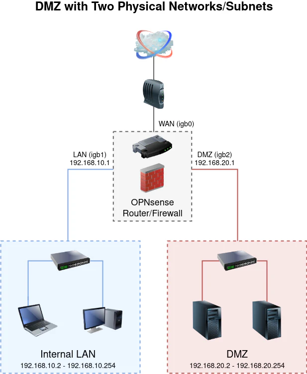
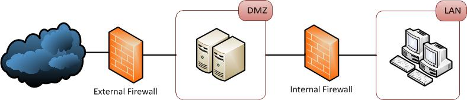

# Preparation phase

* **IR plan**
  * [Sample plan](https://www.wright.edu/sites/www.wright.edu/files/page/attachments/Incident%20Response%20Plan.pdf)
  * stages
    * **Preparation**
      * Developing response plans for different incident types and running simulated scenarios to evaluate how the incident response team responds, training them for the real thing
      * Ensure that all resources needed by the incident response team are approved and ready to use, such as
        * laptops, notebooks, software tools, forensic equipment, training, and the ability to abandon normal responsibilities when an incident occurs
      * Continually train and evaluate the performance of incident response team members to ensure they are capable of completing their duties defined in the response plans
    * **Identification**
      * will provide guidance on how to report an incident, and what information needs to be gathered and included such as:
        * When did the incident occur?
        * Who discovered it?
        * How did they discover it?
        * What systems or business units have been affected?
        * Does it affect the organization’s ability to operate?
        * What is the scope of the incident?
          * How many systems are affected, what was the initial point of entry, and what damage has been caused?
        * Once an incident has been discovered, organizations may choose to assign two values to help with prioritization, especially if multiple incidents occur simultaneously:
          * Criticality level
            * How fast does the response need to be?
          * Impact level
            * How long will the incident impact business operations?
    * **Containment**
      * should outline what actions should be taken to contain the incident by taking actions such as: disconnecting compromised devices from the internet preventing remote access or powering off systems
      * this is when digital evidence will be collected and preserved for later analysis, so containment measures need to be carefully considered, as powering off a system would result in losing crucial evidence that could be in volatile areas such as memory
      * should be documented to allow for straightforward evidence acquisition and containment measures, both short-term and long-term
      * Backups should be kept so that affected systems can be taken down and the backups can be used in their place, allowing normal business operations to continue
    * **Eradication**
      * MITRE ATT&CK framework can be used to work backward and potentially identify previous steps of the attack
      * analysis will be conducted using methods such as looking at packet captures, reviewing logs from a SIEM, and working until the root cause has been identified
      * Once found, it’s time to start removing malicious artifacts such as the presence of malware, any changes to systems and settings made by malicious actors, and ensuring that any methods to retain persistence are removed so actors are not able to get back into systems
      * defensive measures should be taken to ensure that this type of incident can’t happen again by hardening systems, applying patches, and empowering automated defenses such as NIPS and HIPS using indicators of compromise gathered throughout the investigation
      * By creating run-books for different incidents, incident responders can quickly evaluate the suggested measures and implement them quickly to prevent additional incidents from occurring
    * **Recovery**
      * returning business operations to normal by moving affected systems back to production environments now that they have been cleaned and hardened
    * **Lessons Learned**
      * a meeting should be held that includes any stakeholders involved in the incident
      * focus of this meeting should be to recap exactly what happened, specifically what went well, and how could the response have been improved
      * strengths and weaknesses of the response should be discussed and used to drive change, such as rewriting documentation including policies and procedures, or securing more budget if needed for additional tools or personnel

---

* **IR teams**
  * **Incident Commander**
    * in charge of dealing with the incident, typically a dedicated Incident Response Manager
    * should coordinate response efforts and ensure communication is maintained between all relevant parties throughout
    * point of contact for all departments, and will typically provide periodic updates to management and the C-suite
  * **Security Analysts**
    * individuals with a deep technical understanding of networks, and how to triage and investigate security alerts generated by platforms such as IDPS or SIEM
    * provide first-hand analysis of incidents and collect information such as the systems affected, the time, and the specific activity that is happening
  * **Forensic Analysts**
    * take a deeper dive into the incident and retrieve and preserve digital evidence so that it can be used in court if there is a legal prosecution as a result of the incident
  * **Threat Intelligence Analysts**
    * provide context around an incident, such as working to identify the actor(s) behind the attack, performing further exposure checks using IOCs and artifacts collected by forensic analysts, and relaying intelligence to other organizations
  * **Management/C-Suite**
    * Chief Information Security Officer (CISO), Chief Operations Officer (COO), and Chief Technology Officer (CTO)
  * **Human Resources**
    * If an employee is the cause of an incident, individuals from the HR department will need to be involved
      * will coordinate the organization’s response to discipline the employee, whether that’s to take legal action, fire them, or give them a warning
    * **Public Relations**
      * If an incident affects the public, employees, or customers then by law this needs to be announced as soon as possible
      * will handle how the news should be announced, what information to include, and who needs to be notified
    * **Legal**
      * will provide legal advice, and support forensic analysts, HR, and public relations to ensure that everything that happens is legal and the organization has completed any tasks it is required to do by law

---

* **Asset inventory and Risk Assessments**
  * Whilst we would ideally protect all systems, sometimes it is not cost-efficient to protect certain assets, and that’s where risk assessments come in
  * we can identify systems that are of high value to the business, and therefore require more protection than others
  * if multiple incidents occur at the same time, it needs to be clear which incident has priority, and whether the response needs to be immediate or can be delayed
  * a good place to start is by looking at the Business Impact Plan and Business Continuity Plan, both of which should clearly outline the critical systems for business operations
  * An **asset inventory** is a centralized and updated list of all IT assets within an organization. This typically includes:
    * Desktops/Laptops
    * Servers
    * Printers
    * Internet-of-Things Devices (IoT)
      * heaters, TVs, alarms, vending machines, and anything else network connected
    * Network Devices
      * firewalls, switches, routers, load balancers
    * Mobile Devices
      * phones, tablets
  * purpose of this practice is to store key information associated with a device, such as a system owner, the operating system version, the software installed, what IP address it's using. etc
  * can help with:
    * Identify out-of-date operating systems without using a vulnerability management solution
    * find system owners fast
    * If we have a system that is acting suspiciously but we're not sure what the purpose of the system is, and importantly, what type of data is stored on this system (such as confidential or non-confidential) then we could check the asset inventory to understand what team looks after this device, and what it's used for
  * risk assessment works to determine the systems that are the most critical to the business, therefore the most valuable
  * more protection and priority need to be given to these systems, especially if two incidents occur at the same time
  * by determining risk, the right amount of resources can be given to protect that system
  * 4 approaches to risk
    * Transfer the risk
      * e.g. purchasing insurance
    * Accept the risk
    * Mitigate the risk
    * Avoid the risk

---

* **Demilitarized zone (DMZ)**
  * DMZs and honeypots are security controls that can help an organization implement the “defense-in-depth” concept, using multiple layers of security to slow down an attacker
  * DMZ is a physical or logical subnet that separates an internal local area network (aka LAN) from other untrusted networks ( usually the internet)
  * External-facing servers, resources, and services that are located in the DMZ are directly accessible from the internet, however, this layer will keep the internal LAN unreachable, providing an additional layer of security to the LAN as it restricts a hacker’s ability to directly access internal server and data via the internet
  * Protect sensitive organizational systems and resources
  * Isolate and keep potential target systems separate from internal networks
  * Reduce and control access to those systems outside the organization
  * Any service provided to users on the public internet should be placed in the DMZ network
    * e.g. web servers and proxy servers, as well as servers for email, domain name system (DNS), File Transfer Protocol (FTP) and voice over IP (VoIP)
  * 2 major methods to construct a network with a DMZ
    * single firewall (sometimes called a three-legged model)
      * using a single firewall, with a minimum of 3 network interfaces
      
    * or dual firewalls
      * effective way of further increasing protection is to use firewalls built by separate vendors because they are less likely to have the same security vulnerabilities
    

---

* **Host Defenses**
  * **Host Intrusion Detection and Prevention**
    * HIDS is software installed on an endpoint that allows for the detection of suspicious or malicious activity using rules which are checked against activity to see if it matches any known malicious patterns
    * HIPS is software installed on an endpoint that works similarly to HIDS but is able to take autonomous actions to defend systems once malicious activity has been detected instead of just alerting human analysts

---

* **Anti-Virus**
  * AV should be deployed on all endpoints, such as desktops, laptops, and servers
  * Signature-based
    * use signatures which are specific patterns of activity to identify previously documented malware, either removing the file, generating an alert, or quarantining the malware
    * if the AV vendor doesn’t have the signature of a certain type of malware, it will not be detected by this type of anti-virus
  * Behavior-based
    * works to identify suspicious behavior by creating a baseline of “normal” activity and working to identify any deviations or anomalies that don’t fit the baseline

---

* **Centralized Logging**
  * Endpoints can be configured to send logs to a centralized location, a SIEM platform, where this data is aggregated, normalized, and matched against a number of rules designed to detect and flag suspicious or unusual activity

---

* **Endpoint Detection & Response**
  * EDR agents are pieces of software that sit silently on endpoints and provide logging, monitoring, and reactive capabilities
  * Similar to HIDS and HIPS, EDR agents will report activity back to a platform similar to a SIEM, where analysts can log in and investigate alerts generated by the EDR solution
  *  EDR platforms can also be utilized to monitor for insider threats by closely watching exactly what certain users are doing

---

* **Local Firewall**
  * local/web application firewalls use rules that apply to the system the firewall is running on
  * allow administrators to decide what ports should be open, and allow or deny connections coming in or going out of the system

---

* **Windows Group Policies**
  * Group Policy Object is a collection of settings systems administrators create with the Microsoft Management Console (MMC) Group Policy Editor
  * GPO can be associated with one or more of the Active Directory containers, such as sites, domains, or organizational units(OUs)
  * Active Directory applies GPOs in the following order:
    * Local policies
    * Site policies
    * Domain policies
    * OU policies
  * GPOs update randomly every 90 to 120 minutes or so, or when the computer gets rebooted
    * You can specify an update rate from 0 to 64,800 minutes (or 45 days), but if you select 0 minutes, the computer tries to update GPOs every 7 seconds
  * If you must implement an emergency GPO update, you have to keep this in mind and use another method to get users to reboot

---

* **Network Defenses**
  * **Network Intrusion Detection (NIDS)**
    * can be software or physical devices that tap monitor network traffic in order to generate alerts for human analysts to investigate
    * can be:
      * **Inline**
        * The system running the NIDS software is sitting directly in the path of network traffic
        * the system becomes a network intrusion prevention system (NIPS)
        * this way it can perform reactive measures such as blocking or resetting connections
        * if the system goes offline, all traffic will be blocked, potentially causing huge issues
      * **Network Tap**
        * connected to the network by tapping into a physical connection, such as a cable
      * **Passive**
        * connected to a SPAN port on a network device
        * allows all traffic passing through the device to be mirrored to the SPAN port so that the NIDS will get a copy of all network activity
    * products include:
      * Snort
      * Suricata
        * works at the application layer to analyze traffic in more detail and provide greater visibility
      * Zeek (formerly bro)
        * open-source solution that provides network monitoring functionality and acts as a network intrusion detection and prevention system
  * **Network Intrusion Prevention (NIPS)**
    * able to automatically take defensive actions based on the activity that has been identified
    * products include:
      * Snort
      * Suricata
      * Zeek (formerly bro)

---

* **Firewalls**
  * used to separate parts of a network to create private zones by restricting the traffic that can come in or go out
  * prevents random hosts from connecting to the organization’s systems
  * 3 main types:
    * **Traditional Firewalls**
      * can be constructed cheaply, by making use of dedicated hardware and open-source firewall software such as Pfsense
      * use rules that will allow or disallow traffic using pre-defined factors such as
        * Source IP
        * Destination IP
        * Source Port
        * Destination Port
        * Protocol Used
    * **Next-Generation Firewalls (NGFWs)**
      * NGFWs inspect packets as they pass through, looking at each layer of the OSI model
      * can ban the use of specific applications, such as peer-to-peer file-sharing applications, or restrict how applications are used
    * **Web Application Firewalls (WAFs)**
      * usually a proxy server that stands between an application running on a server and users who access the application from outside the corporate networ
      * proxy server accepts incoming data and then establishes its own connection to the application on behalf of the external user
      * the application is shielded from port scans, attempts to determine the software running on the application server, or other malicious activity directed by end-users at the application
      * not all applications are easily supported by proxy firewalls, and they can reduce the performance of the protected application to end-users

---

* **Network Access Control (NAC)**
  * Pre-admission
    * NAC can work to prevent rogue or non-compliant devices from connecting to a private network
      *  Security teams could require that any devices connecting to the network need the latest patches and security updates, and must be running anti-virus
    * typically used for Bring Your Own Device (BYOD) or guest networks, where non-corporate devices will be connecting such as employee mobile phones and personal laptops, which may potentially be infected as they aren’t protected by company security tools
  * Post-admission
    * NAC can also enforce restrictions once the device has been granted access to the network
    * can include defining what resources or systems the device can interact with using Role-Based Access (RBAC) functionality, and restricting access to specific systems such as file servers

---

* **Web Proxy**
  * preventing access to certain resources on the internet for primarily security purposes
  * Requests for internet resources are sent from the requesting client to the web proxy, then sent on behalf of the proxy to the destination, the request is fulfilled and the resource is sent back to the proxy, where it sends it to the requesting client
  * have the ability to reject requests, preventing users from retrieving potentially malicious resources from the internet
  * Preemptive blocks can be conducted based on intelligence or when phishing attacks are observed

---

* **Email Defenses**
  * **Domain (DNS) records**
    * **Sender Policy Framework (SPF)**
      * SPF record is a type of DNS (TXT) record that can help prevent an email address from being forged
      * record is established to identify the hostnames or IP addresses that are allowed to send emails for your custom domain
      * SPF TXT record contains 3 parts:
        * declaration of the record type
        * IP addresses and external domains that can send on your domain’s behalf
        * enforcement rule
    * **Domain Keys Identified Mail (DKIM)**
      * a method of email authentication that cryptographically verifies if an email has been sent by its trusted servers and hasn’t been tampered with during transmission
      * when the mail server sends an email, an encrypted hash of the email contents is generated using a private key and then it adds this hash to the email header as a DKIM signature
      * receiving server will be able to verify whether the email contents have not been tampered with by looking up the corresponding public key in the domains DNS records
      * once the receiving mail server decrypts the email with the public key, it calculates a new hash and verifies whether the original and the newly generated hash match
    * **Domain-based Message Authentication, Reporting & Conformance (DMARC)**
      * DMARC is built largely off of concepts taken from SPF and DKIM
      * allows the domain owner to specify what should happen if emails fail both SPF and DKIM checks
      * 3 basic options that the mail server can take:
        * none
        * quarantine
        * reject
  * **Marking External Emails**
    * majority of phishing emails will come from external addresses
    * in platforms such as Microsoft Exchange or Office365, there is the ability to alter the subject line or body text of an email address that is coming into the organization to alert the recipient that this email isn’t an internal communication, and could potentially be malicious
  * **Spam Filter**
    * Gateway Spam Filters
      * sit behind an on-premises firewall of a network
    * Hosted Spam Filters
      * hosted within the cloud
      * able to update more quickly than some of the on-premises filters
    * Desktop Spam Filters
      * user-installed and are typically used in SOHO scenarios
      * can sometimes be categorized as “Freeware” and you may not fully know what the application is installing on your system
  * **Data Loss Prevention**
    * combination of controls designed to prevent information from leaving an organization via email, or at least notifying someone that potentially sensitive documents have been sent out either via attachments or text in the email body
    * can flag emails based on keywords such as ‘confidential’, ‘proprietary’, etc.
  * **Sandboxing**
    * emails that include file attachments are extracted and analyzed, and files are detonated (run) in a virtual environment
    * if any malicious indicators are observed the attachment is classed as malicious, and the email will not be delivered
  * **Attachment Restrictions**
    * consider what file types are often used for malicious purposes, which file types the organization deals with on a regular basis, and whether blocking them would have any negative impact on the business
    * most obvious file types that are used for malicious activity are:
      * .exe (Executable)
      * .vbs (Visual Basic Script)
      * .js (JavaScript)
      * .iso (Optical Disk Image)
      * .bat (Windows Batch File)
      * .ps/.ps1
      * .htm/.html
  * **Security Awareness Training**

---

* **Physical Defenses**
  * **Deterrents**
    * Warning Signs
    * Fences
    * guard dogs
    * security guards
    * security lightening
      * to prevent low visibility areas
  * **Access Controls**
    * Mantraps
    * Turnstiles/Gates
    * Electronic Doors
    * Security Guards
  * **Monitoring Controls**
    * CCTV
    * Security Guards
    * Intrusion Detection Systems
      * have several different triggers that can generate alerts or set off alarms, including thermal (heat) detection, sound detection, and movement detection

---

* **Human Defenses**
  * Security Awareness Training
  * Security Policies
  * Incentives
  * Phishing Simulations
    * should be conducted quarterly
    * targeting the C-suite should be done every now and again
  * Whistleblowing
    * every organization should provide an anonymous way for employees to tip off the security team about another employee if they are behaving suspiciously or maliciously