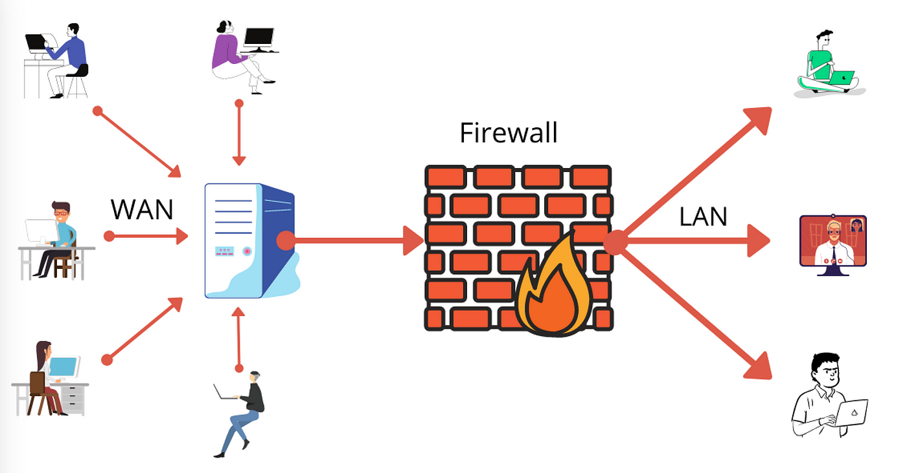

# Networking 101

## Network Fundamentals

### Transmission Control Protocol (TCP)

- **Connection-oriented protocol**: Establishes a reliable, two-way connection for data transmission.
- **Error detection and correction**: Ensures data loss is detected and corrected automatically.
- **OSI Model**: Operates at the transport layer.
- **TCP/IP Protocol Stack**: Commonly used to refer to the Internet protocol suite, as TCP is closely integrated with the Internet Protocol (IP), forming the foundation of public and local networks.

#### Three-Way Handshake

1. **Client sends SYN**: Initiates the connection, including its sequence number.
2. **Server responds with SYN-ACK**: Acknowledges the client’s SYN and sends its own sequence number.
3. **Client sends ACK**: Acknowledges the server’s SYN-ACK and begins data transmission.

---

### User Datagram Protocol (UDP)

- **Connectionless protocol**: Sends data without establishing a connection between sender and receiver.
- **Transport layer**: Mediates between the network layer and the application layer.
- **Key Features**:
  - **Uses ports**: Ensures packets reach the correct subsequent protocols or applications.
  - **Fast, delay-free communication**: Suitable for real-time applications (e.g., streaming) as it doesn’t re-request lost packets.
  - **No guarantees**: Does not ensure security, integrity, or packet order; services using UDP must implement their own correction measures.
  - **UDP Header**:
    - Fields include source port, destination port, packet length, and an optional checksum.

---

### Internet Control Message Protocol (ICMP)

- **Purpose**: Diagnoses network communication issues and determines whether data reaches its intended destination.
- **Usage**: Commonly used in network devices (e.g., routers) for tools like `ping` to test connectivity.

---

### IP Addresses

- **Definition**: Provides an identity for devices on a network, similar to a physical address.
- **DNS Resolution**:
  - Translates domain names (e.g., `www.example.com`) into IP addresses to locate and communicate with devices.

#### Types of IP Addresses

1. **Private IP Addresses**:
   - Used within local networks (e.g., home or business networks).
     - used by tablets, Wi-Fi cameras, wireless printers, and desktop PCs.
   - Assigned manually or automatically via routers.
   - Ranges:
     - `192.168.0.0 - 192.168.255.255`
     - `172.16.0.0 - 172.31.255.255`
     - `10.0.0.0 - 10.255.255.255`
2. **Public IP Addresses**:
   - Used for external communication, assigned by ISPs.
   - Enables devices in a private network to connect to the wider internet.

#### Static vs. Dynamic IPs

- Both private IP addresses and public IP addresses are either dynamic or static, which means that, respectively, they either change or they don't.
  - **Static IP**: Manually assigned; does not change.
  - **Dynamic IP**: Assigned by a DHCP server and may change over time.

---

### MAC Address

- **Definition**: A hardware identification number unique to each network device (e.g., Ethernet or Wi-Fi cards).
- **Format**: Six two-digit hexadecimal numbers separated by colons (e.g., `00:0d:83:b1:c0:8e`).
- **Purpose**: Ensures device-level identification on a network.
- **Viewing in Windows**:
  - Search for "Network Status" → Click "View your network properties".
- **Spoofing**: Cannot be changed but can be spoofed by attackers.

---

## The OSI Model

### Introduction to the OSI Model

To understand how communication between networks works, we can relate it to real-life scenarios. Consider the following analogy:

Imagine you want to send a gift to a friend in another city. Since you can’t deliver it personally, you use an intermediary. To ensure successful delivery, you:

1. Provide your address for pickup.
2. Wrap the gift carefully to avoid damage.
3. Label the package with your friend's address and name.

The intermediary:

1. Checks the package for completeness.
2. Transports it to the destination city.
3. Delivers the gift to your friend after verifying their identity.

Similarly, in the IT world, communication follows a structured process. To standardize this, the **Open Systems Interconnection (OSI) Model** was developed.

---

### What is the OSI Model?

The **Open Systems Interconnection Model (OSI)** is a reference framework created by the International Organization for Standardization (ISO) in 1984. It defines the operation of communication networks by dividing them into **7 distinct layers**. Each layer performs a specific role and interacts with the layer above and below it.

The OSI Model enables standardized data transmission between computers, applications, and networks.

---

### Memorizing the OSI Layers

- **Top to Bottom**: _All People Seem To Need Data Processing (APSTNDP)._
- **Bottom to Top**: _Please Do Not Throw Sausage Pizza Away (PDNTSPA)._

---

### The 7 Layers of the OSI Model

Below is an explanation of each layer, starting from the top (Layer 7) to the bottom (Layer 1), representing how data flows during communication.

The only two layers that can be manipulated by the user:

- Layer 7: Application Layer
- Layer 1: Physical Layer

#### Layer 7: Application Layer

- **Function**: Provides an interface for users to interact with the network.
- **Role**: Handles application-level protocols like:
  - **HTTP**: Web browsing.
  - **SMTP**: Email communication.

#### Layer 6: Presentation Layer

- **Function**: Acts as a translator between the user and the machine.
- **Role**:
  - Ensures data is understandable by applications.
  - Handles encryption and decryption of data.

#### Layer 5: Session Layer

- **Function**: Manages sessions between communicating systems.
- **Role**:
  - Opens, closes, and resets sessions.
  - Establishes the order of communication.

#### Layer 4: Transport Layer

- **Function**: Ensures reliable data transfer between computers.
- **Role**:
  - Assembles and fragments packets.
  - Provides error control, flow control, congestion control, and retransmission.

#### Layer 3: Network Layer

- **Function**: Routes data between networks.
- **Role**:
  - Redirects connections.
  - Finds the optimal path for data delivery.

#### Layer 2: Data Link Layer

- **Function**: Handles addressing and physical transmission of data.
- **Role**:
  - Encapsulates data into frames.
  - Prepares data for physical transfer.

#### Layer 1: Physical Layer

- **Function**: Manages the physical elements of the network.
- **Role**:
  - Includes physical components like Ethernet cables and optical fibers.
  - Handles the global topology and physical transmission of data.

---

## Network Devices

### Router

- **Function**: Forwards data based on logical addresses (e.g., IP addresses in TCP/IP networks).
- **Use Case**: In a home network, if you access `Google.com`, the router:
  - Receives your request.
  - Uses DNS to translate `Google.com` into its IP address.
  - Forwards the request over the internet to the appropriate server IP.
- **OSI Model**: Operates at Layer 3 (Network Layer).

---

### Hub

- **Function**: Connects devices within a Local Area Network (LAN).
- **Characteristics**:
  - Broadcasts data received on one port to all other connected devices.
  - Does not differentiate between intended recipients.
  - Generates unnecessary traffic and poses a security risk (e.g., attackers can intercept data if connected to the hub).
- **Nickname**: "Dumb" device due to lack of recipient awareness.
- **OSI Model**: Operates at Layer 1 (Physical Layer).

---

### Switch

- **Function**: A "smart" hub that forwards data to the correct recipient.
- **How it Works**:
  - Uses **MAC addresses** as unique identifiers to determine the recipient of incoming data.
  - Prevents unnecessary traffic by sending data only to the intended device.
  - Relies on the Address Resolution Protocol (ARP) to map IP addresses to MAC addresses.
- **Use Case**: In a network, if a desktop sends a print request, the switch forwards the data only to the printer.
- **OSI Model**: Operates at Layer 2 (Data Link Layer).

---

### Bridge

- **Function**: Connects separate networks to form a single larger network.
- **Difference from a Router**:
  - Bridges combine networks into one cohesive entity.
  - Routers connect networks while allowing them to operate independently.
- **OSI Model**: Operates at Layer 2 (Data Link Layer).

---

### Firewall

- **Function**: Provides fundamental network security by monitoring and controlling traffic based on predefined rules.
- **Types**:
  - **Hardware firewalls**: Physical devices integrated into network infrastructure.
  - **Software firewalls**: Installed on devices to manage traffic.
- **Use Case**: Creates private networks by blocking unauthorized communication and allowing only permitted traffic.
- **Activity**: Set up a PfSense firewall to practice creating and applying rules.
- **OSI Model**: Operates at Layers 3 (Network Layer) and 4 (Transport Layer).

---

## Network Tools

### Command-Line Tools

Section names include tool names for Windows and Linux. Examples only show linux commands.

#### IP and ipconfig

- **Purpose**: Displays the current network configuration of the device, including:
  - Private IP address
  - Gateway address
  - DNS server
- **Use Case**: Troubleshooting connectivity issues.
- **Examples**:
  - `ip a` – Shows IP addresses on the device.
  - `ip r list` – Displays the routing table.
  - `ip link set dev [Device Name] [up|down]` – Enables or disables a network interface.

---

#### Traceroute and Tracert

- **Purpose**: Shows the path network packets take from one host to another.
- **Use Case**: Troubleshooting routing issues between systems.
- **Examples**:
  - `traceroute [url]` – Runs a basic traceroute to view the path to a specified address.
  - `traceroute [url] -p [port number]` – Runs a traceroute for a specific port.

---

#### Dig and Nslookup

- **Purpose**: Queries DNS servers for information about a domain.
- **Use Case**: Identify IP addresses of domains or locate mail servers.
- **Examples**:
  - `dig [domain name]` – Queries the DNS server for the A record.
  - `dig [domain name] MX` – Queries DNS for mail (MX) records.
  - `dig [domain name] ANY +nocomments +noauthority +noadditional +nostats` – Queries the DNS server for all DNS records for the specified domain and removes the extra information provided by dig.

---

#### Netstat

- **Purpose**: Monitors TCP and UDP connections on the host system.
- **Use Case**: Troubleshooting applications or identifying signs of malware (e.g., connections to remote servers).
- **Examples**:
  - `netstat -a` – Displays all current connections and listening ports.
  - `netstat -a -b` – Displays connections and ports with their corresponding executables.
  - `netstat -s -p tcp -f` – Displays TCP connection statistics in FQDN format.
    - FQDL format is `hostname.domain.TLD`. For example, `yahoo.com` domain might use the FQDN `mail.yahoo.com`.

---

### Nmap

- **Purpose**: A versatile tool for network discovery and security scanning.
- **Use Case***:
  - Reveals open ports and running services.
  - Identifies devices, operating systems, and potential vulnerabilities.
- **Examples**:  
  - Running a TCP SYN scan with verbosity: `nmap -v -sT -sV scanme.nmap.org`.

---

### Nmap Scripting Engine (NSE)

- **Purpose**: Enhances functionality through scripts for:
  - Network discovery
  - Version detection
  - Vulnerability detection and exploitation

---

## Protocols and Ports

- **Port**: In networking, a port is a communication endpoint. At the software level, a port identifies a specific process or a type of network service.
- **Port Ranges**:
  1. **Well-known ports (0–1023)**: Reserved for widely used services (e.g., FTP, SSH, DNS, HTTPS).
  2. **Registered ports (1024–49151)**: Assigned to specific services upon registration.
  3. **Private ports (49152–65535)**: Used for ephemeral (temporary) connections by clients during server-client communication.
     - When connecting to a web server on port 443 (HTTPS), the source port used by the client will be a random private port (49152–65535).

---

### Common Ports and Protocols

[Port quiz](https://www.proprofs.com/quiz-school/quizshow.php?title=network-ports-quiz&q=1.).

#### Port 20, 21 - **File Transfer Protocol (FTP)**

- **Function**: Transfers files between systems.
- **Use Case**: Employees retrieving files from a company FTP server.
- **Weakness**: Communication, including usernames and passwords, is transmitted in cleartext, making it vulnerable to eavesdropping.

---

#### Port 22 - **Secure Shell (SSH)**

- **Function**: Provides encrypted remote access to servers. This channel is encrypted, so any data moved between two connected systems will not be clearly visible.
- **Use Case**: IT technicians use SSH for secure maintenance of remote servers.

---

#### Port 23 - **Telnet**

- **Function**: Enables remote access to servers (unencrypted). Was used before SSH.
- **Weakness**: Transmits data in cleartext, making it insecure.  

---

#### Port 25 - **Simple Mail Transfer Protocol (SMTP)**

- **Function**: Sends emails between servers.
- **Use Case**: Transport emails over internal or external networks.
- **Note**: This is just a transport method, to actually download and view emails you need to use an email client and the protocol POP or IMAP.

---

#### Port 53 - **Domain Name System (DNS)**

- **Function**: Uses relational databases to convert human-readable hostnames and domain names (such as `Google.com`) into their respective IP addresses.
- **Use Case**: Simplifies access to websites using human-readable names instead of numerical IPs.

---

#### Ports 67, 68 - **Dynamic Host Configuration Protocol (DHCP)**

- **Function**: Automatically assigns IP addresses and network configuration to devices.
- **Use Case**: Assigns IPs to devices like phones or laptops when they connect to a network.

---

#### Port 80 - **Hypertext Transfer Protocol (HTTP)**

- **Function**: Allows clients (e.g., browsers) to request content from web servers.
- **Use Case**: Viewing unencrypted web pages.
- **Weakness**: Data is transmitted in cleartext, making it susceptible to sniffing attacks.

---

#### Port 443 - **Hypertext Transfer Protocol Secure (HTTPS)**

- **Function**: Encrypted version of HTTP using Transport Layer Security (TLS).
- **Use Case**: Secure communication between web servers and clients.
- **Strength**: Sites that use HTTPS are less susceptible to man-in-the-middle and sniffing attacks.

---

#### Port 514 - **Syslog (UDP)**

- **Function**: A Syslog server will have port 514 open and listening for incoming Syslog notifications, transported by UDP protocol packets. These packets are generated by remote systems that have been set up to forward Syslog information to the server.
- **Use Case**: Forwards logs to SIEM platforms for security event monitoring.

---

#### Port 3389 - **Remote Desktop Protocol (RDP)**

- **Function**: Microsoft proprietary protocol that enables remote connections to computers over TCP.
- **Use Case**: IT professionals remotely manage Windows systems.