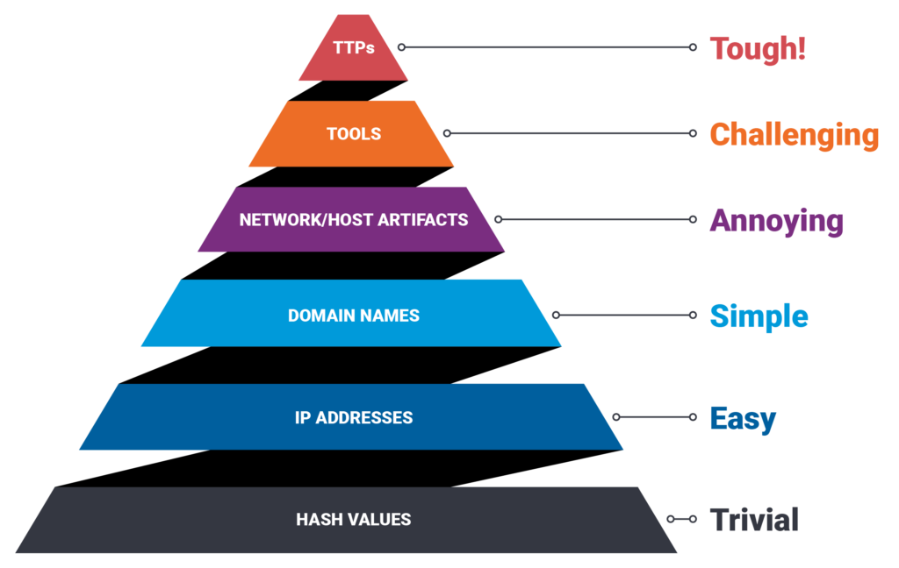

# Operational Threat Intelligence

## Precursors

* allow us to determine the existence of vulnerabilities within a system
* usually the most complicated element to obtain in a threat identification process
    * the majority of attacks do not have identifiable or detectable precursors (from the organization’s perspective)
* used by attackers and researches

---

### Types of Precursors

* **Port Scanning, Operating System and Application Fingerprinting**
  * the most effective ways to obtain information about a network is through scanning
    * Nmap, Netcat, or Nessus
  * you can learn about the services and vulnerabilities that exist on a system by performing:
    * host discovery
    * port scanning
    * vulnerability scanning activities
      * which ports or services are running and responding on a system
      * what operating system is installed
      * what applications and versions of applications are present
  * **precursors of this activity**
    * Logs from firewalls or web application firewalls (WAFs) that have rules written to alert and log when one source IP is attempting to connect on X number of ports over a short period of time
    * Logs from systems that are being scanned
* **Social Engineering and Reconnaissance**
  * dumpster diving for USB sticks, printed documents, notebooks, etc
  * eavesdropping on conversations between employees
  * **precursors of this activity**
    * listen to employee reports of unusual or suspicious activity
    * CCTV footage from both inside and outside the office
    * Non-employees looking through the organization’s bins that are conducting ‘dumpster diving’
    * Non-employees hanging around outside the office or lobby areas
    * Employees being engaged with outside or near the office by unknown individuals
    * Calls from unknown, withheld or spoofed phone numbers
    * Documents or office equipment going missing
* **OSINT Sources and Bulletin Boards**
  * social media, blogs, forums, and bulletin boards, security articles and reports, and other OSINT data both on the clear web and dark web
    * free tools such as TweetDeck and paid intelligence resources such as Recorded Future
  * **precursors of this activity**
    * An email or online message from a threat group threatening or stating they will attack the organization.
    * Publicly disclosed vulnerabilities (CVEs) that affect systems or programs that are used by the organization.
    * Chatter on underground forums about a zero-day or new malware that is being exploited or utilized in the wild.
    * Reports stating an increase in vulnerability exploitation activity supplied by government organizations or intelligence vendors.

---

## Indicators of Compromise Explained

* IoC are used to power IDS/IPS, EDRs, firewalls, and other automated defenses
* Human analysts can use these to perform threat exposure checks against their environments to identify signs of a cyberattack
* **Example of IOCs**
  * Email Addresses
  * IP Addresses
  * Domain Names/URLs
  * File Hashes/File Names
* **IOC Formats**
  * **STIX**
    * Structured Threat Information eXpression
    * developed by MITRE and the OASIS Cyber Threat Intelligence Technical Committee as a standardized language for sharing threat information
    * designed to be used in conjunction with TAXII, but can be shared without it
    * designed to share not just IOCs, but also threat:
      * Motivations
      * Abilities
      * Capabilities
      * Response
  * **TAXII**
    * Trusted Automated eXchange of Intelligence Information
    * defines how cyber threat information can be shared by using services and message exchanges
    * designed to handle STIX information
    * is run on a server and allows the sharing of information between specified groups or provides a public “threat stream” that individuals can sign up to and receive intelligence from

---

## MITRE ATT&CK Framework

* MITRE’s Adversarial Tactics, Techniques, and Common Knowledge (ATT&CK)
* knowledge base and model for cyber adversary behavior
* reflects various phases of an adversary’s attack lifecycle and the platforms they are known to target
* contains exhaustive information about types of attacks and their corresponding behavior
* primary use case is identifying the behavior of APTs
* **Resources**
  * [Getting Started with ATT&CK: Threat Intelligence](https://medium.com/mitre-attack/getting-started-with-attack-cti-4eb205be4b2f)
  * [ATT&CKing Your Adversaries](https://www.slideshare.net/slideshow/attcking-your-adversaries-operationalizing-cyber-intelligence-in-your-own-environment-for-better-sleep-and-a-safer-tomorrow/164054861)
  * [Using ATT&CK to Advance Cyber Threat Intelligence](https://medium.com/mitre-attack/using-att-ck-to-advance-cyber-threat-intelligence-part-2-6f21fdba80c)
  * [ATT&CKing the Status Quo - Video](https://www.youtube.com/watch?v=p7Hyd7d9k-c)
  * [ATT&CKing with Threat Intelligence - Video](https://www.pscp.tv/w/1yoKMVDjbrkGQ)
  * [ATT&CK Navigator Use Case for Threat Intelligence - Video](https://www.youtube.com/watch?v=pcclNdwG8Vs)

---

* **ATT&CK vs. Kill Chain**
  * Cyber Kill Chain proposes a well-defined sequence of events, while an ATT&CK scenario defines the techniques used on a case-to-case basis
  * ATT&CK framework helps identify specifically how an attack was performed and using their website, lets any security researcher explore both methods of attacks and APT groups that use them
  * Cyber Kill Chain is a more generic method of identifying an attack

---

## Lockheed Martin Cyber Kill Chain

* Intelligence Defense model for the identification and prevention of cyber-attacks, especially APTs
* CKC is split into seven different stages, with all seven stages needing to be completed to have a successful attack

### Kill Chain Stages

1. **Reconnaissance**
    * **Attackers:** research the target org using active and passive recon methods
      * domain record lookups, public IP range ports, vulnerability scanning, scouting out employees on social media, etc.
    * **Defenders:** precursors
        * IPs that are performing port or vulnerability scanning, employees being approached by individuals that they do not know, and employees potentially receiving connection/friend requests on social media
2. **Weaponization**
    * **Attackers:** create their backdoor and host this file on a domain they own; write a macro that connects to the attacker-owned domain and downloads the malware to the system where the file was opened
    * **Defenders:** hard to detect this stage as it's not happening w/in their env; AV, email security, and system hardening should be used
3. **Delivery**
    * **Attackers:** craft a spear-phishing email using information gathered on the target from OSINT sources. The email contains a file with a malicious macro
    * **Defenders:** have email defenses in place such as attachment sandboxing which should be able to detect any malicious attachments
4. **Exploitation**
    * **Attackers:** identified a vulnerability that can provide them with higher privileges
    * **Defenders:** hardening systems and performing vulnerability management processes to identify and remediate vulnerabilities
5. **Installation**
    * **Attackers:** install a backdoor and deploy persistence tactics and techniques to keep a foothold within the infected system
    * **Defenders:** deploy EDR software agents to potentially infected hosts to allow for the detection, investigation, and eradication
6. **Command and Control**
    * **Attackers:** install malware that opens a channel between the malicious actor and remote machine, allowing them to send commands to the malware
    * **Defenders:** ?
7. **Actions on Objectives**
    * **Attackers:** obtained keyboard access and now able to complete any objectives
    * **Defenders:** must detect this stage as quickly as possible to prevent further damage and minimize the time that the attacker can complete their objectives

---

* cyber kill chain does not do a good job of describing insider threats, as well as the first two phases traditionally occur outside of the defender’s network, making them much harder to detect
* MITRE combined its ATT&CK framework with the cyber kill chain to develop the Unified Kill Chain (UKC)
* UKC consists of 18 unique attack phases that may occur during a cyber attack and this includes things that the CKC left out

---

## Attribution and its Limitations

* attribution is the determination of a cause or origin of action
* **Machine Attribution**
  * identifying the machine(s) used in an attack
* **Human Attribution**
  * finding the identity of the person(s) responsible for the activity
* **Ultimately Responsible Attribution**
  * attributing this malicious activity to the ultimately responsible party
* **Key Indicators to attribution**
  * **Tradecraft**
    * frequently used TTPs to conduct cyber attacks
  * **Infrastructure**
    * physical machines or networks used in the attack
  * **Malware**
    * can be specific to a threat actor
    * can be reused or modified quickly to avoid attribution
  * **Intent**
  * **External sources**
    * reports from organizations like cyber security companies, media, etc.

---

## Pyramid of Pain

* visual representation of the amount of pain we can cause a malicious actor in denying them certain indicators
* **Hash Values**
  * can provide the highest confidence indicators yet are vulnerable to modification by the attacker or accidentally by the end-user
  * least useful indicators
  * provides a minimal amount of frustration to an attacker
* **IP Address**
  * having a unique address is beneficial, but it is not uncommon to change these with VPNs, TOR browsing, or open proxies
* **Domain Names**
  * can be changed, but require registration and hosting
  * DNS providers do not all have the same standards across the board in terms of legality and restrictions, which can make it fairly easy for an attacker to change domains
    * not as easy than IP
* **Network/Host Artifacts**
  * **NT**: adversaries’ network activities that are observable. Typical examples include URI patterns, C2 information embedded in network protocols, distinctive HTTP User-Agent, or SMTP Mailer values, etc.
  * **Host**: observables caused by adversary activities on one or more of your hosts, such as registry keys or values known to be created by specific pieces of malware, files, or directories
* **Tools**
  * utilities designed to create malicious documents for spear phishing, backdoors used to establish C2 or password crackers, or other host-based utilities
  * will require re-tooling, researching, or building another method to attack and might make the attacker move on
* **TTPs**
  * how the adversary goes about accomplishing their mission, from reconnaissance all the way through data exfiltration and at every step in between
  * attackers are human and act in similar, producible patterns, forcing them to change their behavior and methods is the most time-consuming defense against them